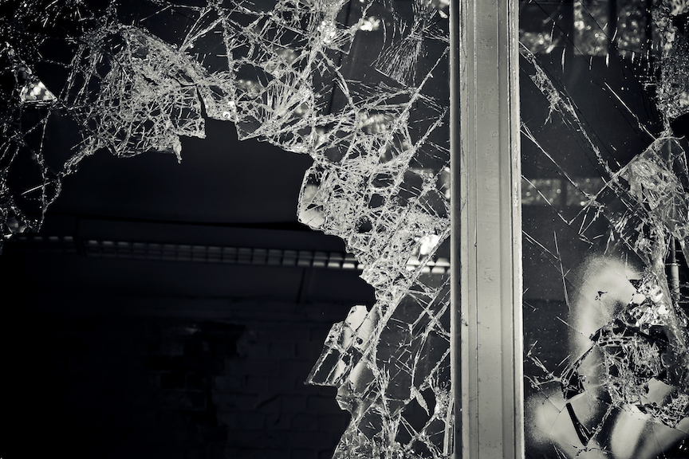

# Trace glass evidence: chemical composition  {#glass}

#### *Soyoung Park, Sam Tyner* {-}

```{r setupglass, include=FALSE}
knitr::opts_chunk$set(echo = TRUE, cache=FALSE, fig.align = "center", tidy = TRUE)
```

```{r glassimage, echo = FALSE, out.width="100%"}

```


## Introduction

It is easy to imagine a crime scene with glass fragments: a burglar may have broken a glass door, a glass bottle could have been used in an assault, or a domestic disturbance may involve throwing something through a window. During the commission of a crime, there are many ways that glass can break and be transferred from the scene. The study of glass fragments is important to forensic science because the glass broken at the scene can transfer to the perpetrator's shoes, clothing, or even their hair [@curranbook].  

Crime scene investigators collect fragments of glass at the scene as a part of the evidence collection process, and the fragments are sent to the forensic science lab for processing. Similarly, evidence such as clothing and shoes are collected from a suspect, and if glass is found, the fragments are sent to the lab and compared to the fragments found at the scene. The question that the analyst usually tries to answer is, "Did these glass fragments come from the same source?" This is a *source level* question, meaning that the comparison of the fragments will only tell the investigators whether or not the fragments from the suspect and the fragments from the scene have the same origin. As discussed in Section \@ref(forscip), the forensic analysis will not inform investigators *how* the suspect came into contact (*activity level*) with the glass or if the suspect was the perpetrator of the crime (*offense level*) [@hop].  


### Problems of interest

There are two key problems of interest in glass fragments comparison, but before defining them, we need to define the different glass involved in the investigation of a crime. Glass fragments found on the suspect, for example in their hair, shoes, or clothes, are [*questioned*](#def:questioned) fragments, which we denote by $Q$. Glass fragments found at the crime scene, for example in front of a broken window or taken from the broken window, are [*known*](#def:known) fragments, which we denote $K$.  This brings us to a [specific source](#def:specsource) question: Did the questioned fragments $Q$ found on the suspect come from the same source of glass as the known fragments $K$, which we know belong to a specific piece of glass at the scene? The goal is now to quantify the similarity between $Q$ and $K$. There are lots of ways measure similarity between two glass fragments, but the metric should be defined according to available databases of glass fragment measurements for which ground truth is known. For example, if we have elemental compositions measured in parts per million (ppm) as numerical values, the similarity can be quantified by the difference of the chemical compositions of $Q$ and $K$. 


### Current practice

There are many types of glass measurements such as color, thickness, [refractive index](#def:ri) (RI) and chemical concentrations. In this chapter, we will focus on [float glass](#def:floatglass) that is most frequently used in windows, doors and automobiles. For discussions of the other measurements see e.g. @curranbook. The elemental concentrations of float glass that we use here were obtained through inductively coupled mass spectrometry with a laser add-on (LA-ICP-MS). In the current practice, there are two analysis guides from [ASTM International](#def:ASTM), [@ASTME233012] and [@ASTME292716]. To determine the source of glass fragments according to these two guides, intervals around the mean concentrations are computed for each element, and if all elements' intervals overlap, then the conclusion is that the fragments come from the same source. For more detail on these methods, see @ASTME233012 and @ASTME292716. 


### Comparing glass fragments 

In order to determine if two glass fragments come from the same source, a forensic analyst considers many properties of the glass, including color, [fluorescence](#def:fluor), thickness, surface features, curvature, and chemical composition. All methods for examining these properties, except for methods of chemical composition analysis, are non-destructive. If the fragments are large, exclusion are easy to reach if the glass are of different colors because of the wide variety of glass colors possible in manufacturing. Typically, however, glass fragments are quite small and color determination is very difficult. Similarly, thickness of glass is dictated by the manufacturing process, which aims for uniform thickness, so if two glass fragments differ in thickness by more than 0.25mm, an exclusion is made [@glassbackground]. For glass fragments of the same color and thickness, microscopic techniques for determining light absorption (fluorescence), curvature, surface features (such as coatings), are used before the destructive chemical composition analysis. 

### Goal of this chapter

In this chapter, we construct a new rule for making glass source conclusions using the [random forest](#def:rfdef) algorithm to classify the source of glass fragments [@park2018]. 


## Data 


### Chemical composition of glass 

The process for determining the chemical composition of a glass fragment is given in great detail in @ASTME233012 and @ASTME292716. This destructive method determines elemental composition with Inductively Coupled Plasma Mass Spectrometry (ICP-MS). Up to 40 elements can be detected in a glass fragment using this method. In @weisglass, only 18 elements are used: calcium (Ca), sodium (NA) and magnesium (Mg) are the major elements, followed by aluminum (Al), potassium (K) and iron (Fe) as minor elements, and lithium (Li), titanium (Ti), manganese (Mn), rubidium (Rb), strontium (Sr), zirconium (Zr), barium (Ba), lanthanum (La), cerium (Ce), neodymium (Nd), hafnium (Hf), and lead (Pb) as the trace elements. The methods of @weisglass use standard deviations ($\sigma$) of repeated measurements of the same fragment to create intervals around the measurements. Intervals of width $2\sigma, 4\sigma, 6\sigma, 8\sigma, 10\sigma, 12\sigma, 16\sigma, 20\sigma, 30\sigma,$ and $40\sigma$ are considered for overlap. 


### Data source

Dr. Alicia Carriquiry of Iowa State University commissioned the collection of a large database of chemical compositions of float glass samples. The details of this database are explained in @park2018. The full database is available [here](https://github.com/CSAFE-ISU/AOAS-2018-glass-manuscript/tree/master/glassdata). The database includes 31 panes of float glass manufactured by Company A and 17 panes manufactured by Company B, both located in the United States. The Company A panes are labeled AA, AB, ... , AAR, and the Company B panes are labeled BA, BB, ... ,BR.  The panes from Company A were produced during a three week period (January 3-24, 2017) and the panes from Company B were produced during a two week period (December 5-16, 2016). 

<!-- You don't talk about the ribbon before now so people won't know what you're talking about. Either explain it or find another way to talk about variability without mentioning the ribbon. --> 
To understand variability within a ribbon of glass, two glass panes were collected on almost all days in each company, one  from the left side and one from the right side of the ribbon. Twenty four fragments were randomly sampled from each glass pane. Five replicate measurements were obtained for 21 of the 24 fragments in each pane; for the remaining three fragments in each pane, we obtained 20 replicate measurements. Therefore, each pane has 165 measurements for 18 elements.  For example, see the heuristic in Figure \@ref(fig:fragsample). In some panes, there may be a fragment with fewer than five replicate measurements.  The unit for all measurements is parts per million (ppm). 

```{r fragsample, fig.height=2, fig.cap="An example of how the glass fragments were sampled, if the 64 squares are imagined to be randomly broken fragments within a pane.", warning=FALSE}
library(tidyverse)
pane <- expand.grid(x = 1:16, y = 1:4)
n <- nrow(pane)
pane$id <- 1:n
frags <- sample(n, 24)
rep20 <- sample(frags, 3)
rep5 <- frags[!(frags %in% rep20)]
pane_sample <- data.frame(frag = c(rep(rep5, each = 5), rep(rep20, each = 20)), rep = c(rep(1:5, 21), rep(1:20, 3)))
sample_data <- left_join(pane, pane_sample, by = c("id" = "frag"))
ggplot(data = sample_data, aes(x = x, y = y)) + 
  geom_tile(fill = "white", color = "black") + 
  geom_jitter(aes(color = as.factor(rep)), alpha = .8, size = .5) + 
  scale_color_manual(values = c(rep("black", 20))) + 
  theme_void() + 
  theme(legend.position = "none") 
```


### Data structure

Next, we look at the glass data.  

```{r glassdat}
glass<-read.csv('dat/glass_raw_all.csv')
head(glass) 
```

The elements have very different scales, as some (e.g. Ca) are major elements, some  (e.g. Al) are minor elements, and others (e.g Hf) are trace elements. Thus, we take the natural log transformation of all measurements to put them on a similar scale.  

```{r glassdat2}
# need to make sure the panes are shown in order of mfr date
pane_order <- c(paste0("A", LETTERS[c(1:13, 15,22:25)]), 
                paste0("AA", LETTERS[c(1:4, 6,8:13, 17:18)]), 
                names(table(glass$pane))[c(32:48)])
glass$pane<-ordered(glass$pane, levels = pane_order)

glass_log <- glass %>% mutate(log_ppm=log(ppm))
glass_log %>% select(-ppm) %>% spread(element, log_ppm) %>% select(mfr,pane,fragment,Rep,Li,Na,Mg,Al,K,Ca) %>% head()
```


```{r density, fig.cap='Density estimation of selected chemical compositions, colored by manufacturers', fig.align = 'center'}
cols <- csafethemes:::csafe_cols_secondary[c(3,12)]
glass_log %>% filter(element %in% c("Li","Na","Mg","Al","K","Ca")) %>% 
  ggplot() + 
  geom_density(aes(x = log_ppm, fill = mfr), alpha = .7) + 
  scale_fill_manual(name = "Manufacturer", values = cols) +
  facet_wrap(~element, scales = "free", nrow = 2) + 
  labs(x = "Log concentration (ppm)", y = "Density") +
  theme(legend.position = "top")
```

Figure \@ref(fig:density) shows density plots of six chemical compositions of Al, Ca, K, Li, Mg, Na. Na and Ca (major elements) show density curves from two manufacturers are overlapped, while Al, K show clear separation between curves by manufacturers. This implies that glass fragments from different manufacturers will be very easy to distinguish.                       

```{r boxplot, fig.cap='Box plot of four elements in 48 panes, ordered by date of production, from two manufacturers.', out.width="100%"}
glass_log %>% filter(element %in% c("Na","Ti","Zr","Hf")) %>% 
  ggplot() + 
  geom_boxplot(aes(x = pane, y = log_ppm, fill = mfr), alpha = .8, outlier.size = .5, size = .1) + 
  scale_fill_manual(name = "Manufacturer", values = cols) +
  facet_wrap(~element, scales = "free", nrow = 2, labeller = label_both) + 
  theme_bw() + 
  theme(legend.position = "none") + 
  scale_x_discrete(labels = c("AA", rep("", 30), "BA", rep("", 15), "BR")) + 
  labs(x = "Pane (in order of manufacture)", y = "Log concentration (ppm)")

```


Figure \@ref(fig:boxplot) shows box plots of the measurements of four elements (Na, Ti, Zr, Hf) in each of the 48 panes in the database, colored by manufacturer. Boxes are ordered by date of production within manufacturer. We can confirm the between- and within- pane variability. Interestingly, element values of Zr and Hf in manufacturer A are both decreasing in time, which is evidence that the element measurements are highly correlated. To account for this relationship, we use methods that do not require independence of measurements. 


```{r correlation, fig.cap='Correlations among element concentrations in panes AA and BA. Blue and red colored area means correlations between elements are lager than 0.5 or lower than -0.5.', fig.align='center', eval = FALSE}
glass_log_long[,-6] %>% 
  filter(pane=="AA") %>% 
  spread(element, log_ppm) %>% 
  group_by(fragment) %>%
  summarise_if(is.numeric, mean, na.rm = TRUE) -> col_data_AA

glass_log_long[,-6] %>% 
  filter(pane=="BA") %>% 
  spread(element, log_ppm) %>% 
  group_by(fragment) %>%
  summarise_if(is.numeric, mean, na.rm = TRUE) -> col_data_BA

ggcorr(col_data_AA[,3:20], geom = "blank", label = TRUE, hjust = 0.75) +
  geom_point(size = 10, aes(color = coefficient > 0, alpha = abs(coefficient) > 0.5)) +
  scale_alpha_manual(values = c("TRUE" = 0.25, "FALSE" = 0)) +
  guides(color = FALSE, alpha = FALSE) ->P1

ggcorr(col_data_BA[,3:20], geom = "blank", label = TRUE, hjust = 0.75) +
  geom_point(size = 10, aes(color = coefficient > 0, alpha = abs(coefficient) > 0.5)) +
  scale_alpha_manual(values = c("TRUE" = 0.25, "FALSE" = 0)) +
  guides(color = FALSE, alpha = FALSE) -> P2

P1+P2

```
<!-- 
Figure \@ref(fig:correlation) shows correlation plot of pane AA and pane BA. When there is +1 correlation, then there is a strong positive correlation between two variables and when there is -1 correlation, then there is a strong negative correlation. In each correlation plot, we colored blue and red when there is correlation larger than 0.5 or lower than -0.5. In both correlation plots, we see many blue and red areas, so that there are some dependencies among chemical compositions in glass fragments measurements.  
--> 


## R Packages {#glass_rpkgs}

We propose a [machine learning](#def:ml) method to quantify the similarity between two glass fragments $Q$ and $K$. The goal here is to construct a [classifier](#def:classifier) that predicts, with low error, whether or not $Q$ and $K$ have the same source. Using the glass database, we construct many pairwise comparisons between two glass fragments with known sources, and we will record their source as either same source or different source. 

To construct the set of comparisons, we

1. Take the natural log of all measurements of all glass fragments. (ppm to $\log$(ppm))
2. Select one pane of glass in the database to be the "questioned" source. Sample one fragment from this pane, and call it $Q$. 
3.  Select one pane of glass in the database to be the "known" source. Sample one fragment from this pane, and call it $K$. 
4. Construct the response variable: if the panes in 2 and 3 are the same, the response variable is KM for known mates. Otherwise, the response variable is KNM for known non-mates.
5. Construct the features: take the mean of the repeated measurements of $Q$ and $K$ in each element, and take the absolute value of the difference between the mean of $Q$ and the mean of $K$. 
6. Repeat 2-5 until we have a data set suitable for training a classifier. 

<!--caret package to fit the data to random forest on cross-validation--> 

We use the R package [`caret`](https://topepo.github.io/caret/index.html) to train a random forest classifier to determine whether two glass fragments ($Q$ and $K$) have the same source or have different sources [@R-caret]. 

To begin, the package can be installed from CRAN:

```{r, eval=FALSE}
install.packages('caret')
```

```{r, message=FALSE, warning=FALSE}
library(caret)
# other package used for plotting
library(GGally)
library(patchwork)
```

The R package `caret` (**C**lassification **A**nd **RE**gression **T**raining) is used for applied predictive modeling. The `caret` package allows us to run 238 different models as well as adjusting data splitting, preprocessing, feature selection, tuning parameter, and variable importance estimation. We use it here for fitting a random forest model to our data using cross-validation and down-sampling.  


<!--Histogram of Mates and Non-mates -->

```{r diffdata}
diff_Q_K_data <- readRDS("dat/rf_data_kfrags_1z.rds")
```
```{r diffdata2, echo = FALSE}
diff_Q_K_data$class <- ifelse(diff_Q_K_data$pane_q==diff_Q_K_data$pane_k, "KM","KNM")
names(diff_Q_K_data)[1:18] <- str_sub(names(diff_Q_K_data)[1:18], 1,2)
names(diff_Q_K_data)[5] <- "K"
diff_Q_K_data <- diff_Q_K_data %>% mutate_at(vars(Li:Pb), abs)
#table(diff_Q_K_data$class)
##    KM   KNM 
##  1440 67680
diff_Q_K_data[c(1,50,99,2,3,4), c(21,1:6)] %>% knitr::kable(format = "html", caption="Differences of log values of concentrations (Li, Na, Mg, Al, K, Ca) from pairs of known mates (KM) and known non-mates (KNM)", longtable = FALSE, row.names = FALSE, digits=4, col.names = c("Class","Li","Na","Mg","Al","K","Ca"))
```


Table \@ref(tab:diffdata2) shows the example of pairwise differences among glass measurements. If we take the difference of two fragments from the same pane, then KM is assigned to the response variable of `Class`. If we take the difference of two fragments from two different panes, then KNM is assigned to variable `Class`. Each row has 18 differences and one variable `Class` indicating the source of two glass fragments. By taking pairwise differences, there are many more KNM pairs than KM pairs: we can construct 67,680 KNM pairs but only 1,440 KM pairs from the glass database. 


<!--head of difference data  -->

```{r diffhist, fig.cap='Histogram of differences from four chemical elements among KM and KNM.', fig.align='center'}
diff_Q_K_data %>% gather(element, diff, Li:Pb) %>%
  filter(element %in% c("Zr","Li","Hf","Ca")) %>% 
  ggplot() +
  geom_density(aes(x=diff, fill=class), alpha=0.7) + 
  scale_fill_manual(name = "Class", values = cols) +
  facet_wrap(~element, scales = "free", nrow = 2) + 
  labs(x = "Difference between Q and K (log(ppm))") +
  theme(legend.position = "top")
```

Figure \@ref(fig:diffhist) shows the distribution of differences for KM and KNM pairs in the Ca, Hf, Li, and Zr. Across all elements, distribution of differences from KNM pairs are more dispersed than differences of KM. The differences of KM have high density near zero, while the KNM measurements are shifted to the right and have a long tail.  These differences for all 18 elements will be the [features](#def:features) of the random forest.  


<!--random forest classifier / train data and test data separation -->
Finally, we construct the random forest classifier. Since the data have 1,440 KM and 67,680 KNM observations, the response variable is imbalanced. With this large imbalance, the algorithm can simply predict KNM and have low error rate without learning anything about the properties of the KM class. You can find more ways to consider this imbalance problem for fitting the random forest in this glass fragment source prediction in [@park2018].  In this chapter, we will down-sample the KNM observations to equal the number of KM observations. That way, we will have 1,440 KM and 1,440 KNM comparisons. Then, we sample 70% of them to be the training set and the remaining 30% are the testing set. 

```{r data3}
diff_Q_K_data$class <- as.factor(diff_Q_K_data$class)
#Down sample the majority class to the same number of minority class
set.seed(123789)
down_diff_Q_K_data <- downSample(diff_Q_K_data[,c(1:18)], diff_Q_K_data$class)
down_diff_Q_K_data <- down_diff_Q_K_data %>% mutate(id = row_number())
names(down_diff_Q_K_data)[19] <- "class"
table(down_diff_Q_K_data$class)
 

#Create training set
train_data <- down_diff_Q_K_data %>% sample_frac(.70)
#Create test set
test_data  <- anti_join(down_diff_Q_K_data, train_data, by = 'id')
train_data<-train_data[,-20] #exclude id 
test_data<-test_data[,-20]  #exclude id 
#dim(train_data) # 2016   19
#dim(test_data) # 864  19
```


<!--We down-sampled the majority class of KNM into the same number of minority class of KM. In the end, we have 1,440 KM and 1,440 KNM pairs of comparisons as our data. After then, we randomly selected 70% of them as training set for fitting the random forest classifier and set aside the rest of 30% data as test data for the validation of the performance.--> 


After down-sampling and setting aside 30% of the data for testing, we can train the classifier. Below is the R code to fit the random forest, using `caret` [@R-caret]. The tuning parameter for the random forest algorithm is `mtry`, the number of variables available for splitting at each tree node. We use five values (1, 2, 3, 4, 5) to tune `mtry` and pick the optimal one. For the classification, the default `mtry` is the square root of the number of predictor variables (it is $\sqrt{18} \approx 4.2$, in our study). To pick the optimal `mtry` parameter, the area under the [receiver operating characteristic](#def:roc) (ROC) curve is calculated. The optimal value will result the highest area under the ROC curve (AUC). The data are also automatically centered and scaled for each predictor. We use 10-fold [cross-valildation](#def:crossval) to evaluate the random forest algorithm and repeat entire process three times. 

```{r RF, eval=FALSE}
ctrl <- trainControl(method = "repeatedcv",
                     number = 10,
                     repeats = 3,
                     savePredictions="final",
                     summaryFunction = twoClassSummary,
                     classProbs = TRUE)

# mtry is recommended to use sqrt(# of variables)=sqrt(18) 
# so 1:5 are tried to find the optimal one
RF_classifier <- train (class~.,
                        train_data,
                        method = "rf",
                        tuneGrid = expand.grid(
                          .mtry = c(1:5)),
                        metric="ROC",
                        preProc=c("center", "scale"),
                        trControl = ctrl)
```

```{r RF2}
RF_classifier<-readRDS('dat/RF_classifier.RDS')
RF_classifier
```

```{r ugh, echo = FALSE}
val1 <- round((RF_classifier$results %>% filter(mtry == RF_classifier$bestTune$mtry))$ROC, 3)
```

From the RF fitting result, it showed the AUC (ROC), Sens ([Sensitivity](#def:sensitivity)) and Spec ([Specificity](#def:specificity)) values in each mtry values. R-package caret selects the best mtry value (it is 2, in our study) to give the highest AUC (ROC) value `r val1`, from 10-fold cross-validation and 3 repeated process. 


The final performance of the random forest algorithm with the optimal mtry of 2 with 500 of number of trees. In the training set, the false negative rate is `r round(RF_classifier$finalModel$confusion[1, 3], 3)` and the false positive rate is `r round(RF_classifier$finalModel$confusion[2, 3], 3)`  of false positive rate, which is the optimized classification result. We see the OOB estimate of error rate of `r round((RF_classifier$finalModel$confusion[1,2] + RF_classifier$finalModel$confusion[2,1]) / RF_classifier$trainingData %>% nrow(),3)`, which is the average error rate from the fold left out of the training set during cross-validation.  

```{r RF3}
RF_classifier$finalModel$confusion
```


```{r varimp, fig.cap='Variable importance from the RF classifier, colored by element types (major, minor or trace).', fig.align='center', out.width="75%"}
imp <- varImp(RF_classifier)$importance
imp <- as.data.frame(imp)
imp$varnames <- rownames(imp) # row names to column
rownames(imp) <- NULL  
imp<-imp %>% arrange(-Overall)
imp$varnames<-as.character(imp$varnames)
elements <- read_csv("dat/elements.csv")

imp %>% left_join(elements[,c(2,4)], by=c("varnames"="symb")) %>% 
ggplot(aes(x=reorder(varnames, Overall),y=Overall, fill = classification)) + 
  geom_bar(stat = "identity", color = "grey40") +
  scale_fill_brewer(name="Element", palette = "Blues", direction = -1) +
  labs(y = "Overall importance", x = "Variable") + 
  scale_y_continuous(position = "right") + 
  coord_flip() + 
  theme_bw()
```

By fitting the random forest algorithm, we can also get a measure of variable importance. This metric ranks which elements out of 18 are most important to correctly predicting the source of the glass fragments. Figure \@ref(fig:varimp) shows that elements K, Ce, Zr, Rb, and Hf are five very important variables and Pb, Sr, Na, Ca, and Mg are five minimally important variables. All major elements are not important: this is not surprising because all glass is, broadly speaking, very similar chemically. Conversely, most of the trace elements are ranked in the top half. 


## Drawing Conclusions

The result of the random forest classifier is a probability of the observation belonging to the two classes, KM and KNM, and a predicted class. For an observation, if the class probability for KM is greater than 0.5, then the class prediction is M (mated), otherwise it is NM (non-mated). We use the random forest classifier to predict on the test set. <!--If the random forest predicts the two fragments come from the same pane, we denote this with M for mated. If it predicts they come from different panes, we denote this with NM for non-mated.--> Recall that we know the ground truth, KM and KNM for the test data. 

<!-- show density estimation of RF score in testing set -->

```{r testtable}
# Get prediction from RF classifier in test data
pred_class <- predict(RF_classifier, test_data)                           
table_pred_class<-confusionMatrix(pred_class, test_data$class)$table
table2<-data.frame(table_pred_class) %>% spread(Reference, Freq)
table2$Prediction <- c("M", "NM")
table2 %>%   knitr::kable(format = "html", caption="Classification result of test set", longtable = FALSE, row.names = FALSE)
```

```{r echo = FALSE}
fnr <- table2$KM[2] / sum(table2$KM)
tpr <- table2$KM[1] / sum(table2$KM)
fpr <- table2$KNM[1] / sum(table2$KNM)
tnr <- table2$KNM[2] / sum(table2$KNM)

```

Table \@ref(tab:testtable) shows the classification results on the testing set from the random forest. There are `r table(test_data$class)[1]` KM and `r table(test_data$class)[2]` KNM comparisons in the test set. For the KM cases, the RF classifier correctly predicts the source as M in `r round(tpr,3)*100`% of cases and wrongly predicts the source as NM in `r round(fnr, 3)*100`% of cases. This is the false negative rate, FNR. For the KNM cases, the RF correctly classifies them as NM `r round(tnr, 3)*100`% of the time, while `r round(fpr, 3)*100`% are incorrectly classified as M. We know that the method resulted in higher FPR (`r round(fpr, 3)*100`) because the data we have are from many close panes made by the same manufacturer that are difficult to distinguish from one another.   


```{r testscore, fig.cap='Scores from the RF classifier for the test set. Ground truth (either KM or KNM) is known. Any observations above 0.5 are declared same source, while all others are declared different source. Notice the long tail in the KNM cases.'}
#class probability for the same pane is used as similarity score for RF
prob_prediction <- predict(RF_classifier, test_data,type="prob")[,"KM"]  
test_data$prob<-prob_prediction

test_data %>% 
  ggplot() + 
  geom_density(aes(x = prob, fill = class), alpha = .7) + 
  scale_fill_manual(name = "Class", values = cols) +
  labs(x = "Empirical probability for KM from RF classifier", y = "Density") +
  theme(legend.position = "top")
```


<!--We draw the empirical class probability of M that is predicted by the random forest classifier for each measurement in test data. -->Figure \@ref(fig:testscore) shows the distribution of the RF scores, colored by true classes in test data. The score is the empirical class probability that an observation belongs to the KM class. The modes of the the two classes are well separated, while there is still some overlap between the classes' density curve. The tail of the distribution of scores for KNMs is more skewed than that of the KMs, which helps explain the higher false positive rate.  Table \@ref(tab:testtable) is the predicted classification result using the cut-off of 0.5. If the RF score is larger than 0.5, then we will predict the pair of glass fragments have the same source (M). If not, then we declare they have different source (NM). 


## Case Study

Here we introduce a new set of five pairs of comparisons and use the random forest classifier we trained in Section \@ref(glass_rpkgs) to determine if the two samples being compared are from the same source of glass or from different sources. 

```{r getnewdataglass, echo=FALSE}
new_samples <- glass %>% filter((pane == "AB" & fragment == 2) | 
                   (pane == "AB" & fragment == 24) | 
                   (pane == "BB" & fragment == 1) | 
                    (pane == "BB" & fragment == 2) | 
                   (pane == "BB" & fragment == 5) | 
                   (pane == "AF" & fragment == 2) | 
                   (pane == "BB" & fragment == 14) | 
                   (pane == "BD" & fragment == 2))
new_samples <- new_samples %>% group_by(pane, fragment) %>% mutate(sample_id = group_indices()) %>% ungroup() %>% select(sample_id, element, ppm) %>% group_by(sample_id, element) %>% sample_n(5)
new_data <- new_samples %>% mutate(logppm = log(ppm)) %>% summarize(mlppm = mean(logppm)) %>% spread(element, mlppm)
comparisons <- tibble(compare_id = 1:5, sample_id_1 = c(1,4,1,1,7), sample_id_2 = c(2,6,5,3,8)) %>% arrange(sample_id_1, sample_id_2) %>% mutate(compare_id = row_number())
```

Suppose you are given the following data on eight glass samples, where each sample has been measured 5 times: 

```{r, echo = FALSE}
DT::datatable(new_samples %>% arrange(sample_id, element))
```

Your supervisor wants you to make five comparisons: 

```{r, echo=FALSE}
knitr::kable(comparisons)
```

First, you need to take the log of the measurements, then get the mean for each sample and each element. 

```{r tidy=FALSE}
# take the log, then the mean of each for comparison
new_samples <- mutate(new_samples, logppm = log(ppm)) %>% 
  select(-ppm) %>% 
  group_by(sample_id, element) %>% 
  summarise(mean_logppm = mean(logppm))
```

Next, make each of the five comparisons. We write a function, `make_compare()` to do so, then we use [`purrr::map2()`](https://purrr.tidyverse.org/reference/map2.html) to perform the comparison for each row in `compare_id`. The resulting compared data is below. 

```{r}
make_compare <- function(id1, id2){
  dat1 <- new_samples %>% filter(sample_id == id1) %>% 
    ungroup() %>%  select(element,mean_logppm) 
  dat2 <- new_samples %>% filter(sample_id == id2) %>% ungroup() %>% 
    ungroup() %>%  select(element,mean_logppm) 
  tibble(element = dat1$element, 
         diff = abs(dat1$mean_logppm - dat2$mean_logppm)) %>% 
    spread(element, diff)
}

compared <- comparisons %>% 
  mutate(compare = map2(sample_id_1, sample_id_2, make_compare)) %>% 
  unnest() 

DT::datatable(compared) %>% 
  DT::formatRound(4:21, 3)
```

Finally, we take the compared data and predict using the random forest object: 

```{r newtest2}
newpred <- predict(RF_classifier, newdata = compared, type = "prob")
```
```{r newtesttable}
# only take the id data from compare, and the M prediction from newpred
bind_cols(compared[,1:3], score = newpred[,1]) %>%
  mutate(prediction = ifelse(score > .5, "M", "NM")) %>% 
  knitr::kable(format = "html", caption="Predicted scores of new comparison cases from the random forest classifier", longtable = FALSE, row.names = FALSE, digits=3, col.names = c("Comparison ID", "Sample ID 1", "Sample ID 2", "Score", "Decision"))
```

 <!--For comparison 1 the RF score are over 0.9, meaning the RF is 90% sure about the source of these comparisons to be same pane. The comparison 3 is comparing a pair of glass fragments from panes produced in different manufacturers. In this case, the RF score is zero. The comparison 4 and 5 is non-mated pairs from two different panes but very closed produced (within 2 days) in the same manufacturer. For comparison 4, the RF score is 0.16, so that it clearly indicates the source toward the different source. For comparison 5, the RF score is 0.56 which is unclear to declare one of hypotheses either same source or different source. --> 

Table \@ref(tab:newtesttable) shows the RF score which is defined as the empirical class probability that the samples are from the same pane (M) by the RF algorithm^[In fact, we do know the truth here: for comparisons (1, 2, 3, 4, 5), the truth is (M, NM, NM, M, M).]. Based on these scores, it appears that samples 1 and 2 are very likely from the same source, while samples 1 and 5 are very likely from different sources. Using a threshold of 0.5, sample 4 and sample 6 are predicted to be from different sources. However, this score is so close to the threshold of 0.5 that we may want to say this is inconclusive.^[See this discussion of "equivocal zones:" http://appliedpredictivemodeling.com/blog/2013/8/15/equivocal-zones] Samples 1 and 3 are probably from different sources, though we are less confident in that determination than we are in the decision that samples 1 and 5 are from different sources. Finally, samples 7 and 8 are probably from the same source, but we are less certain of this than we are that samples 1 and 2 are from the same source. 


More research into the appropriateness of this random forest method for making glass source conclusions is needed. Important points to consider are: 

- What database should be used to train the algorithm? 
- Could the random forest method over fit, reducing the generalizability of this method? 

Nevertheless, the RF classifier makes good use of the glass fragment data, with its high dimension and  small number of repeated measurements. More details on the RF classifier and additional discussion can be found in @park2018. 

```{r newtest, results='asis', echo=FALSE, eval = FALSE}
newcase <- read.csv('dat/casestudy.csv')
newcase %>% knitr::kable(format = "html", caption="Predicted scores of new comparison cases by the RF classifier and the ASTM classifier", longtable = FALSE, row.names = FALSE, digits=3, col.names = c("Comparison", "Pane-Frag", "Pane-Frag", "RF", "Truth")) 
```


```{r newcase, results='asis', eval=FALSE, echo=FALSE}
newpair<-read.csv('dat/score_test.csv',row.names = NULL)[,-1]
colnames(newpair)<-str_sub(names(glass)[4:21], 1,2)
predict(RF_classifier, newpair,type="prob")[,"KM"] 
#0.886 0.824 0.316 0.492 0.724
```


