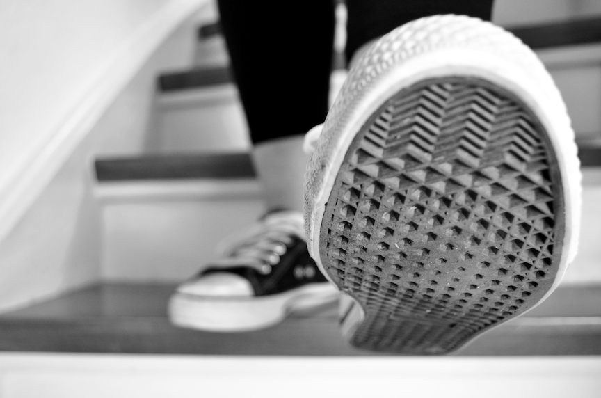
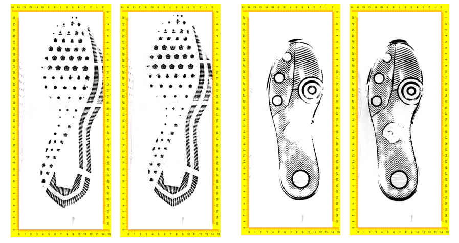

# Shoe Outsole Impression Evidence {#shoe}

#### *Soyoung Park, Sam Tyner* {-}

```{r setupshoe, include=FALSE}
knitr::opts_chunk$set(echo = TRUE, cache=FALSE, fig.align = "center", message = FALSE, warning = FALSE)
```

```{r shoestock, echo = FALSE, out.width="90%"}

```

## Introduction

In the mess of a crime scene, one of the most abundant pieces of evidence is a [shoe outsole](#def:shoeoutsole) impression [@bodziak2017footwear]. A shoe outsole impression is the trace of a shoe that is left behind when the shoe comes in contact with walking surface. Shoe outsole impressions are often left in pliable materials such as sand, dirt, snow, or blood. Crime scene impressions are lifted using [adhesive](#def:adhesivelift) or [electrostatic](#def:electrolift) lifting,  or [casting](#def:casting) to obtain the print left behind.  


When a shoe outsole impression is found at a crime scene, the question of interest is, "Which shoe left that impression?" Suppose we have a database of shoe outsole impressions. We want to find the close images in the database to the questioned shoe impression to determine the shoe brand, size, and other [class characteristics](#def:classchar). Alternatively, if we have information about potential suspects' shoes, then we need to investigate whether the questioned shoe impressions share characteristics. The [summary statistic](#def:summstat) we need is the degree of correspondence between the questioned shoe outsole impression from the crime scene ($Q$) and the known shoeprint from a database or a suspect ($K$). If the similarity between $Q$ and $K$ is high enough, then we may conclude that the source for $Q$ and $K$ is the same. Thus, the goal is to quantify the degree of correspondence between two shoe outsole impressions.  

Note that $Q$ and $K$ have different origins for shoe than they do for [trace glass evidence](#glass): for glass evidence, sample $Q$ comes from a suspect and $K$ comes from the crime scene, while for shoe outsole impression evidence, sample $Q$ comes from the crime scene and sample $K$ comes from a suspect or a [database](#def:database).  


### Sources of variability in shoe outsole impressions

There are many characteristics of shoes that are examined. First, the size of the shoe is determined, then the style and manufacturer. These characteristics are known as [*class characteristics*](#def:classchar): there are large numberso of shoes that share these characteristics, most other shoes that do not share class characteristics with the impression are easily excluded. For instance, a very popular shoe in the United States is the Nike Air Force one, pictured below [@fbishoes]. So, seeing a Nike logo and concentric circles in an impression from a Men's size 13 instantly excludes all shoes that are not Nike Air Force Ones in Men's size 13.

```{r nikeaf1, echo = FALSE, out.width="75%", fig.cap="The outsole of a Nike Air Force One Shoe. This pattern is common across all shoes in the Air Force One model. Source: [nike.com](https://c.static-nike.com/a/images/t_PDP_1728_v1/f_auto/q3byyhcazwdatzj7si11/air-force-1-mid-07-womens-shoe-0nT1KyYW.jpg)"}
knitr::include_graphics("img/nikeshoewhite.png")
```

Next, [*subclass characteristics*](#def:subclasschar) are examined. These characteristics are shared by a subset of elements in a class, but not by all elements in the class. In shoe impressions, subclass characteristics usually occur during the manufacturing process. For instance, air bubbles may form in one manufacturing run but not in another. Also, the different molds used to create the same style and size shoes can have slight differences, such as where pattern elements intersect [@mfrshoes]. Just like with class characteristics, subclass characteristics can be used to eliminate possible shoes very easily. 

Finally, the most unique parts of a shoe outsole impression are the [randomly acquired characteristics](#def:racs) (RACs) left behind. The RACs are smaller knicks, gouges, and debris in soles of shoes that are acquired over time, seemingly at random, as the shoes are worn. These are the *identifying* characteristics of shoe impressions, and examiners look for these irregularities in the crime scene impressions to make an identification. 


### Current practice 

Footwear examiners compare $Q$ and $K$ by considering class, subclass and identifying characteristics on two impressions. The guideline for comparing footwear impressions from the Scientific Working Group for Shoeprint and Tire Tread Evidence (SWGTREAD), details seven possible conclusions for comparing $Q$ and $K$ [@swgtreadconclude]: 

1. Lacks sufficient detail (comparison not possible)
2. Exclusion
3. Indications of non-association 
4. Limited association of class characteristics 
5. Association of class characteristics
6. High degree of assocation 
7. Identification

Examiners rely on their knowledge, experience, and [guidelines](http://treadforensics.com/images/swgtread/standards/current/swgtread_08_examination_200603.pdf) from SWGTREAD to come to one of these seven conclusions for footwear impression examinations. 


### Goal of this chapter 

In this chapter, we will show our algorithmic approach to measure the degree of similarity between two shoe outsole impression. For this, [CSAFE](https://forensicstats.org) collected shoe outsole impression data, developed the method for calculating similarity score between two shoe impressions and R package [`shoeprintr`](https://github.com/csafe-isu/shoeprintr) for the developed method [@R-shoeprintr]. 

## Data 

Crime scene data that we can utilize to develop and test a comparison algorithm for footwear comparison is very limited for several reasons: 

1. Shoe impressions found at crime scenes are confidential because they are a part of cases involving real people.
2. Although some real, anonymized crime scene data is available, we typically don't know the true source of the impression.
3. Most shoe outsole impressions found at the crime scene are partial, degraded, or otherwise imperfect. They are not appropriate to develop and test an algorithm.  

### Data collection 

CSAFE collected shoe impressions using the two-dimensional EverOS footwear scanner from [Evident, Inc.](https://www.shopevident.com/product/everos-laboratory-footwear-scanner). The scanner is designed to scan the shoe outsole as the shoe wearer steps onto the scanner. As more pressure is put on the scanner, there will be more detailed patterns detected from the outsole. The resulting images have resolution of 300 DPI. In addition, the images show a ruler to allow analysts to measure the size of the scanned impression. Figure \@ref(fig:everosx) shows examples of impression images from the EverOS scanner. On the left, there are two replicates of the left shoe from one shoe style, while on the right, there are two replicates from the right shoe from a different shoe stle. The repeated impressions are very similar, but not exact because there are some differences in the amount and location of pressure from the shoe wearer while scanning.

```{r everosx, echo = FALSE, out.width="75%", fig.cap="Examples of images from the EverOS scanner. At left, two replicates of one left shoe. At right, two replicates from the right shoe of another pair of shoes."}

```


This scanner enables us to collect shoe impressions and make comparisons where ground truth is known. By collecting repeated impressions from the same shoe, we can construct comparisons between known mates (same shoe) and known non-mates (different shoes). CSAFE has made available a large collection of shoe outsole impressions from the EverOS scanner [@shoedb].


### Transformation of shoe image

<!-- replace wikipedia with actual references--> 
The resulting image from the EverOS scanner is very large, making comparisons of images very time-consuming. To speed up the comparison process, we used [MATLAB](https://www.mathworks.com/products/matlab.html) 
to downsample all of the images at 20%.   Next, we apply [edge detection](https://en.wikipedia.org/wiki/Edge_detection) to the images, which leaves us with outlines of important patterns of shoe outsoles. We extract the edges of the outsole impression using the [Prewitt operator](https://en.wikipedia.org/wiki/Prewitt_operator) to obtain the ($x$,$y$) coordinates of the shoe patterns. All class and subclass characteristics, as well as possible RACs on the outsole impression are retained using this method.

The final data we use for comparison are the $x$ and $y$ coordinate values of the impression area edges that we extracted from the original image in the $Q$ shoe and the $K$ shoe, as shown in Figure \@ref(fig:datshoe). 

<!-- Sam, please locate Q on the left and K on the right. -->

```{r datshoe, fig.cap="Outsole impressions of two shoes, $K$ and $Q$."}
shoeQ<-read.csv('dat/Q_03L_01.csv')
shoeK<-read.csv('dat/K_03L_05.csv')
shoeQ$source <- "Q"
shoeK$source <-  "K"

library(tidyverse)
bind_rows(shoeQ, shoeK) %>% 
  ggplot() + 
  geom_point(aes(x = x, y = y), size = .05) + 
  facet_wrap(~source, scales = "free")
```


### Definition of classes

We use the data CSAFE collected to construct pairs of known mates (KM) and known non-mates (KNM) for comparison. The KMs are two repeated impressions from the same shoe, while the KNMs are from two different shoes. For the known non-mates, the shoes are identical in size, style, and brand, but they come from two different pairs of shoes worn by two different people. We want to train a comparison method using this data because shoes that are the same size, style, and brand are the most similar to each other, and thus the detection of differences will be very hard. By training a method on the hardest comparisons, we make all comparisons stronger. 
 

## R Package(s)

The R package `shoeprintr` was created to perform shoe outsole comparisons (Chapter 3 in @park2018learning).

To begin, the package can be installed from Github using [`devtools`](https://devtools.r-lib.org/):

```{r, eval=FALSE}
devtools::install_github("CSAFE-ISU/shoeprintr", force=TRUE)
```

We then attach it and other packages below: 

```{r, message=FALSE, warning=FALSE}
library(shoeprintr)
library(patchwork)
```


We use the following method to quantify the similarity between two impressions: 

1. Select "interesting" sub-areas in the $Q$ impression found at the crime scene.
2. Find the closest corresponding sub-areas in the $K$ impression.
3. Overlay sub-areas in $Q$ with the closest corresponding areas in $K$.
4. Define similarity features we can measure to create an outsole signature.
5. Combine those features into one single score. 

To begin our comparison, we choose three circular sub-areas of interest in $Q$ by giving the information of their centers and their radii. These areas can be selected "by hand" by examiners, as we do here, or by computer, as we do in Section \@ref(shoe-case-study). The three circles of interest are given in `input_circles`

```{r qcircles}
input_circ <- matrix(c(75.25, 110, 170, 600.4, 150, 470, 50, 50, 50), nrow = 3, ncol = 3)
input_circ
```
For circle $q_1$, we select the center of (75.25, 600.4) and the radius of 50. The second and the third rows in this matrix show center and radius for circle $q_2, q_3$.  

```{r startplot, fig.align = 'center'}
start_plot(shoeQ[,-3], shoeK[,-3], input_circ)
```
Here, we can draw the graph of coordinates of edges from $Q$ and $K$. For $Q$, we use the function `start_plot` draw the $Q$ impressions colored by the three circular areas we chose. We call the red circle, $q_1$, orange $q_2$, and green $q_3$. The goal here is to find the closest areas to $q_1$, $q_2$, and $q_3$ in shoe $K$. 

To find the closest areas of $q_1$, $q_2$, and $q_3$ in shoe $K$, we use the function `match_print_subarea`. In this particular comparisons with full impressions of $Q$ and $K$, we know that circle $q_1$ is located in left toe area of $Q$. Thus, the algorithm confines the searhing area in $K$ into upper left area of $K$. 
```{r match, fig.align = 'center', eval=FALSE}
match_print_subarea(shoeQ, shoeK, input_circ)
```


```{r matchgraph, fig.cap="Final match result between shoe Q and shoe K", echo=FALSE, fig.align = 'center'}
knitr::include_graphics("img/matchgraph.png", dpi = 100)
```

The function `match_print_subarea` will produce the best matching areas in shoe $K$ for circles of $q_1$, $q_2$, and $q_3$ in shoe $Q$, which we fixed. Figure \@ref(fig:matchgraph) shows the final result from the function `match_print_subarea`. Three circles of red, orange, green colors in the right panel in Figure \@ref(fig:matchgraph) indicate that those circles that the algorithm foound showed the best overlap with circles of $q_1$, $q_2$, and $q_3$ in shoe $Q$. 


Next, we explore how the function `match_print_subarea` finds the corresponding areas between two shoe impressions. Too find the corresponding areas for circle $q_1$ in shoe $K$, the underlying algorithm first finds many candidate circles in shoe $K$, as shown in Figure \@ref(fig:step1plot).   

```{r step1plot, fig.cap='Circle $q_11$ in $Q$ (left) and candidate circles in $K$', echo=FALSE, fig.align = 'center'}
knitr::include_graphics("img/step1_Q_K.png", dpi = 100)
```

For the comparison, the function selects many candidate circles in $K$ labeled as circle $k_1, \dots, k_9$ in Figure \@ref(fig:step1plot). For candidate circles in $K$, we use larger radius than circle $q_1$ because we want any candidate circles to fully contain circle $q_1$ if they are mates. Ideally, the union of the candidate circles in $K$ should contain all edge points in $K$. The algorithm compares all candidate circles in shoe $K$ with the fixed circle $q_1$and picks the closest one as the area corresponding to $q_1$ in shoe $K$. <!--But, to reduce the time to compare two impressions, we will confine the search area to $k_5$, ..., $k_9$ for circle $q1$. -->

<!---Let's look details how to find the corresponding areas in $K$ for $q_1$ with center of (75.25, 600.4) and radius of 50. --> 

<!-- 
For the comparison, we will select many candidate circles in $K$ labeled as circle $k_1$, ..., $k_9$ in Figure \@ref(fig:step1plot). For candidate circles in $K$, we use larger radius than circle $q_1$ because we want any of candidate circles can contain circle $q_1$ if they are mates. Ideally, the union of candidate circles in $K$ should contain entire edge points in $K$. However, we know that circle $q_1$ in $Q$ is located in the toe so that we limit the search area into upper left of $K$. We might try to compare circle $q_1$ to circles $k_7, k_8, k_9$ which are overlapped each other. As an example here, we will compare circle $q_1$ with circle $k_8$. 

For the comparison of circle $q_1$ and circle $k_8$, we will use the concept of maximum clique. A graph is an object consited with vertices or nodes connected with edges or lines. When comparing two graphs, the maximum clique from two graphs is defined as the largest complete subgraph, meaning the subset of nodes with the same geometrical relationship between two graphs. In the shoe outsole comparison application, The interest features detected from impression are becoming vertices and the distances among them become edges. The maximum clique is a good tool to reflect the fact that geometrics in the patterns (at least class characteristics) of shoe outsole are not changing a lot. 

```{r mcgraph, fig.cap='caption', echo=FALSE, fig.align = 'center'}
knitr::include_graphics("img/maxclique_ex2.png", dpi = 100)
```

In Figure \@ref(fig:mcgraph), we want to compare Image 1 and Image 2. In Image 1, a set of nodes is {a, b, c, d, e, f, g} and a set of nodes for Image 2 is {1, 2, 3, 4, 5, 6}. When we look closely, the distances bewteen 'a' and three 'd','e' and 'g' in Image 1 are the same with distances between '1' and three '3', '6' and '5'. This way, pairwise distances among corresponding nodes between twoo images should have the same geometrics and the set of largest complete correspondence between two images are \{'a1','d3','e6','g5'\}. This set is a set of maximum clique. Some nodes such as \{'b','c','f'\} in Image 1 and \{'2','4'\} in Image 2 are examples of noises that might be apppeared in the outsole impressions.
-->
 
 
 
 
### One subarea matching

In this section, we show one example of the matching process by examining the comparison between circle $q_1$ and circle $k_8$ in Figure \@ref(fig:step1plot). We selected $k_8$ because it is a close match to circle $q_1$ well.  

```{r onecircle, eval=FALSE}
nseg=360
circle_q1<-data.frame(int_inside_center(data.frame(shoeQ), 50, nseg, 75.25, 600.4))
circle_k8<-data.frame(int_inside_center(data.frame(shoeK), 65, nseg, 49, 700))

match_q1_k8<-boosted_clique(circle_q1, circle_k8, ncross_in_bins = 30, xbins_in = 20, 
                            ncross_in_bin_size = 1, ncross_ref_bins = NULL, xbins_ref = 30, 
                            ncross_ref_bin_size = NULL, eps = 0.75, seed = 1, num_cores = parallel::detectCores(), 
                            plot = TRUE, verbose = FALSE, cl = NULL)
```


The `shoeprinter` function `boosted_clique` finds the subset of pixels (the [maximal clique](#def:maxclique)) that can be used for alignment of circle $q_1$ and circle $k_8$. Using corresponding pixels, the function computes the rotation angle and translation metric which result the best alignment between them. Circle $q_1$ is transformed to be on top of the circle $k_8$, using the calculated alignment information. The function then produces summary plots as shown in Figure \@ref(fig:MCresult) and a table of similarity features as shown in Table \@ref(tab:resulttable). 

```{r MCresult, fig.cap='Resulting plot when comparing circle $q_1$ (blue points) and circle $k_8$ (red points).', fig.align = 'center', echo=FALSE}
knitr::include_graphics("img/MC_result.png", dpi = 100)
```

Figure \@ref(fig:MCresult) has four sections. In the first row, first column, the distances between all points in the maximal clique are shown: the x-axis is the distance between points in circle $k_8$ and the y-axis is the distance between points in circle $q_1$. These values should fall on or near the $y=x$ diagonal, because for identical circles, the points in the maximal clique are the same. The second plot in the first row of Figure \@ref(fig:MCresult) shows the $(x,y)$ values of the points in the maximal clique. Red points are from $k_8$, blue circles are from $q_1$. The bottom two plots show all points in the two circles after alignment. We can see that the two circles share a large area of overlap: the blue points are almost perfectly overlapping with the red points.

<!--In the second row, two plots show the alignment result of circle $q_1$ and circle $k_8$. The plot on the second row and second column shows the area of red pixels that are overlapped the best with blue pixels. This figure is to calculate the radius and center for the corresponding circle in $K$ for circle $q_1$. Thus, we see only blue pixels from circle $q_1$, but red pixels from circle $k_8$ is behind blue pixels. --> 


```{r resulttable, results='asis', echo=FALSE}
tabb <- data.frame(c(18, 12.05, 0.75, 0.97, 0.3, 54.5, 688.5, 50.28))
tabb <- data.frame(t(tabb))
tabb %>% knitr::kable(format = "html", caption="Resulting table from the matching betwen q1 and k8", longtable = FALSE,
                      row.names = FALSE, col.names = c("Clique size","Rot. angle","Overlap on k8", "Overlap on q1","Median distance", "center x", "center y", "radius"))
```

Table \@ref(tab:resulttable) contains the similarity measures and other information about $k_8$, the closest matching circle to $q_1$.  The first five features measure the degree of similarity between circle $q_1$ and circle $k_8$, after aligning them. There are 18 pixels in the maximal clique, and the rotation angle between them is 12.05$^o$.  The two overlap features indicate that 75% of circle $k_8$  pixels are overlapped with circle $q_1$ and 97% of circle $q_1$ pixels are overlapped with circle $k_8$ after alignment. The median value of the distance between two close points after aligning the circles is 0.3. For the clique size and overlap metrics, larger values indicate more similar circles, while the opposite is true for distance metrics. The last three columns are about information of the found circle in $K$ that is matched the best with circle $q_1$. Thus, the center (54.5, 688.5) and the radius 50.28 in $K$ is the best matching circle to $q_1$.
 

```{r graphq1, fig.cap='Circles $q_1$ and $k_8$ in context.', echo=FALSE, fig.align = 'center'}
knitr::include_graphics("img/graph_q1.png", dpi = 100)
```

Figure \@ref(fig:graphq1) shows the two matching circles as part of the larger shoe impression. By fixing circle $q_1$ (in blue), we found the closest circle (in red) in shoe $K$. The blue circle in $Q$ and red circle in $K$ look pretty similar. This process would be repeated for the two other circles that we fixed in $Q$, using the function `match_print_subarea`. 


## Drawing Conclusions

To determine whether impressions $Q$ and $K$ were made by the same shoe or not, we need to define the signature of the questioned shoe outsole impression. We define the signature of shoe $Q$ as the three circular areas of the shoe after edge detection.

```{r signature, fig.cap="Comparing the lengths of the blue lines is important for determining if the same shoe made impression $Q$ and impression $K$.", echo=FALSE, fig.align = 'center'}
knitr::include_graphics("img/final3.png", dpi = 100)
```

Figure \@ref(fig:signature) shows the signature in $Q$ and the corresponding areas in $K$ found by the `match_print_subarea` function. We use the average of the five similarity features from the three circle matchings to draw a conclusion. If the circles in $K$ match the circle in $Q$, then the corresponding geometry between the three circles in $Q$ and $K$ should be very similar. The blue lines in Figure \@ref(fig:signature) form a triangle whose vertices are the centers of the three circles in each shoe impression. The difference of the side lengths (numbered 1,2,3 in the figure) between the two triangles are an additional feature used to determine if $Q$ and $K$ were made my the same shoe or not. If the two triangles in Figure \@ref(fig:signature) have similar side lengths, this is evidence that shoe $Q$ and shoe $K$ are from the same source. 


```{r finaltable, results='asis', echo=FALSE}
X1<-c('$q_1$-$k^*_1$',18, 12.05, 0.75, 0.97, 0.3, 0.58)
X2<-c('$q_2$-$k^*_2$',17, 10.57, 0.53, 0.91, 0.43, 0.55)
X3<-c('$q_3$-$k^*_3$',20, 12.14, 0.63, 1.00, 0.24, 1.03)

tabb2 <- data.frame(X1, X2, X3)
tabb2 <- data.frame(t(tabb2))
tabb2 %>% knitr::kable(format = "html", caption="Resulting table comparing Q and K.", longtable = FALSE,
                      row.names = FALSE, col.names = c("Comparison","Clique size","Rot. angle","Overlap on k*", "Overlap on q","Median distance", "Diff in length from Triangle"))
```

Table \@ref(tab:finaltable) contains the summary features from comparing the signature with three circles in $Q$ to the corresponding areas in $K$ which are the closest match.   There is one row for each comparison between $q_i$ and $k^{*}_i$ for $i=1,2,3$. The last column is the absolute value of difference of the triangle side lengths from three circles in $Q$ and $K$. Smaller differences incidate more similarity between $Q$ and $K$. Finally, we take the average of all features except rotation angle over the three circle. For the rotation angle, we take the standard deviation of the three measurements instead of the mean. If the two prints come from the same shoe, the rotation angle will be very similar in all three circles, so we expect small values of the standard deviation to indicate mates, while large values indicate non-mates. <!-- ??? Soyoung, I am confused about the triangle lengths. Which length is which?? Also, how do you actually make a final decision?????? -->


## Case Study {#shoe-case-study}

Comparing two impressions with totally different outsole patterns is a very easy problem for humans and computers. But what if we are tasked to compare two impressions from two different shoes from different people that have the same brand, model, and size? 

Suppose we have one questioned shoe outsole impression ($Q$) and two known shoe impressions ($K_1, K_2$) from two different shoes. All three impressions share the same [class characteristics](#def:classchar). How can we conclude if the source of $Q$ is the same as $K_1$ or $K_2$?


```{r eximgs, fig.cap="Example images of shoe outsole impressions. The questioned impression ($Q$) and two known impressions ($K_1$, $K_2$). Does $Q$ have the same source as $K_1$ or $K_2$?", echo=FALSE, fig.align = 'center'}
knitr::include_graphics("img/NIKE_QK1K2.jpg", dpi = 100)
```


Figure \@ref(fig:eximgs) displays three outsole impressions. With a cursory glance, it looks like impression $Q$ could have been made by the same shoe as either $K_1$ or $K_2$. The two known impressions are from the same brand and model of shoes, which were worn by two different people for about six months. Since the three impressions all share class and subclass characteristics, it is a very hard comparison. There are some differences among images $Q, K_1, K_2$ but it is hard to determine if these differences are due to measurement errors or variation in the EverOS scanner or to wear and tear of the outsole or RACs.  

### Compare $Q$ and $K_1$ {#sec:shoeqk1}

Let's compare $Q$ and $K_1$ first. In $Q$, we select three circlular areas. For this, we use the function `initial_circle` to select three centers within the (30%, 80%), (20%, 40%), (70%, 70%) quantiles of the $(x, y)$ ranges of the coordinates in $Q$. The function automatically generates corresponding centers of the circles with radius of 50. 

```{r datshoe2, echo=FALSE}
imgQ<-read.csv('dat/lc_nike_10.5_647_Q.csv')
imgK1<-read.csv('dat/lc_nike_10.5_649_K1.csv')
imgK2<-read.csv('dat/lc_nike_10.5_520_K2.csv')
```


```{r cirQ}
input_circles_Q <- initial_circle(imgQ)
input_circles_Q
```


```{r startQK1, fig.align = 'center', fig.cap="The input circles and the shoe $Q$ impression (left) and the shoe $K_1$ impression (right)."}
start_plot(imgQ, imgK1, input_circles_Q)
```

Next, run `match_print_subarea()` to findcircles in $K$ that most closely correspond to the circles in $Q$. The result is shown in Figure \@ref(fig:exKM). In $K_1$, the algorithm finds the closest circles which show the most overlap with each of the circles that we fixed in $Q$. The corresponding circle information and summary features are shown in Tables \@ref(tab:KMtable1) and \@ref(ftab:KMtable2), respectively. Each row in Table  \@ref(tab:KMtable2) shows the similarity features from circle $q_i$ and circle $k^{1}_i$ when $i=1,2,3$. 

```{r matchKM, eval=FALSE}
match_print_subarea(imgQ, imgK1, input_circles_Q)
```


```{r exKM, fig.cap="The input circles ($q_1, q_2, q_3$) and the shoe $Q$ impression (left) and the closest matching circles ($k_1^1, k_2^1, k_3^1$) and shoe $K_1$ impression (right), which are the result of `match_print_subarea`.", echo=FALSE, fig.align = 'center'}
knitr::include_graphics("img/Nike_edge_ex_KM.png", dpi = 100)
```


```{r KMtable1, results='asis', echo=FALSE}
table_KM<-read.csv('dat/Nike_edge_ex_KM.csv')
table_KM$diff<-abs(table_KM$Euc_input_dist-table_KM$Euc_ref_dist)

table_KM[,3:5] %>% knitr::kable(format = "html", caption="Centers and radius information for circles in $K_1$ that are the closest match to the circles in $Q$ according to the matching algorithm.", longtable = FALSE, row.names = FALSE,  digits=2)
```

```{r KMtable2, results='asis', echo=FALSE}
table_KM[,c(6:10, 14)] %>% knitr::kable(format = "html", caption="Similarity features from comparing circles in $Q$ to the best matching circles in $K_1$.", longtable = FALSE, row.names = FALSE, digits=2)
```


### Compare $Q$ and $K_2$

We repeat the process from Section \@ref(sec:shoeqk1) to find the best matching circles in $K_2$.  

```{r matchKM2, eval=FALSE}
match_print_subarea(imgQ, imgK2, input_circles_Q)
```

```{r exKNM, fig.cap="The input circles ($q_1, q_2, q_3$) and the shoe $Q$ impression (left) and the closest matching circles ($k_1^2, k_2^2, k_3^2$) and shoe $K_2$ impression (right), which are the result of `match_print_subarea`.", echo=FALSE, fig.align = 'center'}
knitr::include_graphics("img/Nike_edge_ex_KNM.png", dpi = 100)
```

Figure \@ref(fig:exKNM) shows the circles from the matching algorithm. In this comparison, $k_3^2$ is in a very different position compared to $q_{3}$. 


```{r KNMtable1, results='asis', echo=FALSE}
table_KNM<-read.csv('dat/Nike_edge_ex_KNM.csv')
table_KNM$diff<-abs(table_KNM$Euc_input_dist-table_KNM$Euc_ref_dist)

table_KNM[,3:5] %>% knitr::kable(format = "html", caption="Centers and radius information that the matching algorithm found as the best overlap circle in $K_2$ for fixed circles in $Q$", longtable = FALSE, row.names = FALSE,  digits=2)
```

```{r KNMtable2, results='asis', echo=FALSE}
table_KNM[,c(6:10, 14)] %>% knitr::kable(format = "html", caption="Similarity features by comparing circles in $Q$ to the best matching circles in $K_2$.", longtable = FALSE, row.names = FALSE, digits=2)
```


Table \@ref(tab:KNMtable1) and Table \@ref(tab:KNMtable1) show the location information of matching circles in $K_2$ for fixed circles in $Q$ and their corresponding similarity features, respectively.


### Interpreting Comparisons betwenn $Q, K_1$ and $Q, K_2$ 

To summarize similarity features from the match of the two impressions, we will take the average of each similarity feature across the three circle matchings, and the standard deviation of the rotation angle estimates. For features such as clique size and overlap, larger values indicate more similar impressions. For the features median distance and absolute value of differences of lengths from two triangles in two impressions, smaller values indicate more similar impressions. For the rotation angle estimation, we use the standard deviation of the three values because we are interested in comparing the three values to each other, not in the value of the angles themselves. If all rotations are about the same, the algorithm is consistently finding those patterns, and the prints are likely from the same shoe, even if the image has been rotated . If the rotation angles are very different, however, the algorithm is forcing similarity where it doesn't exist, and the prints are likely from different shoes. 


```{r summarytable, results='asis', echo=FALSE}
D1<-table_KM[,c(6:10, 14)]
D1 %>% summarize(clique_size=mean(clique_size),
                sd_rot_angle=sd(rotation_angle),
                overlap_k=mean(reference_overlap),
                overlap_q=mean(input_overlap),
                med_dist=mean(med_dist_euc),
                diff_length=mean(diff)

)->D_KM

D2<-table_KNM[,c(6:10, 14)]
D2 %>% summarize(clique_size=mean(clique_size),
                sd_rot_angle=sd(rotation_angle),
                overlap_k=mean(reference_overlap),
                overlap_q=mean(input_overlap),
                med_dist=mean(med_dist_euc),
                diff_length=mean(diff)

)->D_KNM

Match<-c("Q, $K_1$", "Q,$K_2$")
data.frame(Match, rbind(D_KM, D_KNM)) %>% knitr::kable(format = "html", caption="Summary table of two comparisons of $Q-K_1$ and $Q-K_2$. Similarity features are averaged but rotation angles are summarised as standard deviation.", longtable = FALSE, row.names = FALSE, digits=2)

```


Table \@ref(tab:summarytable) shows the summarized similarity features from two comparisons we did for $Q,K_1$ and $Q, K_2$. In both comparisons, the average clique size and median distance look similar. The standard deviation (SD) of rotation angle estimations and difference in lengths from triangles, however, are very different. The comparison $Q,K_1$ results in similar rotation estimates (1.23, 1.88, 2.68), while the comparison $Q,K_2$ results in very different rotation estimates (1.87, 7.16, 32.93) in Table \@ref(tab:KMtable2) and Table \@ref(tab:KNMtable2). The length comparison from $Q,K_2$ is five times larger than that from the $Q,K_1$ comparison. In addition, $Q,K_1$ has high overlap average chance of about 94% while $Q-K_2$ has about a 77% average. Therefore, we have evidence that prints $Q$ and $K_1$ were left by the same shoe, while prints $Q$ and $K_2$ were left by different shoes. 


Finally, we reveal the truth: the impressions $Q$ and $K_1$ are from the same shoe. The impression $K_2$ is scanned from different shoe of the same size, brand, and style. Because the two shoes share class characteristics, the comparisons we did here were the hardest cases. To see what typical values we will have for mates and non-mates, we need to do more analyses to get similarity features from many comparisons. In other analyses, for instance in @park2018learning,  we use random forests to classify mates and non-mates using the definitions of clique size, overlap, etc. as the features. The empirical probablity from the random forest could serve as a score, similar to what was done in Chapter \@ref(glass)

