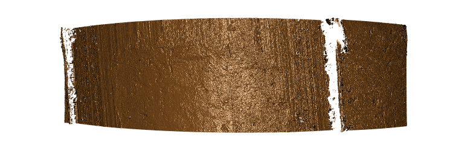

# Firearms: bullets {#bullets}


## Introduction

When a bullet is fired from a gun barrel, striation markings from imperfections in the barrel manufacturering process are imprinted onto what is called the Land Impression region of the bullet. These impressions are assumed to be unique to individual gun barrels, and as a result, traditional forensic science methods have employed trained forensic examiners to assess the likelihood of two bullets being fired from the same barrel (a "match"). Conventionally, this has been done using the metric Consecutively Matching Striae, or CMS [@biasotti:1959]. However, no official standards have been established to scientifically delineate a number that effectively separates matches from non-matches. Therefore, significant work has been done, and continues to be done, in order to add scientific rigor to the bullet matching process.

The 2009 National Academy of Sciences Report [@NAS:2009] may have been the "call-to-arms" that the field needed. This report both criticized the lack of rigor seen to this date, but also described the "path forward". As the authors saw it, the path forward included an aption of standards. A standard format to represent the structure of bullets opened the door for much of what you'll read about in this chapter, including opening up the formerly unknown process of bullet matching to a much wider audience, and providing the foundations for truly automated and statistical algorithms to perform the procedure.

In this chapter, we outline the new standard data format used to store three-dimensional bullet scans. We proceed by outlying relevant R packages for the processing and analysis of these scans. Finally, we discuss ways in which to draw conclusions based on these results, and tie it all together in the form of a relevant case study.

## Data 

Data on both breech face and land impressions are available from the NIST Ballistics Database Project in the x3p (XML 3-D Surface Profile) format. This format was designed to implement a standard for exchanging 3D profile data. This format was adopted by the Open Forensic Metrology Consortium, or OpenFMC, a group of firearm forensics researchers whose aim is to establish best practices for researchers using metrology in forensic science.

Figure \@ref(fig:x3pcontain) shows an illustration of the internal structure of the x3p file format. x3p files contain an XML data file with metadata on the bullet scans, as well as binary data containing the surface topology measurements. The metadata includes information on the scanning equipment and operator, as well as information on the resolution of the scans. 

```{r x3pcontain, echo=FALSE, fig.cap='An illustration of the internal structure of the x3p file format. x3p files contain an XML data file with metadata on the bullet scans, as well as binary data containing the surface topology measurements.'}
knitr::include_graphics("img/x3p_container.png")
```

The use of the x3p format has positively impacted procedures relating to forensic analysis of bullets. Because the format is an open standard, researchers on a wide range of computing platforms can access and analyze the data. Due to the x3p container holding a rich set of metadata, the limitations of traditional "black box"-type file formats are eliminated. The source, parameters, and raw data contained within each 3D scan is readily available for critical analysis and examination.

## R Package(s)

The first R package created to read and process x3p files was `x3pr` [@x3pr]. This package includes reading routines, to read in both the data as well as the metadata, of a particular bullet land, as well as some plotting functions and a writing routine to create x3p files. A new package, `x3ptools` [@x3ptools], was created to handle some limitations in x3p and expand upon the functionality. A companion package, `bulletr` [@bulletr], expands upon x3ptools and provides functions to perform an automated bullet analysis routine based on the algorithms described in @hare2017.

The two packages `x3ptools` and `bulletr` will be the focus of the remainder of this chapter.

### x3ptools

Although `x3ptools` isn't written specifically for the purposes of handling bullet scans, it is the package of choice to begin a bullet analysis. In fact, the package itself is generic and can handle a wide range of data types that use the x3p container format.

To begin, the package can be installed from CRAN:

```{r, eval=FALSE}
install.packages("x3ptools")
```

We will load the package and use some pre-provided x3p data to get a feel for the package functionality. We will work with the Center for Statistical Applications in Forensic Evidence (CSAFE) logo. In its original colored form, the logo looks like Figure \@(fig:csafelogo).

```{r csafelogo, fig.cap='The CSAFE logo.'}
knitr::include_graphics("img/csafe-logo.jpeg")
```

A scan of a 3D version of this logo is available, where portions of the logo are raised and recessed. This makes for a good test case in introducing `x3ptools` and the idea behind 3D scans of objects, as we transition towards bullet analysis.

```{r, message=FALSE, warning=FALSE}
library(tidyverse)
library(x3ptools)

logo <- read_x3p(system.file("csafe-logo.x3p", package = "x3ptools"))
names(logo)
```

We can see that there are five elements to the list object returned:

- **header.info** - Provides us information on the resolution of the scan
- **surface.matrix** - The actual surface data of the scan
- **feature.info** - Properties of the scan itself
- **general.info** - Information on how the data was captured
- **matrix.info** - Some information expanding upon header.info

The two most relevant for our purposes are **header.info** and **surface.matrix**. To begin to understand this container format better, we can use the `image_x3p` function to produce a visualization of the surface. In interactive mode, this would be an interactive display. Here we're using the `file` parameter to export as a static image for purposes of viewing in this book, shown in Figure \@(fig:csafelogoscan).

```{r csafelogoscan, fig.cap='3D surface scan of the CSAFE logo.'}
image_x3p(logo, file = "img/csafe-logo-scan.png")

```

We can use the function `x3p_to_df` in order to convert this structure into a standard R data frame, which will allow us to do any number of data manipulation and plotting routines. In this case, Figure \@ref(fig:x3pplot) shows a simple scatterplot created with `ggplot2` of the height measurements across the surface of the bullet.

```{r x3pplot, fig.cap='A simple scatterplot created with ggplot2 of the height measurements across the surface of the bullet.'}
logo_df <- x3p_to_df(logo)

ggplot(data = logo_df, aes(x = x, y = y, color = value)) +
  geom_point()
```

A key feature of the data is that the `value` column represents the height of the pixel corresponding to the particular location. In this logo, we can see that the fingerprint section of the logo is raised above the background quite clearly. As we transition to operating on images of bullets, this will be important to note.

One other important feature of the package is the ability to sample. Depending on the size and resolution of a particular scan, the resulting object could be quite large. This CSAFE logo, despite being a relatively small physical size, still results in a 310,479 row data frame. Though manageable, this means that certain routines, such as producing the above scatterplot, can be quite slow.

At times where resolution isn't a huge concern, we may elect to sample the data to reduce the resulting size. This can be done with the `sample_x3p` function. The function takes a parameter `m` to indicate the sampling factor to use. For example, a value of `m = 4` will sample every 4th height value from the 3D scan, as illustrated in Figure \@ref(fig:samp).

```{r samp, fig.cap='A sampled scan of an x3p file extracted using the sample_x3p function.'}
sample_logo <- sample_x3p(logo, m = 4)

sample_logo_df <- x3p_to_df(sample_logo)

ggplot(data = sample_logo_df, aes(x = x, y = y, color = value)) +
  geom_point()
```

You can see the clarity of the resulting plot has noticeably declined, but the overall structure has been maintained. Depending on the application, this could be a solution for making a slow statistical process a bit faster.

### bulletr

As mentioned, we will use the `bulletr` package to process 3D surface scans of bullets. This package depends on `x3ptools` for the reading and writing portion (involving x3p files) but otherwise focuses on statistical routines for matching bullets. The package is available on CRAN, and can be installed as follows:

```{r, eval=FALSE}
install.packages("bulletr")
```

We are going to pull data from the National Ballistics Toolmark Research Database at NIST. We will download the surface scan for a bullet from the Hamby Study [@hamby:2009].

```{r, message=FALSE}
library(bulletr)
library(curl)

bullet_temp <- tempfile()

curl_download("https://tsapps.nist.gov/NRBTD/Studies/BulletMeasurement/DownloadMeasurement/0a59a13e-a7db-47bd-a96e-f2dc7895ec1f", bullet_temp)

br1_b1_l1 <- x3ptools::read_x3p(bullet_temp)
```

A note on the naming convention: A bullet is composed of a certain number of **land impressions**. The rifling of the barrel induces these land impressions, which can be seen as a series of alternating raised and recessed portions on the fired bullet. In addition, manufacturing defects imprint **stariation markings** on the bullet as it travels through the gun barrel when fired [@afte:1992].

Why is this relevant to this portion? The data we just read in is of one single land. That is, it is a portion of the bullet that is assumed to contain striation markings. You'll notice the naming convention `br1_b1_l1`. This indicates that we are looking at a bullet that was fired from Barrel 1 (`br1`). It's the first bullet (`b1`), and the first land on that bullet (`l1`). When working with lots of bullet data, it's important to stay organized in terms of the naming convention of objects in your R session.

Let's take a quick look at what we see on this bullet land (Figure \@ref(fig:b111)).

```{r b111, fig.cap='Land 1 of Bullet 1 from Barrel 1 of the Hamby Study (Set 44).'}
image_x3p(br1_b1_l1, file = "img/b111-scan.png")

```

Immediately, the vertical striation markings become clear. To better visualize these markings, we can extract a cross-section from the bullet and plot in two dimensions. To accomplish this, `bulletr` provides us with a function `bulletCheckCrossCut` to choose the ideal location at which to do so. We set the `path` parameter to a blank string because we've already read in the bullet land, so there is no need to do so again.

```{r}
br1_b1_l1 <- bulletr::read_x3p(bullet_temp)
cc_b11 <- bulletCheckCrossCut(path = "", bullet = br1_b1_l1)
cc_b11
```

This value provides us with the location, in number of pixels, at which the algorithm believes is a good place to extract a cross-section. The two primary criteria for determining this are:

1. The location should be nearest the barrel ($x = 0$) because the striae are most pronounced there.
2. Cross-sections taken near this location should be similar to this cross-section (stability).

`bulletCheckCrossCut` looks for the first cross-section meeting this criteria, searching upwards from the base of the bullet land. With this value, we can extract and plot the cross-seciton like so (Figure \@ref(fig:cc)):

```{r cc, fig.cap='Cross-section of the bullet land at the ideal cross-section location.', warning=FALSE}
ccdata_b11 <- get_crosscut(bullet = br1_b1_l1, x = cc_b11) 

ggplot(data = ccdata_b11, aes(x = y, y = value)) +
  geom_line() +
  theme_bw()
```

Most of the scans exhibit the pattern that we see here, where there are "wedges" on the left and right side - This area is called the **shoulder**, and its the area separating the land impression (the curved region in the middle) from the groove (the area not scanned because it doesn't exhibit striations). In other words, to better hone in on the striae along the land, we should subset this region to include only the middle curved land impression portion. Fortunately, `bulletr` provides us with functionality to automatically do that. First, we use the `get_grooves` function to detect the location of the grooves. This returns a list object, with one element being the two locations along the axis, and the lother element being the plot, given in Figure \@ref(fig:grooveloc).

```{r, grooveloc, fig.cap='Location of the grooves in our bullet scan, as detected by the get_grooves function.', warning=FALSE}
grooves_b11 <- get_grooves(bullet = ccdata_b11, groove_cutoff = 700, adjust = 60)
grooves_b11$plot
```

With the grooves detected, we can now smooth out the surface using a LOESS [@cleveland:1979]. Once we do so, we obtain what we call a **bullet signature**, Figure \@(fig:loess), representing the clearest picture yet of the striation markings along the surface of the land.

```{r loess, fig.cap='LOESS-smoothed version of our bullet profile, called the bullet signature.', warning=FALSE}
b111_processed <- processBullets(bullet = br1_b1_l1,
                                 name = "b111",
                                 x = ccdata_b11$x[1],
                                 span = 0.75,
                                 grooves = grooves_b11$groove) %>%
  bulletSmooth(span = 0.03)

ggplot(data = b111_processed, aes(x = y, y = l30)) +
  geom_line() +
  theme_bw()
```

The bullet signature is the key piece for extraction out of the `bulletr` package. With multiple bullet signatures, matches can quickly and easily be made using the `bulletGetMaxCMS` function, which we will discuss later on in the chapter.

## Drawing Conclusions

## Case Study

