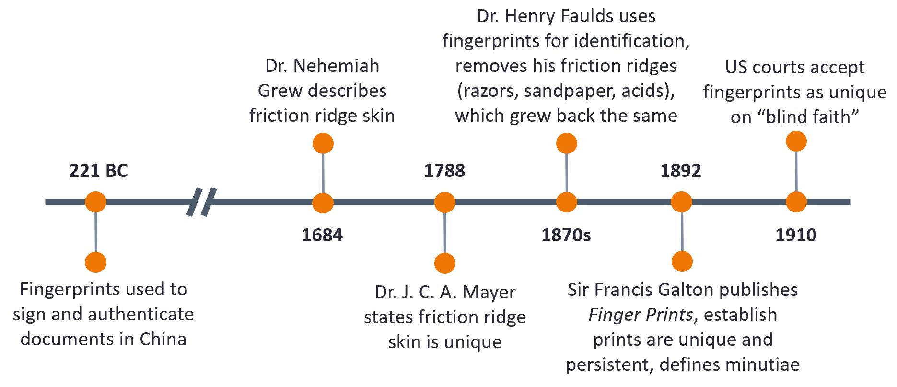

# Latent Fingerprints {#fingerprints}

## Introduction

(ref: DOJ fingerprint handbook)

placeholder tineline, edit/add to, probably move out of image format

Level 1 detail: friction ridge flow, pattern type, and general morphological information.

Level 2 detail: individual friction ridge paths and associated events, including minutiae (features).

Level 3 detail: friction ridge dimensional attributes, such as width, edge shapes, pores, scars.

Terminology? latent, exemplar, dusting, lifting

ACE-V process - Analysis, Comparison, Evaluation, Verification

AFIS/(I)AFIS - (Integrated) Automatic Fingerprint Identification System used by the FBI, black box. Takes a fingerprint image and returns the top _n_ matches in a database, which LPEs use to go through the ACE-V process manually

## Fingerprint Quality Metrics and Algorithms

Fingerprint quality metrics/algorithms (generally) fall into two types: global and feature specific. Global scores assign a single score to an entire fingerprint image, while feature specific algorithms give a score to each feature or minutiae. This requires having marked minutiae, either by a latent print examiner (LPE) or an automated method (MINDTCT, etc.)

Peskin and Kafadar algorithm: feature specific, score from 0-100 for each feature.

## Data 

NIST SD27a database that used to be available online. Contains just under 300 latent and exemplar print pairs that two or more LPEs have agreed "match"; i.e., these are not guaranteed to be ground truth matches.

## R Package(s)

## Drawing Conclusions

## Case Study
