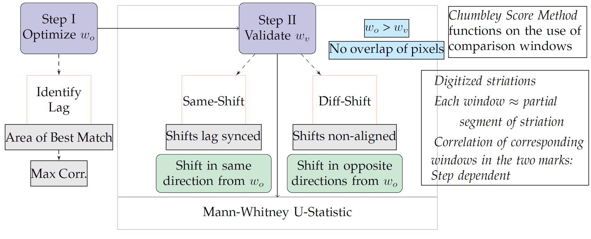

# Toolmarks {#toolmarks}

#### *Authors* {-}

## Introduction to Toolmark analysis

Toolmarks found on crime scenes have been an important part of forensic evidence presented in court proceedings. Unambiguous comparison of any two toolmarks to identify the source is therefore necessary for being presented as conclusive evidence. In current standards such comparisons are made by Forensic Toolmark Examiners (FTEs) by looking at the markings under a comparison microscope and concluding if there is a sufficient degree of agreement between them. One drawback with this kind of comparison is that it introduces subjectivity in conclusions made by the examiners. This is one reason why objective methods of comparison were given serious considereation. One way of achieving objectivity is by the development of automated comparison methods that can be used to suggest error rates and thereby provide better understanding of how same-source or different-source classifications are made. Automated methods for solving the same source problem in toolmarks usually take two markings, convert them into a digitized format, standardize the marking, identify regions of interest, align the markings, calculate the correlation between the markings and try to come up with a score by performing a statistical test on them. Particularly for striated toolmarks, some such algorithmic methods have been developed for objective comparisons which not only give you a score but also allow calculation of associated error rates. Depending on the objective method being considered, sometimes these striated marking have been thought to comprise of broadly two distinct features. These features of the markings are the class characteristics of the manufactured class of tools and individual characteristics of the tool \cite{hadlermorristhesis}. The toolmark is therefore assumed to be decomposable into these feature. The class charaterstics here are the trend lines of the toolmark that signify the overall structure of the marking, while the individual characteristics are the minute oscillations observed on the marking trends. In this chapter we will be looking at some of these methods of objective comparison and look closely how the comparisons are made by them.

## R packages

The 'toolmaRk' package in R, is a package available for objective analysis of toolmaRks in R and the only one to do so. The package has three methods of making a comparison between two markings. 

## Data

For our examples we will be using striated markings made by screwdrivers under different angles. The data was generated at Ames lab \cite{datatoolmark} and is available inside the 'toolmaRk' package. It consists of a sample of 16 toolmark profiles and descriptors. These profiles represent a cross-sectional cut information extracted from the surface on which the marking was made. The measurements in these profiles are taken at equispaced intervals across the toolmark.  The profiles with the same toolmark identifier are known matches, all other profiles are known non-matches.
The 'ID' variable is a toolmark identifier and Factor variable. The side of the screwdriver from which the marking was made is called side. It is a factor variable with values A or B. The 'angle' variable is the degree of the angle under which the toolmark was created. 'Rep' on the other hand shows the replicate number for a toolmark, while 'side' is the side of the tool used to generate the marking. The sample data provided is not complete, therefore it only shows one randomly sampled replicate for each of the 16 profiles under consideration. For a more complete data set or more information please contact the references given below.

In the following sections of this chapter we will be discussing the available methods for an analysis of toolmarks from the 'toolmaRk' package. We will first build an intuition about what these methods are, along with how to use them in R. This allows us to understand what to expect out of the function  and how to make better inference from the output from these methods as we compare two toolmarks.

## Methods

### Hypothesis

The hypothesis for all methods implemented in the 'toolmaRk' package follow the principles of court. It means that given a crime has been committed, a suspect brought in court, is considered innocent until proven guilty. In similar lines, for setting up a null and alternate hypothesis, a match that identifies the source of a marking to be the same, is considered incriminating. Therefore the hypothesis for a statistical test that identifies a toolmark as same-sourced or different sourced is considered as follows

**H~0~**: The two markings being compared come from different sources.  
**H~A~**: The two markings being compared come from the same source.

This means that the statistical test being performed, has to have sufficient evidence to reject the null hypothesis in order to conclude that two markings come from the same source.

### Normalization and Smoothness settings

The normalization of markings is an important step in all the methods of comparison of two toolmarks as implemented in the 'toolmaRk' package. It removes relatevely smooth or long-range trends and any small aberrations or "fixturing errors" introduced in the markings during the digitizing of the markings. To achieve this a coarse LOWESS smooth is applied which resolves the aforementioned problems. The residuals from this coarse LOWESS smoothing is the normalized toolmark and is used in the comparison process for calculating a similarity index betweek two such toolmarkings.


### Toolmark Windows

The methods used in the 'toolmaRk' package all rely on taking small equi-distant segments of each toolmark under considersation for comparison. These segments can be thought of small windows in the toolmark. These windows are used to calculate correlations at different positions of one toolmark with that of the  second toolmark. The length of the windows are manually selected and both toolmarks being compared will have the same number of windows. This is important because if the number of windows is say n, then the correlation matrix of the two toolmarks will have n x n elements in it.

### Diamond Search Fixed Width methods

The diamond search method is a method that relies on finding a suitable constraint region in the covariance or correlation matrix of the two marking. Each row and column of this correlation matrix represents a correlation between a window from the first toolmark and a window from the second toolmark. The constraint on the correlation matrix is for having a more appropriate search region around the maximum correlation identified in the matrix. The maximum correlation represents the maximum correlation between two windows in the two toolmarks under consideration and therefore signifies the lag between the two marking. The diamond search methods allow for a a diamond shaped search region around this point in the correlation matrix. Here a new parameter M is introduced to restrict the allowable search region for a maximized correlation by disallowing the first and last M rows and columns from matrix. Therefore M can be thought of the parameter that helps define the perimeter of the search region around the maximum correlation point. 

The diamond search fixed width methods rely on the assumption that the toolmarks can always be decomposed into its class and individual components. It also relies on stationarity assumptions. 

The R functions 'fixed_width_with_model' and 'fixed_width_with_no_model' use the diamond search fixed width method in its computations. These functions return results in the form of variables and plots. The meaning of these lists, variables and plots are given below:

1.  max_corr ::  maximized indiviudal component correlation, this is the value of the maximum correlation
2.  Smooth_offset ::  optimal Class offset, this is location of the maximum class correlation matrix
3.  Resid_offset ::  optimal individual offset, this is location of the maximum individual correlation matrix as computed by applying search constraints
4.  dist_pval ::  distance p-value, this is the p-value computed using the distance test statistic
5.  thresh_pval ::  threshold p-value, this is the p-value computed using the threshold test statistic.
6.  Above ::  Number of offsets with correlation bigger than threshold
7.  total_thresh ::  2*M+1, this is the interval width of the search region.
8.  mark1_decompostion ::  plot of decomposition, shows the class and individual component of the first toolmark along with the normalized toolmark.
9.  mark2_decompostion ::  plot of decomposition, shows the class and individual component of the first toolmark along with the normalized toolmark.
10. class_correlations ::  plot of class correlation, shows a visalization of the correlation matrix of the class component of the toolmark
11. individual_correlations ::  plot of individual correlation, shows a visalization of the correlation matrix of the individual component of the toolmark
12. distance_plot ::  distance_plot
13. threshold_plot ::  threshold_plot

To better understand what these results stand for and to be able to draw conclusions from them, we will have a closer look at the most important aspects of these functions, and their most important steps in the following sections. In te

#### Smoothness for class and individual component decomposition

\citep{bachrach} noted that “waviness" of a toolmark can be considered to be the class characteristics, while the individual characteristics are the “roughness" or deviations around the waviness. Therefore for the decomposition of the toolmarks the class component of the normalized tool mark is accepted as the general, long scale trend of the mark and the individual component is the shorter scale residual deviations around this trend.

In order to achieve these decompositions a second LOWESS smooth is applied to the normalized toolmarks and has a lower degree of smoothing than the smoothing that is done during the normalization step. This results in a representation of the trend which is considered to be the class component. The residuals of this smooth, which are the unique oscillations around this general trend, is the individual component. All the three i.r normalized marking, and two decomposed marking have approximately zero mean. From this it is clear the class component captures the general shape of the mark and
the individual component is the unique deviations around this trend.


```{r echo=FALSE, message=FALSE, warning=FALSE, results='hide'}
load("./dat/ameslab.RData")
library(tidyverse)
dat1 <- ameslab$profile[[1]]
dat1 <- matrix(dat1[round(0.01*nrow(dat1)):round(0.99*nrow(dat1)),], ncol = 1)
coarse = 0.25
y1 <- dat1 - lowess(y = dat1,  x = 1:nrow(dat1), f= coarse)$y

tmark<- data.frame(x = 1:nrow(y1), Depth = y1)
colnames(tmark)

ggplot(tmark, aes(x = x, y = Depth)) +  geom_line() + 
  ggtitle("Normalized toolmark") + theme_bw()

fine = 0.01
y1class <- lowess(y = y1,  x = 1:nrow(dat1), f= fine)$y

tmarkclass<- data.frame(x = 1:length(y1class), Depth = y1class)
colnames(tmarkclass)

ggplot(tmarkclass, aes(x = x, y = Depth)) +  geom_line() + 
  ggtitle("Class component") + theme_bw()

resid.indiv <- as.numeric(y1 - y1class)

tmarkindiv<- data.frame(x = 1:length(resid.indiv), Depth = resid.indiv)
colnames(tmarkindiv)

ggplot(tmarkindiv, aes(x = x, y = Depth)) +  geom_line() + 
  ggtitle("Individual component") + theme_bw()

```


#### Distance Test Statistic

To understand this we recall the decomposition of each toolmark being compared into class and individual component series. The intuition behind understanding this test statistic is that given the location of the maximum of the class component correlation matrix (optimal class offset), the same location can be found in the correlation matrix of the individual component. A constraint which defines a diamond search perimeter is put on the individual component correlation matrix around the optimal class offset postition. Given this perimeter, the maximum of individual component correlation is computed.

The distance test statistic is therefore defined as follows
       t = absolute value of the difference between the Optimal class offset and the Optimal Individual offset 
  and the p-value which helps classify the two toolmarks as same-source and different source is computed as follows
     Pr(T <= t ) = (2t +1)/(2M+1) 
     where t is the realized  value of the test statistic as shown above and 2M+1 is the interval width of the searc region. For tool marks made by the same tool, we expect relatively small values of T.
     
#### Threshold Test Statistic

The threshold test statistic follows the same setup as described above for the Distance test statistic, but instead of computing the distance, searches the diamond search region in the individual component correlation matrix to identify the number of correlation values that are greater than or equal to the maximum of the class component correlation matrix. This is the number of offsets and is the thrshold test statistic t as the threshold here is the maximum of the class component correlation matrix. The computed t is used in the p-value computations for classification of matches and non-matched. The p-value has the same form as for the distance test statistic i.e (2t+1)/(2M+1).
Therefore to have evidence against the null hypothesis, we need only a small number of offsets from the individual components to result in a similarity value larger than the threshold as described above. A small p-value therefore rejects the null and concludes that the two marks were made by the same tool.

### Diamond search method based functions in R  
#### Fixed width method with direct correlation computation

This method follows all the described above, and only deals with direct pearson correlations computed between windows to generate the correlation matrix. The method does not involve any further modeling steps in it for identifying the optimal offset. It is therefore all that is described above and no additional steps are required.

#### Fixed width method with modeling in correlation matrix

In this method the correlation matrix are first generated for both the class and individual components. The pearson correlations of the comparison windows are what comprise of the correlation matrix. a potential drawback of defining the optimal
class offset as described earlier, is that there is no guarantee that all windows of comparison with the same optimal class offset value will produce large correlation values in the correlation matrix of individual component correlation matrix or the normalized marking correlation matrix (when correlations are computed between windows of comparison of two non-decomposed but normalized toolmarks to produce a correlation matrix). In fact the same optimal class offset value might have both the largest correlation values as well as the smallest correlation values in the normalized correlation matrix. To circumvent this contradiction, a modeling effort is made to first identify the optimal offsets for both the components.

The modeling effort basically takes the current class correlation matrix as the responses and then finds estimates for a new correlation term that is supposed to be a parameter in the model and dependent on a new more restrictive search region. This search region now accounts for the minimum pearson correlation values from the original pearson class correlation matrix, that the same offset can take. The new estimated class correlation matrix is now used in the same way to compute the laocation of the maximum class correlation component. The rest of the statistical testing methods follows on the same lines as described in the previous sections. 


### Chumbley Adjusted Non-random score

The chumbley score method since it was first developed has gone through many modifications. The most recent and the only non-random versions are available in the 'toolmark' package. In this chapter we will be discussing these methods of comparing two toolmarks as developed. The adjusted chumbley non-random method \cite{gkhh-chumbley} and chumbley non-random as developed by \cite{hadler} are both available in the 'toolmaRk' package. 

The method comprises of specifying a comparison window size for the so called optimization step and validation step, and  a coarseness parameter for the LOWESS smooth. The blockdiagram shown in \@ref{fig:blockdiag}, gives an overview of the chumbley score algorithms.


```{r blockdiag, echo=FALSE}

```


The chumbley score methods as found in the 'toolmark' package all work on the same principle as shown in \@ref{fig:blockdiag}. The optimization step includes computation of correlation between all possible combinations of optimization windows in the two signatures to generate an optimization step correlation matrix. The maximum value of this matrix essentially identifies the optimal locations by identifying the corresponding windows in the two toolmarks. The location of the pair of windows in the two markings is used to compute the lag in the two toolmarks. This is also called the optimal offset. Now the intuition is that for shifts in the pair of windows (a smaller window size) that are synchronized with the lag or this optimal offset, should in theory have higher correlations when the ground truth for the two toolmarks is a match. The correlation of these set of synchronized pair of windows would be systematically higher when compared to pairs of windows that do not correspond to a synchronized offsetting. The same-shift step therefore corresponds to a lag synchronized selection of pairs of windows and computing there correlations, while the different shift step corresponds to picking pair of windows that are not lag synchronized and computing a set of correlations for these. A Mann-whitney U statistic is then computed by comparing the same-shift set and the different-shift set of correlations. This U-statistic is used to compute a p-value and therefore classify the two toolmarks as same-source or different-source. \cite{gkhh-chumbley}

### Computational Considerations

#### Coarseness parameter values
For the Diamond Search fixed width functions there are two kinds smoothness parameter values namely 'coarse' and 'fine'. The coarse parameter is used for normalization, while the parameter 'fine' is used to get the class component of the two markings. The residual or the difference between these two smoothed processes is the individual component. The default value for 'coarse' is defined as 0.25 while that for the 'fine' is 0.01.

For the Chumbley score methods there is no decomposition of the marking into class and individual components, but the first step is still to normalize the toolmark. Therfore, the 'coarse' parameter in this method is used to remove the major trend of the marking and to normalize it. One LOWESS smooth is therefore enough to achieve this and the value is taken around 0.25 for toolmarks.

#### Window size selection

The choice of the window size is generally dependent on the size of the toolmark. An approximate rule of thumb suggested by \cite{hadler} for the Chumbley score methods is to use 10% of the length of the toolmark as the size of the optimization window. The size of the validation window is much smaller than the optimization window. This leads to a bigger correlation matrix for both same-shift comparisons as well as different shift comparisons. This said, the choice of the window size can have a big effect on the performance of the algorithm, especially if going too small or too large. An example of an indepth analysis on the choice of windows in the chumbley score methods can be seen in the work of \cite{gkhh-chumbley). In the diamond search fixed width methods there is only one window size that needs to be specified. The default window size for this is taken around 6% of the toolmark length.


#### Case Study

To construct the set of comparisons, we  

1. First specify the two toolmarks to be compared. For this we first choose a set of known match or same-source pairs and then a pair of different source pairs to see how the different tests perfrom.
```{r echo=TRUE, eval=FALSE, results='asis'}
# Same-source toolmarks
known_match.dat1<- ameslab$profile[[1]]
known_match.dat1 <- matrix(known_match.dat1[round(0.01*nrow(known_match.dat1)):round(0.99*nrow(known_match.dat1)),], ncol = 1)

known_match.dat2<- ameslab$profile[[2]]
known_match.dat2 <- matrix(known_match.dat2[round(0.01*nrow(known_match.dat2)):round(0.99*nrow(known_match.dat2)),], ncol = 1)

# Different source toolmarks
known_non_match.dat1<- ameslab$profile[[1]]
known_non_match.dat1 <- matrix(known_match.dat1[round(0.01*nrow(known_non_match.dat1)):round(0.99*nrow(known_non_match.dat1)),], ncol = 1)

known_non_match.dat2<- ameslab$profile[[2]]
known_non_match.dat2 <- matrix(known_non_match.dat2[round(0.01*nrow(known_non_match.dat2)):round(0.99*nrow(known_non_match.dat2)),], ncol = 1)

```


2. Adjusted Chumbley score method by \cite{gkhh-chumbley}
```{r echo= TRUE, eval = FALSE}
# Analysis and Results for Same-source markings
# Specify parameter values
optim_win = 500
val_win = 50
coarse_smooth = 0.25

# Adjusted chumbley score function
chnra_scoring_knownmatch<- chumbley_non_random_adj(known_match.dat1, known_match.dat2, window_opt = optim_win, window_val = val_win, coarse = coarse_smooth) 

# Results
chnra_scoring_knownmatch$p_value
# 9.19e-06
chnra_scoring_knownmatch$U
# 4.28
chnra_scoring_knownmatch$same_shift_n
# 94
chnra_scoring_knownmatch$diff_shift_n
# 94
```

```{r echo = TRUE, eval = FALSE}
# Analysis and Results for different-source markings
# Specify parameter values
optim_win = 500
val_win = 50
coarse_smooth = 0.25

# Adjusted chumbley score function
chnra_scoring_known_nonmatch<- chumbley_non_random_adj(known_non_match.dat1, known_non_match.dat2, window_opt = optim_win, window_val = val_win, coarse = coarse_smooth) 

# Results
chnra_scoring_known_nonmatch$p_value
# 
chnra_scoring_known_nonmatch$U
# 
chnra_scoring_known_nonmatch$same_shift_n
# 
chnra_scoring_known_nonmatch$diff_shift_n
# 
```


3. Diamond search fixed width with no modeling
```{r echo = TRUE, eval = FALSE}
# Analysis and Results for Same-source markings
# Specify parameter values
coarse_smooth = .25
fine_smooth = .01
win_size_perc = .6
M = 500

# Run function
fwnm_scoring_knownmatch<- fixed_width_no_modeling(known_match.dat1, known_match.dat2, coarse = coarse_smooth, fine = fine_smooth, window.size = win_size_perc, M = M)

# Results 
fwnm_scoring_knownmatch$dist_pval
# 0.015
fwnm_scoring_knownmatch$thresh_pval
# 0.015
fwnm_scoring_knownmatch$max_corr
# 0.507
fwnm_scoring_knownmatch$Above
# 14
fwnm_scoring_knownmatch$Smooth_offset
# 22
fwnm_scoring_knownmatch$Resid_offset
# 29
```

```{r echo = TRUE, eval = FALSE}
# Analysis and Results for different-source markings
# Specify parameter values
coarse_smooth = .25
fine_smooth = .01
win_size_perc = .6
M = 500

# Run function
fwnm_scoring_known_nonmatch<- fixed_width_no_modeling(known_non_match.dat1, known_non_match.dat2, coarse = coarse_smooth, fine = fine_smooth, window.size = win_size_perc, M = M)

# Results 
fwnm_scoring_known_nonmatch$dist_pval
# 
fwnm_scoring_known_nonmatch$thresh_pval
# 
fwnm_scoring_known_nonmatch$max_corr
# 
fwnm_scoring_known_nonmatch$Above
# 
fwnm_scoring_known_nonmatch$Smooth_offset
# 
fwnm_scoring_known_nonmatch$Resid_offset
# 
```

4.  Diamond search fixed width with modeling

```{r echo = TRUE, eval = FALSE}
# Analysis and Results for Same-source markings
# Specify parameter values
coarse_smooth = .25
fine_smooth = .01
win_size_perc = .6
M = 500

# Additional Package Dependencies on 'glmnet' and 'Matrix', make sure they are installed
# before using this function

# Run function
fwwm_scoring_knownmatch<- fixed_width_with_modeling(known_match.dat1, known_match.dat2, coarse = coarse_smooth, fine = fine_smooth, window.size = win_size_perc, M = M)

# Results 
fwwm_scoring_knownmatch$dist_pval
# 0.007
fwwm_scoring_knownmatch$thresh_pval
# 0.006
fwwm_scoring_knownmatch$max_corr
# 0.519
fwwm_scoring_knownmatch$Above
# 5
fwnm_scoring_knownmatch$Smooth_offset
# 26
fwnm_scoring_knownmatch$Resid_offset
# 29
```

```{r echo = TRUE, eval = FALSE}
# Analysis and Results for different-source markings
# Specify parameter values
coarse_smooth = .25
fine_smooth = .01
win_size_perc = .6
M = 500

# Additional Package Dependencies on 'glmnet' and 'Matrix', make sure they are installed
# before using this function

# Run function
fwwm_scoring_known_nonmatch<- fixed_width_with_modeling(known_non_match.dat1, known_non_match.dat2, coarse = coarse_smooth, fine = fine_smooth, window.size = win_size_perc, M = M)

# Results 
fwwm_scoring_known_nonmatch$dist_pval
# 0.007
fwwm_scoring_known_nonmatch$thresh_pval
# 0.006
fwwm_scoring_known_nonmatch$max_corr
# 0.519
fwwm_scoring_known_nonmatch$Above
# 5
fwnm_scoring_known_nonmatch$Smooth_offset
# 26
fwnm_scoring_known_nonmatch$Resid_offset
# 29
```

### Dependence on parameter values

### Inference and drawing conclusions


With a conclusive classification of the two markings as match or non-match from the three methods, its often important to also identify how good these methods are in reality. To do so we need a sample dataset with a large number of comparisons and ground truth available. Given the ground truth of several such cross-comparisons, its often helpful to make a confusion table which gives a good insight into how to intuitively think of the results. A confusion table and ROC curves can give us the False Positives, False Negatives, True Positives and True Negatives of the comparisons using the three methods prescribed in this chapter. This allows us to compute the error rates. The identification of error rates not only helps build trust into these objective method, but also allows understanding of the limitations under different parameter settings.

