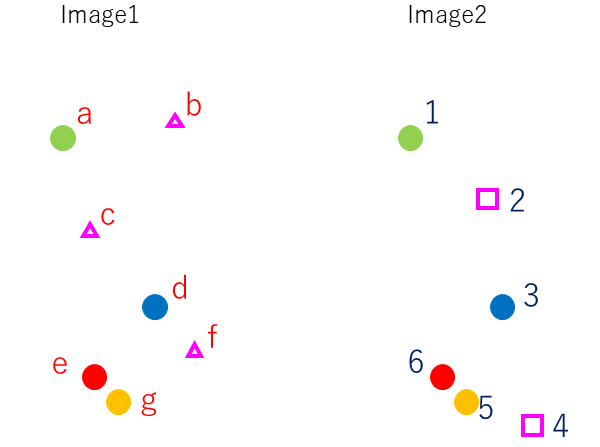
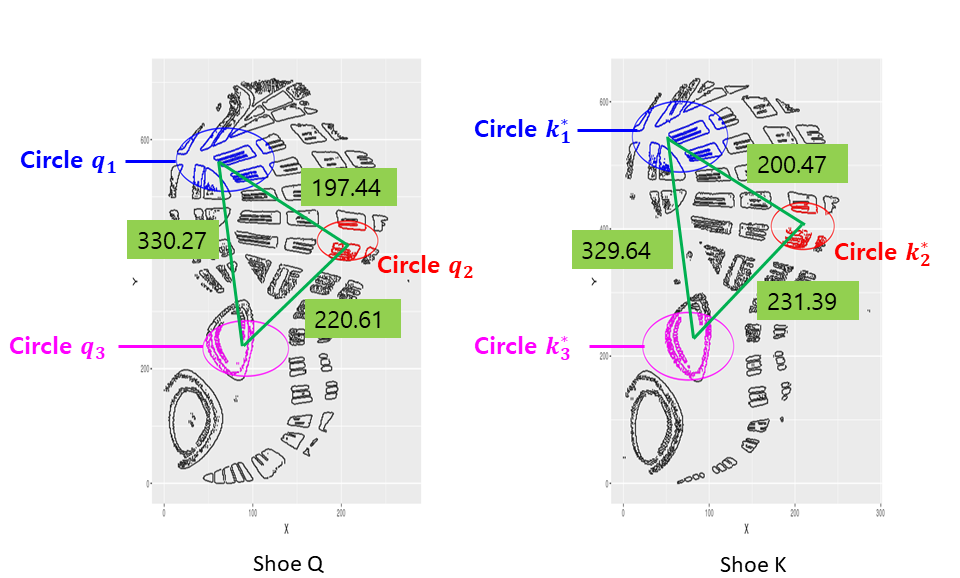
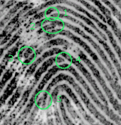

--- 
title: "Open Forensic Science in R"
author: "Editors: Sam Tyner, Heike Hofmann"
date: "`r Sys.Date()`"
site: bookdown::bookdown_site
output: bookdown::gitbook
documentclass: book
bibliography: [bib/book.bib, bib/packages.bib, bib/glass.bib, bib/shoe.bib, bib/fingerprint.bib, bib/dna1.bib, bib/humans.bib, bib/bullets.bib, bib/casings.bib, bib/marketplaces.bib]
biblio-style: apalike
link-citations: yes
github-repo: rstudio/bookdown-demo
description: "This book is for anyone looking to do forensic science analysis in a data-driven and open way."
---

# Prologue {.unnumbered}

This book is for anyone looking to do forensic science analysis in a data-driven and open way. Whether you are a student, teacher, or scientist, this book is for you. We take the latest research, primarily from the Center for Statistics and Applications in Forensic Evidence ([CSAFE](https://forensicstats.org/)) and the National Institute of Standards and Technology ([NIST](https://www.nist.gov/)) and show you how to solve forensic science problems in `R`. The book makes some assumptions about you: 

1. **You have some experience with `R`.** We don't assume you're an expert by any means, but we do assume you're comfortable enough with it to install & library packages, load data, identify different data structures, and to follow along with the code we present in each chapter. If you need help getting started with `R`, check out [this free course from DataCamp](https://www.datacamp.com/courses/free-introduction-to-r). You can install `R` for Windows, Mac, and Linux [here](https://cloud.r-project.org/) for free. We also recommend you install [RStudio](https://www.rstudio.com/products/rstudio/download/), the wonderful free IDE (Integrated Development Environment) for `R`. If you want a deeper dive into `R`, take a walk through [*R for Data Science*](http://r4ds.had.co.nz/). If you really want to explore the depths, [*Advanced R*](https://adv-r.hadley.nz/) is an excellent resource. 
2. **You are interested in forensic science.** Hopefully that's why you're here! You may only be interested in DNA or bullets, so we've split the book up into chapters by forensic science subfield. You also don't have to be an expert in the field. We will explain the basics of the field in the introduction of each chapter. You can also download this book **(INSERT LINK)** and follow along on your own computer.
3. **You care about open source software.** This doesn't really affect your ability to read this book, but it's a nice quality to have. The purpose of this book is to make forensic science more accessible. Right now, most databases, algorithms, and programs that get used every day in forensic science are proprietary. This means that only the owners know how these systems work, how they were made, and what the source code looks like. This closed approach has lead to [miscarriages of justice](https://www.propublica.org/article/thousands-of-criminal-cases-in-new-york-relied-on-disputed-dna-testing-techniques). With this free online book that relies *solely* on open-source software for analysis, we hope to demonstrate the impact open source software can have on forensic science, both in research and in practice. And in this spirit of openness, we ask that you contribute if you find an error or want to add a chapter on a topic we didn't cover. You can open an issue **(INSERT LINK)** or fork the book's Github repository **(INSERT LINK)** and submit your changes via a pull request. 


# About the Authors {.unnumbered}


## Sam Tyner {-}

Sam is a Postdoctoral Research Associate in the [Center for Statistics and Applications in Forensic Evidence](https://forensicstats.org/) (CSAFE) at [Iowa State University](https://www.iastate.edu/) (ISU). She earned her Ph.D. in Statistics from ISU in 2017. In 2018, she received a fellowship from [rOpenSci](https://ropensci.org/blog/2018/02/14/announcing-2018-ropensci-fellows/) to create this free book for anyone interested in open source forensic science.

## Heike Hofmann  {-}

Heike is a Professor of Statistics at Iowa State University. 

## Soyoung Park {-}

Soyoung is ...

## Eric Hare {-}

Eric is the Chief Data Scientist at [Omni Analytics](https://omnianalytics.io/). He earned his Ph.D. in Statistics from Iowa State University in 2017. (?) 

## Xiao Hui Tai {-}

Xiao Hui is ...

## Karen Pan {-}

Karen is ...

## Amanda Luby {-}

Amanda is ... 


```{r include=FALSE}
# automatically create a bib database for R packages
knitr::write_bib(c(
  .packages(), 'bookdown', 'knitr', 'rmarkdown'
), 'packages.bib')
```

<!--chapter:end:index.Rmd-->

# Introduction {#intro}


## R Packages 

Here are all of the `R` packages used in this book. If you would like to download and compile this book on your own system, this chunk will install and load all of the necessary packages for you. If you run into issues with dependencies, please post an issue on the Github repo for this book. (INSERT LINK)

```{r all_packages, eval = FALSE}
# check if a package is installed, if not install it from cran
install_cran_missings <- function(pkgname){
  if(class(pkgname) != "character"){
    stop("pkgname must be a character")
  }
  if (!require(pkgname, character.only = TRUE, quietly = TRUE)){
    install.packages(pkgname, dep = T)
    if(!require(pkgname,character.only = TRUE)) stop("CRAN Package not found")
  }
}
# check if a package is installed, if not install it from Github
install_dev_missings <- function(pkgname, ghuser){
  if(class(pkgname) != "character"){
    stop("pkgname must be a character")
  }
  if (!require(pkgname, character.only = TRUE, quietly = TRUE)){
    repo <- paste(ghuser, pkgname, sep ='/')
    devtools::install_github(repo)
    if(!require(pkgname,character.only = TRUE)) stop("Github repo for package not found")
  }
}
# need devtools to get some packages 
install_cran_missings("devtools")

# Chapter 3: DNA Validation
install_cran_missings("strvalidator")

# Chapter 4: DNA Mixture
# TBD

# Chapter 5: Shoe 
# TBD

# Chapter 6: Bullets
install_cran_missings("tidyverse") # or install_dev_missings("tidyverse", "tidyverse")
install_cran_missings("x3ptools") # or install_dev_missings("x3ptools", "heike")
install_cran_missings("randomForest") 
install_dev_missings("bulletxtrctr", "heike")

# Chapter 7: Casings
if (!requireNamespace("BiocManager", quietly = TRUE))
    install.packages("BiocManager")
BiocManager::install("EBImage", version = "3.8")
install_dev_missings("cartridges", "xhtai")

# Chapter 8: Digital 
# TBD 

# Chapter 9: Fingerprints
install_cran_missings("bmp")
install_cran_missings("kableExtra")

# Chapter 10: Handwriting 
# TBD

# Chapter 11: Toolmarks
# TBD

# Chapter 12: Human Factors
install_dev_missings("blackboxstudyR", "aluby")
install_cran_missings("rstan")
install_cran_missings("RColorBrewer")
install_cran_missings("gridExtra")
install_cran_missings("gghighlight")
install_cran_missings("ggpubr")
```

<!--chapter:end:01-intro.Rmd-->

# Forensic Science Problems {#forscip}

The purpose of this chapter is to introduce the general type of problem that will be covered in the book. Investigators use forensic science resources to help solve crimes. At the highest level, the investigator is in charge of answering a very different question than the forensic scientist examining the evidence. The investigator wants to know who committed the crime, while the forensic scientist wants to determine the source of the evidence. The former is known as an *offense level hypothesis*, while the latter is the *source level hypothesis.* To write these hypotheses in the form of statistical hypothesis for testing, we write: 
\begin{align*}
H_0: & \text{The suspect committed the crime.} \\
H_A: & \text{The suspect did not commit the crime.}
\end{align*}
for the offense level and 
\begin{align*}
H_0: & \text{The suspect is the source of the evidence.} \\
H_A: & \text{The suspect is not the source of the evidence.}
\end{align*}
for the source level. Notice the distinction: the forensic scientist is not a criminal investigator, so their main concern is not "catching the bad guy." Instead, they are concerned with coming to the best conclusion using science.


First, let's define some terms: 

forensic evidence

forensic science

source hypothesis

activity hypothesis

offense hypothesis


<!--chapter:end:02-for-sci-prob.Rmd-->

# Validation of DNA Evidence Systems {#dnaval}

## Introduction

The earliest documented (https://www.bbc.co.uk/sounds/play/b008fcdz at 19:23) use of DNA profiling in the legal system was an immigration dispute in the United Kingdom. A young man of Ghanain (sp?) descent with family in the UK was believed to have forged his Ghanaian passport and had an expired British passport. DNA profiling techniques developed by Sir Alec Jeffreys were used to prove that the he was indeed his mother's son, and thus he did have a right to immigrate to the UK. The technique was subsequently used for many other parentage cases, and soon after, DNA profiling was used for the first time to convict someone of a crime. (Cite for colin pitchfork) 

When DNA profiling began, a blood sample was taken to create someone's "DNA fingerprint." Now, DNA can be taken by a cheek swab, and the most minute traces of DNA can tie a perpetrator to the scene of the crime. This is thanks to the polymerase chain reaction, or PCR, a method of copying a DNA sample over and over again to amplify the genetic signal for profile extraction. Once a DNA sample is amplified with PCR, different DNA markers can be analyzed to make an identification. The standard for forensic DNA typing is to use short tandem repeats or STRs as the DNA marker. Other markers, single nucleotide polymorphisms (SNPs) and the mitochondrial genome (mtDNA), have different uses. SNPs can be used to identify ancestry or visible traits of a human, while mtDNA is used in cases where DNA is highly degraded [@dnareview]. Because STR is the standard, we dedicate the rest of this chapter to its methodology. 

### Procedure for DNA Analysis using STRs

In order to understand the STR methodology and analysis, we first need to understand what is being analysed. We present the comparison of genetic and printed information from @butler09 in Table \@ref(tab:comparetable). When forensic scientists analyze a DNA sample, they are looking for repeated "words" or DNA sequences in different "paragraphs," or loci. The locus information is stored in the chromosome, which is the "page" the genetic information is on. Your *chromosomes* exist in the *nucleus* of every *cell* in your body, just like a *page* is within a *chapter* in a *book* in a *library*.  STR markers are a set of loci or genes. At each locus, the number of times a tetranucleotide sequence repeats is counted [@butler05]. This count indicates the allele, or gene variation, at that particular locus. 

```{r comparetable, results='asis', echo = FALSE}
x <- c("Library", "Book", "Chapter", "Page", "Paragraph", "Word", "Letter")
y <- c("Body", "Cell", "Nucleus", "Chromosome", "Locus or gene", "Short DNA sequence", "DNA nucleotide")
knitr::kable(data.frame(x,y), col.names = c("Printed Information", "Genetic Information"), caption = "Recreation of Table 2.1 from @butler09")
```

In forensic DNA profiling, a particular set of 12-20 loci are examined for comparison. The number of loci in the set depends on the equipment and database being used for comparison.  These sets of loci were chosen because of their high variability in the population. To find the alleles at each loci, the DNA sample is amplified using PCR, and then run through capillary electrophoresis (CE). The result of CE is the DNA profile, with the alleles on each locus indicated by different colored peaks from a chemical dyeing process. 

This method of DNA profiling has known errors, and different labs may use different machines and other materials, so validation of methods and materials is a crutial step. According to the Scientific Working Group on DNA Analysis Methods (SWGDAM), "validation is a process by which a procedure is evaluated to determine its efficacy and reliability for forensic casework and/or database analysis" [@swgdamval] Validation helps minimize error in forensic DNA analysis and helps keep results consistent across laboratories. 

The process of validation for forensic DNA methodology is expensive, time consuming, and unstandardized [@strval]. The R package `strvalidator` was created to help solve these problems in the forensic DNA field. In the remainder of this chapter, we'll introduce the data for this package, how to use the package, and show the entirety of the validation process in R. 


## Data 

## R Package(s)

## Drawing Conclusions

## Case Study

<!--chapter:end:03-dna.Rmd-->

# Mixture DNA {#mixdna}

## Introduction

Start with a brief intro to the simplicity of single-source DNA. 

As discussed in Chapter \@ref(dnaval), forensic DNA analysis relies on the counts of alleles at particular loci on the human genome. 

Describe why (in broad strokes) mixture DNA is more difficult. 

What is the procedure for mixture dna? How can you tell when there are many profiles? What is done? (Step-by-step) 

There are probabilistic models for determining the number of contributors, how much each person contributed, etc. 

## Data


## R Package(s)

## Drawing Conclusions

## Case Study

<!--chapter:end:035-dna-mixure.Rmd-->

# Trace glass evidence: chemical composition  {#glass}


## Introduction

It is easy to imagine a crime scene with glass fragments: a burglar may have broken a glass door, a glass bottle could have been used in an assault, or a domestic disturbance may involve throwing something through a window. There are many ways that glass can break and that glass fragments can be transferred. The study of glass fragments is important to forensic science because the glass broken at the scene can transfer to the perpetrator's shoes or other clothing, or even their hair [@curranbook].  

Crime scene investigators collect fragments of glass at the scene as a part of the evidence collection process and the fragments are sent to the forensics lab for processing. Similarly, evidence such as clothing and shoes are collected from a suspect, and if glass is found, the fragments are compared to the fragments found at the scene. The question that the analyst usually tries to answer is, "Did these glass fragments come from the same source?" This is a *source level* question, meaning that the comparison of the fragments will only tell the investigators whether or not the person came in contact with the broken glass at the scene. It will not tell them *how* they came into contact (*activity level*) with the glass or if they committed the crime (*offense level*) [@hop].  


## Question of interest
There could be two questions of interest in glass fragments comparison; (1) The specific source problem, whether the questioned fragment ($Q$) is from the lass pane that known fragments ($K$) found at the crime scene, (2) the common source problem, whether the questioned fragment ($Q$) share the source that known fragment belong to.  Regardless of which question we are facing, the statistic we need to help answer the question is the similarity between $Q$ and $K$. There are lots of ways to define the similarity between two glass fragments, $Q$ and $K$ but it should be defined based on the what types of data or measurements we have for glass fragments. For example, if we have a elemental compositions measured in ppm and they are numerical values, the easy version of similarity would be the differneces of numerical values between $Q$ and $K$. 


## Method for matching

### The standard method from the ASTM


### The random forest classifier


## Data 
### Comparing glass fragments 

In order to determine if two glass fragments come from the same source, a forensic analyst considers many properties of the glass, including color, fluorescence, thickness, surface features, curvature, and chemical composition. All methods for examining these properties, except for methods of chemical composition analysis, are non-destructive. If the fragments are large, exclusion are easy to reach if the glass are of different colors because of the wide variety of glass colors possible in manufacturing. Typically, however, glass fragments are quite small and color determination is very difficult. Similarly, thickness of glass is dictated by the manufacturing process, which aims for uniform thickness, so if two glass fragments differ in thickness by more than 0.25mm, an exclusion is made [@glassbackground]. For glass fragments of the same color and thickness, microscopic techniques for determining light absorption (fluorescence), curvature, surface features (such as coatings), are used before the destructive chemical composition analysis. 

### Chemical composition of glass 

The process for determining the chemical composition of a glass fragment is given in great detail in @astm. This destructive method determines elemental composition with Inductively Coupled Plasma Mass Spectrometry (ICP-MS). Up to 40 elements can be detected in a glass fragment using this method. In @weisglass, only 18 elements are used: calcium, sodium and magnesium are the major elements, followed by aluminum, potassium and iron as minor elements, and lithium, titanium, manganese, rubidium, strontium, zirconium, barium, lanthanum, cerium, neodymium, hafnium, and lead as the trace elements. The methods of @weisglass use standard deviations ($\sigma$) of repeated measurements of the same fragment to create intervals around the measurements. Intervals of width $2\sigma, 4\sigma, 6\sigma, 8\sigma, 10\sigma, 12\sigma, 16\sigma, 20\sigma, 30\sigma,$ and $40\sigma$ are considered for overlap. 


### Data source

CSAFE have collected float glass data on the chemical composition of float glass samples, where the details of these dataset are explained in @park2018. These data were collected as part of an effort to construct a dataset to be put in the public domain. The dataset includes 31 panes of float glass manufactured by Company A and 17 panes manufactured by Company B, both located in the United States. The Company A panes are labeled AA, AB, ... , AAR, and the Company B panes are labeled BA, BB, ... ,BR.  The panes from Company A were produced within 3 weeks (Jan. 3 - Jan. 24, 2017) and the panes from Company B were produced within 2 weeks (Dec. 5 - Dec. 16, 2016). To understand variability within a ribbon of glass, two glass panes were collected on almost all days in each company, one  from the left side and one from the right side of the ribbon. Twenty four fragments were randomly sampled from each glass pane. Five replicate measurements were obtained for 21 of the 24 fragments in each pane; for the remaining three fragments in each pane, we obtained 20 replicate measurements. Therefore, each pane has 165 measurements for 18 elements.  In some panes, there may be a fragment with fewer than five replicate measurements.  The unit for all measurements is parts per million (ppm).


## R Package(s)

-caret package to fit the data to random forest on cross-validation 


## Drawing Conclusions

## Case Study

<!--chapter:end:04-glass.Rmd-->

# Shoe Outsole Impression Evidence {#shoe}


## Introduction

In the mess of a crime scene, one of the most abundant pieces of evidence is a shoe outsole impression. A shoe outsole impression is the trace of a shoe that is left behind. The pattern of the sole is transferred to the walking surface. Impressions are also often left in pliable materials such as sand, dirt, snow, or blood. These crime scene impressions are lifted using dusting or casting techniques to obtain the print left behind. The 

- Crime scene impression
- Definition
- How used in forensic science? 

## Question of interest
Once we find shoe outsole impressions at the crime scene, the question of interest is who left this impression. From the database of shoeprint, we want to find the closest shoeprint image to the questioned shoe impressions to give the hint of shoe brand. Or, if we have information about the suspect's shoes, then we need to investigate whether the questioned shoe impressions show the major similarity with shoes that the suspect have. Statistically, the summary statistic we need to assess is the degree of correspondence between questioned shoe outsole impression ($Q$) and known shoeprint ($K$). If the similarity between $Q$ and $K$ is high enough, then we may conclude that the source for $Q$ and $K$ would be the same. Thus, the goal is how to quantify the degree of correspondence between two shoe outsole impressions.  


## Sources of variability in shoe outsole impressions

There are many characteristics of shoes that are examined. First, the size of the shoe is determined, then the style and manufacturer. These characteristics are known as *class characteristics* because there are many, many shoes that share these characteristics, but they can be used to easily exclude most other shoes. For instance, a very popular shoe in the United States is the Nike Air Force one, pictured below [@fbishoes]. So, seeing a Nike logo and concentric circles in an impression from a Men's size 13 instantly excludes all shoes that are not Nike Air Force Ones in Men's size 13. 


Next, *subclass characteristics* are examined. These characteristics are shared by a subset of elements in a class, but not by all elements in the class. In shoe impressions, subclass characteristics usually occur during the manufacturing process. For instance, air bubbles may form in one manufacturing run but not in another. Also, the different molds used to create the same style and size shoes can have slight differences, such as where pattern elements intersect [@mfrshoes]. Just like with class characteristics, subclass characteristics can be used to eliminate possible shoes very easily. 

Finally, the most unique parts of a shoe outsole impression are the randomly acquired characteristics (RACs) left behind. The RACs are smaller knicks, gouges, and debris in soles of shoes that are acquired over time, seemingly at random, as the shoes are worn. These are the *identifying* characteristics of shoe impressions, and examiners look for these irregularities in the crime scene impressions to make an identification. 

To make an identification, a shoe that investigators think could have caused the print is studied for its class, subclass, and randomly acquired characteristics. 

1. Size 
2. Manufacturer (Nike, Adidas, Converse, etc.)
3. Style (Air Force One, Chuck Taylor All-Star, etc.)
4. Mold used in manufacture
5. Other manufacturing process variability
6. Randomly acquired characteristics (RACs)
    a. gouge
    b. rocks
    c. knicks 
7. Transfer of outsole to surface    
    
1-3 : class characteristics
4-5 : subclass characteristics
6 : indentifying characterisics
7 : random 


## Method for matching
There are rich literature on comparison of 2D shoe impressions. Region based, points of interest based.... blah.. 
For the successful matching result, we need two things;(1) Good features that are well-representative to the given shoe impressions and (2) Good matching method to quantify the similarity well between features from $Q$ and $K$.   


### Interest feature
We want to introduce several kinds of interest feature that can be detected from shoe outsole impressions. By identifying points of interest, the selected features are used as a information of given shoeprint. For example, edges (boundaries of patterns) and corners (intersection of patterns) could be possible points of interest. MSER, SIFT, SURF are also possible features to be detected and used as a information to be compared. In this Section, we will use edge detection (by Prewitt operator) as the feature to be compared. By detecting entire edges which are boundaries of patterns of shoe outsole impression, edges will contain class, subclass and possible RACs to uniquely indentify the suspect.   


### Method
MC-COMP on three circular area matching via maximum clique

It is a crucial for calculating the similarity to adjust the rotation and translation to compare $Q$ and $K$. In our analysis, we use the concept called 'maximum clique' in the graph theory (some references.....). A graph is an object consited with vertices or nodes connected with edges or lines. When comparing two graphs, the maximum clique from two graphs is defined as the largest complete subgraph, meaning the subset of nodes with the same geometrical relationship between two graphs. In the shoe outsole comparison application, The interest features detected from impression are becoming vertices and the distances among them become edges. The maximum clique is a good tool to reflect the fact that geometrics in the patterns (at least class characteristics) of shoe outsole are not changing a lot. In Figure, we want to compare Image 1 and Image 2. In Image 1, a set of nodes is \{'a','b','c','d','e','f','g'\} and a set of nodes for Image 2 is \{'1','2','3','4','5','6'\}. When we look closely, the distances bewteen 'a' and three 'd','e' and 'g' in Image 1 are the same with distances between '1' and three '3', '6' and '5'. This way, pairwise distances among nodes defined as correspondence should have the same geometrics and the largest complete correspondence between two images are \{'a1','d3','e6','g5'\}. Some nodes in two images such as \{'b','c','f'\} in Image 1 and \{'2','4'\} in Image 2 are examples of noises that might be apppeared in impressions.
 




### Signature of the questioned shoe outsole impression
Refer Soyoung's dissertation

Defining the signature of $Q$ is helpful to measure the similarity between two impressions $Q$ and $K$. As footwear exaiminer does to compare $Q$ and $K$, we define the signature of $Q$ as subareas that we think the most interesting part such as unique pattern that shoe has and the part with some RACs. As you find in Figure, there are three circular areas that we selected and each circle contains edge points (detected by Prewitt operator) and its coordinate information. The goal is to find the most similar three circular areas in $K$. The final similarity between two impressions are summarized from the similarity of each corresnponding circle and geometrics between three centers of circles in $Q$ and $K$, using the congruence of traingle. If two impressions are from the same shoe, then the similarities from three corresponding circles from $Q$ and $K$ are high and the geometrics of triangle from centers of circles are very similar. 




## Data 

### Data collection 
Real data that we can utilize to test a matching algorithm for footwear comparison is very limited with the several reasons; (1) Shoe impressions found at the crime scene is credential because those are a part of evidence to link the suspect, (2)  Although some of real crime scene data is actually available, we don't know the true source of the impression, (3) Since most of shoe impressions found at the crime scene is partial, degraded, blurred or damaged, they are not appropriate to test the performance of developing algorithm.  


CSAFE collected shoe impressions using two-dimensional EverOS footwear scanner (\url{http://www.shopevident.com}{http://www.shopevident.com}). The scanner is designed to scan the shoe outsole as person step onto the scanner by recording the weight distribution. The scanned images are 300 dpi resolution. As more pressure is put on the scanner, then there will be more detailed patterns detected from the outsole. Also, the scanner is not only scanning the outsole details, but also it shows the yellow line of ruler to allow to measure the size of scanned impression. Figure \ref{everos_ex} shows the exmaple impressions scanned from EverOS scanner. First two left shoe images are replicated impressions from the same shoe of ID 1 and two right shoes are also replicated impressions from the same shoe of ID 2. By getting impressions repeatedly, the overall patterns are very similar but there are some measurement differences by different amount of pressure.


This 2D EverOS scanner enables to collect shoe impressions with ground truth. By collecting replicated impressions from the same shoe, the comparison of known mated is possible and by comparing impressions from two different shoe, the known non-mated comparison is available. CSAFE collected a large collection of shoe outsole impressions from EverOS scanner. With this database, we test the performance of developing matching algorithm with the full shoe images and furthermore, we can degrade shoe impressions to mimic the crime scene like images.      


We collected 150 shoes that are used for certain period of time and scanned the outsole impressions 5 times from each of left and right shoes. This results in 1,500 images of shoe outsole impressions. For shoe ID 1, there are 5 impressions from left shoe and 5 impressions from the right shoe. Some of impressions have the exact same shoe brand and model but most of shoes have different class characteristic.  


As a preprocessing step, we used Matlab to down sample all of images at 20%. With the down-sampled images, edges are detected by Prewitt operator. The location of edges are recorded as .csv file. Each edge point has ($x$,$y$) of coordinate information, with lower left corner of (0,0).   


### Definition of classes
To test the method and the signature we defined, we are using our data collection to come up with known mated (KM) comparisons and known non-mated (KNM) comparisons. The KM means a match between two repeated impressions from the same shoe source. The KNM means a match between two impressions from two different shoes. By the data collection set up, all of shoes have the same class characteristics, meaning the outsole pattern with no wear should be the same across the shoes. Based on results of KM and KNM, we will test the performance of the matching method whether it can discriminate well two classes, KM and KNM. Also, we want for the matching method to produce score distributions well separating two classes.  
 

## R Package(s)

R package called 'shoeprintr' is developed for shoe outsole comparison (reference - Soyoung's paper). Especially, the command $boosted\_clique$ is finding the set of maximum clique on the parallelized version to speed up the algorithm. The command $boosted\_clique$ adjusts the rotation and translation of two sets of edges and then produces several similarity features such as the number of cliques, how much two sets of edges overlapped after the alignment is applied and the median distances between overlapped edges. For sub area in $K$, it finds the circle information in $K$ that is the most similar pattern with sub area in $Q$ that we asked to compare. 


## Drawing Conclusions


## Case Study


<!--chapter:end:05-shoe.Rmd-->

# Firearms: bullets {#bullets}


## Introduction

When a bullet is fired from a gun barrel, small imperfections in the barrel leave striation markings on the bullet. These striae are expressed most in the area of the bullet that has the closest contact to the barrel. 

 These engravings are assumed to be unique to individual gun barrels, and as a result, traditional forensic science methods have employed trained forensic examiners to assess the likelihood of two bullets being fired from the same barrel (a "match"). Conventionally, this has been done using the metric Consecutively Matching Striae, or CMS [@biasotti:1959]. However, no official standards have been established to scientifically delineate a number that effectively separates matches from non-matches. Therefore, significant work has been done, and continues to be done, in order to add scientific rigor to the bullet matching process.

The 2009 National Academy of Sciences Report [@NAS:2009] may have been the "call-to-arms" that the field needed. This report both criticized the lack of rigor seen to this date, but also described the "path forward". As the authors saw it, the path forward included an aption of standards. A standard format to represent the structure of bullets opened the door for much of what you'll read about in this chapter, including opening up the formerly unknown process of bullet matching to a much wider audience, and providing the foundations for truly automated and statistical algorithms to perform the procedure.

In this chapter, we outline the new standard data format used to store three-dimensional bullet scans. We proceed by outlying relevant R packages for the processing and analysis of these scans. Finally, we discuss ways in which to draw conclusions based on these results, and tie it all together in the form of a relevant case study.

## Data 

Data on both breech face and land engraved areas are available from the NIST Ballistics Database Project in the x3p (XML 3-D Surface Profile) format. This format was designed to implement a standard for exchanging 3D profile data. This format was adopted by the Open Forensic Metrology Consortium, or OpenFMC, a group of firearm forensics researchers whose aim is to establish best practices for researchers using metrology in forensic science.

Figure \@ref(fig:x3pcontain) shows an illustration of the internal structure of the x3p file format. x3p files contain an XML data file with metadata on the bullet scans, as well as binary data containing the surface topology measurements. The metadata includes information on the scanning equipment and operator, as well as information on the resolution of the scans. 

```{r x3pcontain, echo=FALSE, fig.cap='An illustration of the internal structure of the x3p file format. x3p files contain an XML data file with metadata on the bullet scans, as well as binary data containing the surface topology measurements.'}
knitr::include_graphics("img/x3p_container.png")
```

The use of the x3p format has positively impacted procedures relating to forensic analysis of bullets. Because the format is an open standard, researchers on a wide range of computing platforms can access and analyze the data. Due to the x3p container holding a rich set of metadata, the limitations of traditional "black box"-type file formats are eliminated. The source, parameters, and raw data contained within each 3D scan is readily available for critical analysis and examination.

## R Package(s)

The first R package created to read and process x3p files was `x3pr` [@x3pr]. This package includes reading routines, to read in both the data as well as the metadata, of a particular bullet land, as well as some plotting functions and a writing routine to create x3p files. A new package, `x3ptools` [@x3ptools], was created to handle some limitations in x3p and expand upon the functionality. A companion package, `bulletxtrctr` [@bulletxtrctr], expands upon x3ptools and provides functions to perform an automated bullet analysis routine based on the algorithms described in @hare2017.

The two packages `x3ptools` and `bulletxtrctr` will be the focus of the remainder of this chapter.

### x3ptools

Although `x3ptools` isn't written specifically for the purposes of handling bullet scans, it is the package of choice to begin a bullet analysis. In fact, the package itself is generic and can handle a wide range of data types that use the x3p container format.

To begin, the package can be installed from CRAN:

```{r, eval=FALSE}
#install.packages("x3ptools")
# install from github for now
devtools::install_github("heike/x3ptools")
```

We will load the package and use some pre-provided x3p data to get a feel for the package functionality. We will work with the Center for Statistical Applications in Forensic Evidence (CSAFE) logo. In its original colored form, the logo looks like Figure \@(fig:csafelogo).

```{r csafelogo, fig.cap='The CSAFE logo.'}
knitr::include_graphics("img/csafe-logo.jpeg")
```

A scan of a 3D version of this logo is available, where portions of the logo are raised and recessed. This makes for a good test case in introducing `x3ptools` and the idea behind 3D scans of objects, as we transition towards bullet analysis.

```{r, message=FALSE, warning=FALSE}
library(tidyverse)
library(x3ptools)

logo <- read_x3p(system.file("csafe-logo.x3p", package = "x3ptools"))
names(logo)
```

We can see that there are five elements to the list object returned:

- **header.info** - Provides us information on the resolution of the scan
- **surface.matrix** - The actual surface data of the scan
- **feature.info** - Properties of the scan itself
- **general.info** - Information on how the data was captured
- **matrix.info** - Some information expanding upon header.info

The two most relevant for our purposes are **header.info** and **surface.matrix**. To begin to understand this container format better, we can use the `image_x3p` function to produce a visualization of the surface. In interactive mode, this would be an interactive display. Here we're using the `file` parameter to export as a static image for purposes of viewing in this book, shown in Figure \@(fig:csafelogoscan).

```{r csafelogoscan, fig.cap='3D surface scan of the CSAFE logo.'}
image_x3p(logo, file = "img/csafe-logo-scan.png")
knitr::include_graphics("img/csafe-logo-scan.png")
```

We can use the function `x3p_to_df` in order to convert this structure into a standard R data frame, which will allow us to do any number of data manipulation and plotting routines. In this case, Figure \@ref(fig:x3pplot) shows a simple scatterplot created with `ggplot2` of the height measurements across the surface of the bullet.

```{r x3pplot, fig.cap='A simple scatterplot created with ggplot2 of the height measurements across the surface of the bullet.'}
logo_df <- x3p_to_df(logo)

ggplot(data = logo_df, aes(x = x, y = y, color = value)) +
  geom_point()
```

A key feature of the data is that the `value` column represents the height of the pixel corresponding to the particular location. In this logo, we can see that the fingerprint section of the logo is raised above the background quite clearly. As we transition to operating on images of bullets, this will be important to note.

One other important feature of the package is the ability to sample. Depending on the size and resolution of a particular scan, the resulting object could be quite large. This CSAFE logo, despite being a relatively small physical size, still results in a 310,479 row data frame. Though manageable, this means that certain routines, such as producing the above scatterplot, can be quite slow.

At times where resolution is not of a huge concern, we may elect to sample the data to reduce the resulting size. This can be done with the `sample_x3p` function. The function takes a parameter `m` to indicate the sampling factor to use. For example, a value of `m = 4` will sample every 4th height value from the 3D scan, as illustrated in Figure \@ref(fig:samp).

```{r samp, fig.cap='A sampled scan of an x3p file extracted using the sample_x3p function.'}
sample_logo <- sample_x3p(logo, m = 4)

sample_logo_df <- x3p_to_df(sample_logo)

ggplot(data = sample_logo_df, aes(x = x, y = y, color = value)) +
  geom_point()
```

You can see the clarity of the resulting plot has noticeably declined, but the overall structure has been maintained. Depending on the application, this could be a solution for making a slow statistical process a bit faster.

### bulletxtrctr

As mentioned, we will use the `bulletxtrctr` package to process 3D surface scans of bullets. This package depends on `x3ptools` for the reading and writing portion (involving x3p files) but otherwise focuses on statistical routines for matching bullets. The package is not yet available on CRAN, but can be installed from GitHub:

```{r, eval=FALSE}
devtools::install_github("heike/bulletxtrctr")
```

We are going to pull data from the National Ballistics Toolmark Research Database at NIST. We will download the surface scan for a bullet from the Hamby Study [@hamby:2009], using built-in functions in this package, and rotate the images so that the long axis is the horizontal.

```{r, message=FALSE}
library(randomForest)
library(bulletxtrctr)

br1_b1 <- read_bullet(urllist = hamby252demo[[1]]) %>%
    mutate(x3p = x3p %>% purrr::map(.f = x3p_m_to_mum)) %>%
    mutate(x3p = x3p %>% purrr::map(.f = function(x) x %>% 
                             rotate_x3p(angle = -90) %>%
                             y_flip_x3p()))
```

A note on the naming convention: A bullet is composed of a certain number of **land engraved areas**. 
The rifling of the barrel induces these land engraved areas, which can be seen as a series of alternating raised and recessed portions on the fired bullet. In addition, manufacturing defects engrave **striation markings** on the bullet as it travels through the gun barrel when fired [@afte:1992].

Why is this relevant to this portion? The data we just read in is of one single land. That is, it is a portion of the bullet that is assumed to contain striation markings. You'll notice the naming convention `br1_b1`. This indicates that we are looking at a bullet that was fired from Barrel 1 (`br1`). It's the first bullet (`b1`). There will be 6 observations in this data frame corresponding to each land engraved area.  When working with lots of bullet data, it's important to stay organized in terms of the naming convention of objects in your R session.

Let's take a quick look at what we see on this bullet land (Figure \@ref(fig:b111)).

```{r b111, fig.cap='Land 1 of Bullet 1 from Barrel 1 of the Hamby Study (Set 44).'}
image_x3p(br1_b1$x3p[[1]], file = "img/b111-scan.png")
knitr::include_graphics("img/b111-scan.png")
```

Immediately, the vertical striation markings become clear. To better visualize these markings, we can extract a cross-section from the bullet and plot in two dimensions. To accomplish this, `bulletxtrctr` provides us with a function `x3p_crosscut_optimize` to choose the ideal location at which to do so.

```{r}
cc_b11 <- x3p_crosscut_optimize(br1_b1$x3p[[1]])
cc_b11
```

This value provides us with the location, in percentage of pixels, at which the algorithm believes is a good place to extract a cross-section. The two primary criteria for determining this are:

1. The location should be nearest the barrel ($x = 0$) because the striae are most pronounced there.
2. Cross-sections taken near this location should be similar to this cross-section (stability).

`x3p_crosscut_optimize` looks for the first cross-section meeting this criteria, searching upwards from the base of the bullet land. With this value, we can extract and plot the cross-seciton like so (Figure \@ref(fig:cc)):

```{r cc, fig.cap='Cross-section of the bullet land at the ideal cross-section location.', warning=FALSE}
ccdata_b11 <- x3p_crosscut(br1_b1$x3p[[1]], y = cc_b11)

ggplot(data = ccdata_b11, aes(x = x, y = value)) +
  geom_line() +
  theme_bw()
```

Most of the scans exhibit the pattern that we see here, where there are "wedges" on the left and right side - This area is called the **shoulder**, and its the area separating the land engraved area (the curved region in the middle) from the groove (the area not scanned because it doesn't exhibit striations). In other words, to better hone in on the striae along the land, we should subset this region to include only the middle curved land engraved area portion. Fortunately, `bulletxtrctr` provides us with functionality to automatically do that. First, we use the `cc_locate_grooves` function to detect the location of the grooves. This returns a list object, with one element being the two locations along the axis, and the lother element being the plot, given in Figure \@ref(fig:grooveloc).

```{r, grooveloc, fig.cap='Location of the grooves in our bullet scan, as detected by the get_grooves function.', warning=FALSE}
grooves_b11 <- cc_locate_grooves(ccdata_b11, return_plot = TRUE, method = "middle")
grooves_b11$plot
```

With the grooves detected, we can now smooth out the surface using a LOESS [@cleveland:1979]. Once we do so, we obtain what we call a **bullet signature**, Figure \@(fig:loess), representing the clearest picture yet of the striation markings along the surface of the land.

```{r loess, fig.cap='LOESS-smoothed version of our bullet profile, called the bullet signature.', warning=FALSE}
b111_processed <- cc_get_signature(ccdata = ccdata_b11, grooves = grooves_b11, span1 = 0.75, span2 = 0.03) %>%
  filter(!is.na(sig), !is.na(raw_sig))

ggplot(data = b111_processed, aes(x = x, y = sig)) +
  geom_line() +
  theme_bw()
```

The bullet signature is the key piece for extraction out of the `bulletxtrctr` package. With multiple bullet signatures, matches can quickly and easily be made using the `sig_align` function, in conjuction with the `extract_feature` family of functions, which we will discuss later on in the chapter.

## Drawing Conclusions

We have seen the process of extracting the signature of a bullet and plotting it using R. But recall that the application of these procedures demands an answer to the question of whether this bullet was fired from the same gun barrel as another bullet. The question becomes, does this bullet signature "match" the signature of another bullet with high probability?

This answer could be derived quite seamlessly given a reference database of all bullets in existence in the world that have been fired. We simply compute the signatures for all of them and we can then make probabilistic judgments based on the similarities of signatures fired from the same barrel versus those from different barrels. Without this database, the best we can do is begin a large data collection procedure given reference bullets, such as the NIST Hamby study. We need to quantify the similarity of two land signatures that were part of bullets fired from the same barrel. This will be the focus of the Case Study section.

One other approach to drawing conclusions is to use the generated signatures as a supplement to the manual examination by trained forensic examiners. This semi-automated procedure maintains the valuable expertise of the examiner and provides a scientific backing to some of the conclusions made. In the cases where conclusions may differ, this can lead to either refinement of the examination procedure, or refinement of the automated algorithms described.

## Case Study

We will now walk through the process of performing a bullet match. We will take two bullets, which will include 6 lands each. Thus, there are 36 land-to-land comparisons to be made, of which 6 are known matches, and 30 are known non-matches. We begin by reading the bullets.

```{r}
b1 <- read_bullet(urllist = hamby252demo[[1]])
b2 <- read_bullet(urllist = hamby252demo[[2]])
```

For ease of analysis, we'll bind the bullets in a single dataframe, and identify them using numeric values inside the data frame. We also indicate the six different lands.

```{r}
b1$bullet <- 1
b2$bullet <- 2
b1$land <- 1:6
b2$land <- 1:6
bullets <- rbind(b1, b2)
```

As before, we want to rotate the bullets such that the long axis is along the horizontal, as the functions within the associated R packages assume this format.

```{r}
bullets <- bullets %>%
    mutate(x3p = x3p %>% purrr::map(.f = x3p_m_to_mum)) %>%
    mutate(x3p = x3p %>% purrr::map(.f = function(x) x %>% 
                             rotate_x3p(angle = -90) %>%
                             y_flip_x3p()))
```

We extract the ideal cross-sections from all 12 bullet lands, which allows us to plot Figure \@ref(fig:cscrosscut). We see a rather standard curved pattern, with the exception of Land 6 of Bullet 1, which appears to exhibit some sort of deformation, either in the bullet surface itself, or in the scanning procedure.

```{r cscrosscut, fig.cap='Ideal cross-sections for all 12 bullet lands.'}
bullets <- bullets %>% mutate(
  crosscut = x3p %>% purrr::map_dbl(.f = x3p_crosscut_optimize)
)

bullets <- bullets %>% mutate(
  ccdata = purrr::map2(.x = x3p, .y = crosscut, 
                       .f = x3p_crosscut)
)

crosscuts <- bullets %>% tidyr::unnest(ccdata)

crosscuts %>% 
  ggplot(aes(x = x, y = value)) + 
  geom_line() +
  facet_grid(bullet~land, labeller="label_both") +
  theme_bw()
```

Next, with each of these profiles, we need to extract the grooves. In Figure \@ref(fig:csgrooves), we can see that the groove locations of the 12 bullet lands appear to be detected acceptably well, such that the middle portion between the two vertical blue lines represents a good sample of the land-engraved area.

```{r csgrooves, fig.cap='Groove locations of each of the 12 bullet lands.'}
bullets <- bullets %>% mutate(
  grooves = ccdata %>% 
    purrr::map(.f = cc_locate_grooves, method = "middle", 
               adjust = 30, return_plot = TRUE)
)

do.call(gridExtra::grid.arrange, lapply(bullets$grooves, `[[`, 2))
```

With the groove locations detected, we proceed as before by using a Loess in order to smooth out the curvature of the surface and focus on the striation markings. Figure \@ref(fig:cssigs) shows us the raw signatures of the 12 lands. The striation markings are much more visible now.

```{r cssigs, warning=FALSE, fig.cap='Signatures for the 12 bullet lands.'}
bullets <- bullets %>% mutate(
  sigs = purrr::map2(
    .x = ccdata, .y = grooves, 
    .f = function(x, y) {
      cc_get_signature(
        ccdata = x, grooves = y, span1 = 0.75, span2 = 0.03)
    })
)

signatures <- bullets %>% select(source, sigs) %>% tidyr::unnest()

signatures %>% 
  filter(!is.na(sig),!is.na(raw_sig)) %>%
  ggplot(aes(x = x)) + 
  geom_line(aes(y = raw_sig), colour = "grey70") +
  geom_line(aes(y = sig), colour = "grey30") +
  facet_wrap(~source, ncol = 6) +
  ylim(c(-5,5)) +
  theme_bw()
```

Because we are working with 12 signatures, our goal will be to align all pairwise comparisons (36 comparisons total) between the six lands in each bullet. Figure \@ref(fig:csalign) shows the alignment of Bullet 2 Land 4 with Bullet 1 Land 2, two of the known matches. Immediately it is clear that the pattern of the signatures appears very similar between the two lands.

```{r csalign, warning=FALSE, fig.cap='Alignment of two bullet lands (2-4 & 1-2)'}
bullets$bulletland <- paste0(bullets$bullet,"-", bullets$land)
lands <- unique(bullets$bulletland)
comparisons <- data.frame(
  expand.grid(land1 = lands, land2 = lands), stringsAsFactors = FALSE)

comparisons <- comparisons %>% mutate(
  aligned = purrr::map2(.x = land1, .y = land2, .f = function(xx, yy) {
    land1 <- bullets$sigs[bullets$bulletland == xx][[1]]
    land2 <- bullets$sigs[bullets$bulletland == yy][[1]]
    land1$bullet <- "first-land"
    land2$bullet <- "second-land"
    
    sig_align(land1$sig, land2$sig)
  })
)

subset(comparisons, land1=="2-4" & land2 =="1-2")$aligned[[1]]$lands %>% 
  tidyr::gather(sigs, value, sig1, sig2) %>% 
  ggplot(aes(x = x, y = value, colour = sigs)) + 
    geom_line() +
  theme_bw() +
  scale_color_brewer(palette = "Dark2")
```

Though the visual evidence is strong, we want to quantify the similarity. To do this, we're going to use a number of functions which extract features from the aligned signatures of the bullets. We'll extract the Cross-Correlation, the matching striae count, the non-matching striae count, and many more.

```{r}
comparisons <- comparisons %>% mutate(
  ccf0 = aligned %>% 
    purrr::map_dbl(.f = function(x) extract_feature_ccf(x$lands)),
  lag0 = aligned %>% 
    purrr::map_dbl(.f = function(x) extract_feature_lag(x$lands)),
  D0 = aligned %>% 
    purrr::map_dbl(.f = function(x) extract_feature_D(x$lands)),
  length0 = aligned %>% 
    purrr::map_dbl(.f = function(x) extract_feature_length(x$lands)),
  overlap0 = aligned %>% 
    purrr::map_dbl(.f = function(x) extract_feature_overlap(x$lands)),
  striae = aligned %>% purrr::map(.f = sig_cms_max, span = 75),
    cms_per_mm = purrr::map2(striae, aligned, .f = function(s, a) {
    extract_feature_cms_per_mm(s$lines, a$lands, resolution=1.5625)
  }),
  matches0 = striae %>% purrr::map_dbl(.f = function(s) {
    bulletxtrctr:::extract_helper_feature_n_striae(s$lines, type = "peak", match = TRUE)
  }),
  mismatches0 = striae %>% purrr::map_dbl(.f = function(s) {
    bulletxtrctr:::extract_helper_feature_n_striae(s$lines, type = "peak", match = FALSE)
  }),
  bulletA = gsub("([1-2])-([1-6])","\\1",land1),
  bulletB = gsub("([1-2])-([1-6])","\\1",land2),
  landA = gsub("([1-2])-([1-6])","\\2",land1),
  landB = gsub("([1-2])-([1-6])","\\2",land2)
)
```

We are now ready to begin matching the bullets. We'll start by looking at Figure \@ref(fig:cscompare), which aligns the two bullets by bullet land and colors each of the cells (comparisons) by the CCF value. Encouragingly, we see a diagonal pattern to the matrix appear, which is to be expected given the assumption that the bullet scans were rotated and stored in rotational order. Note that we're also comparing each land to itself in two of the four panels, which as expected exhibit the highest CCF for matches.

```{r cscompare, fig.cap='Land-to-Land Comparison of the two bullets colored by the CCF.'}
comparisons <- comparisons %>% mutate(
  features = purrr::map2(.x = aligned, .y = striae, .f = extract_features_all, resolution = 1.5625),
  legacy_features = purrr::map(striae, extract_features_all_legacy, resolution = 1.5625)
) %>%
  tidyr::unnest(legacy_features) 

comparisons %>% 
  ggplot(aes(x = landA, y = landB, fill = ccf)) +
  geom_tile() +
  scale_fill_gradient2(low = "grey80", high = "darkorange", 
                       midpoint = 0.5) +
  facet_grid(bulletB~bulletA, labeller = "label_both") +
  xlab("Land A") +
  ylab("Land B") +
  theme(aspect.ratio = 1)
```

We can improve upon these results by using the Random Forest in order to assess the probability of a match. Figure \@ref(fig:csrf) displays the random forest score, or match probability, of each of the land-to-land comparisons. The results are even stronger than using pure CCF in this case.

```{r csrf, fig.cap='Random forest matching probabilities of all land-to-land comparisons.'}
comparisons$rfscore <- predict(bulletxtrctr::rtrees, newdata = comparisons, type = "prob")[,2]

comparisons %>% 
  ggplot(aes(x = landA, y = landB, fill = rfscore)) +
  geom_tile() +
  scale_fill_gradient2(low = "grey80", high = "darkorange", 
                       midpoint = .5) +
  facet_grid(bulletB~bulletA, labeller = "label_both") +
  xlab("Land A") +
  ylab("Land B") +
  theme(aspect.ratio = 1)
```

```{r, include=FALSE}
bullet_scores <- comparisons %>% group_by(bulletA, bulletB) %>% tidyr::nest()
bullet_scores <- bullet_scores %>% mutate(
  bullet_score = data %>% purrr::map_dbl(
    .f = function(d) max(compute_average_scores(land1 = d$landA, land2 = d$landB, d$rfscore)))
)
bullet_scores %>% select(-data)
```

Finally, we can visualize the accuracy of our comparisons by highlighting the cells in which they were in fact matches (same-source). Figure \@ref(fig:csss) shows this, indicating that for the comparison between the two bullets, a couple of the lands didn't exhibit a high match probability. With that said, given that the other four lands exhibited a strong probability, this is high evidence these bullets were in fact fired from the same barrel.

```{r csss, fig.cap='All Land-to-Land Comparisons of the bullets, highlighting same-source lands.'}
bullet_scores <- bullet_scores %>% mutate(
  data = data %>% purrr::map(
    .f = function(d) {
      d$samesource = bullet_to_land_predict(
        land1 = d$landA, land2 = d$landB, 
        d$rfscore, difference=0.1)
      d
    })
)
comparisons <- bullet_scores %>% tidyr::unnest(data)
comparisons %>% 
  ggplot(aes(x = landA, y = landB, 
             fill = rfscore, colour=samesource)) +
  geom_tile() +
  scale_fill_gradient2(low = "grey80", high = "darkorange", 
                       midpoint = .5) +
  scale_colour_manual(values = c("grey80", "darkorange")) +
  geom_tile(size = 1, 
            data = comparisons %>% filter(samesource)) +
  facet_grid(bulletB~bulletA, labeller = "label_both") +
  xlab("Land A") +
  ylab("Land B") +
  theme(aspect.ratio = 1)
```

<!--chapter:end:06-bullets.Rmd-->

# Firearms: casings {#casings}

## Introduction

Marks are left on cartridge cases due to the firing process of a gun, in a similar way that marks are left on bullets. In the case of cartridge cases, there are at least two types of marks that are of interest. First, the firing pin hits the primer material at the base of the cartridge, leaving a firing pin impression. The subsequent explosion (which launches the bullet) also causes the cartridge case to be pressed against the breech block of the gun, leaving impressed marks known as breechface marks. Both these types of marks are thought to individualize a gun, hence law enforcement officers frequently collect cartridge cases from crime scenes, in hopes of connecting these to retrieved guns, or connecting crime scenes where the same weapon was used.

In current practice, retrieved cartridge cases are entered into a national database called the National Integrated Ballistics Information Network (NIBIN), through a computer-based platform which was developed and is maintained by Ultra Electronics Forensic Technology (FTI). This platform captures an image of the "new" cartridge case and runs a proprietary search algorithm, returning a list of top ranked potential matches from the database. Firearms examiners then examine this list and the associated images, to make a judgment about which potential matches warrant further investigation. The physical cartridge cases associated with these images are then located and examined under a comparison microscope. The firearms examiner decides if there are any matches, based on whether there is "sufficient agreement" between the marks [@AFTE1992], and may bring this evidence to court.

There has been much public criticism in recent years about the current system. For example, PCAST [@PCAST2016] expressed concern that there had been insufficient studies establishing the reliability of conclusions made by examiners, and the associated error rates had not been adequately estimated. They suggested two directions for the path forward. The first is to "continue to improve firearms analysis as a subjective method," and the second is to "convert firearms analysis from a subjective method to an objective method," through the use of automated methods and image-analysis algorithms.

There have been efforts by various groups, both commercial and academic, in line with this second recommendation. A full review is out of the scope of the current text, but we refer the interested reader to @Roth2015, @Geradts2001, @Thumwarin2008, @Riva2014, @Vorburger2007, @Song2013, and others. One point to note is that as far as we know, none of these methods are open-source. We have developed methodology to process and compare cartridge cases in a fully automatic manner, and in this chapter, we describe R packages to accomplish these tasks.


## Data 
NIST maintains a Ballistics Toolmark Research Database (https://tsapps.nist.gov/NRBTD), an open-access research database of bullet and cartridge case toolmark data. The database contains images from test fires originating from studies conducted by various groups in the firearm and toolmark community. These cartridge cases were originally conducted for different purposes, for example the Laura Lightstone study investigated whether firearms examiners were able to differentiate cartridge cases from consecutively manufactured pistol slides [@Lightstone2010]. Majority of the data available are of cartridge cases that were sent to NIST for imaging, but the website also allows users to upload their own data in a standardized format.

There are a total of 2305 images (as of 8/21/2018) **[[update figure]]**, and among these are data sets involving consecutively manufactured pistol slides, a large number of firings (termed persistence studies because they investigate the persistence of marks), as well as different makes and models of guns and ammunition. Gun manufacturers include Glock, Hi-Point, Ruger, Sig Sauer, and Smith \& Wesson, and ammunition brands include CCI, Federal, PMC, Remington, Speer, Wolf and Winchester.

Measurements are primarily made using a Leica FS M 2D reflectance microscope, and a Nanofocus uSurf disc scanning confocal microscope. The former captures photo images while the latter captures 3D topographies. Detailed metadata are available for each of these images, for example for photo images, the magnification was 2X with a lateral resolution of $2.53 \mu m$, producing $2592 \times 1944$ pixel, 256-grayscale PNG images. For 3D, various magnifications were used, for example an objective of 10X results in a lateral resolution of $3.125 \mu m$, and images that are around $1200 \times 1200$. The 3D data are in x3p format, and more information about this file format can be found in Chapter \@ref(bullets). 

Examples of images are in Section \@ref(casings-caseStudy).


## R Package(s)
The goal of the analysis is to derive a measure of similarity between a pair of cartridge case images. There are a few steps involved in such an analysis. Broadly, we first need to process the images so that they are ready for analysis. This might involve selecting relevant marks or highlighting specific features. Next, given two images, they need to be aligned so that any similarity measure extracted is meaningful. The final step is to estimate the similarity score.

We have developed R packages to analyze images in the standard format in NIST's database. [`cartridges`](https://github.com/xhtai/cartridges) analyzes 2D photo images, while [`cartridges3D`](https://github.com/xhtai/cartridges3D) analyzes 3D topographies. A complete description of methodology used in `cartridges` is in @Tai2018. `cartridges3D` modifies this for 3D topographies, with the major difference being in pre-processing. **[[write about this in package readme]]**

The primary functions of the package are `allPreprocess` and `calculateCCFmax`. The former performs all pre-processing steps, while the latter does both alignment and computation of a similarity score. The corresponding functions for 3D are `allPreprocess3D` and **[[package needs to be updated]]**. The end result is a similarity score for a pair of images being compared. 

## Drawing Conclusions {#casings-conclusions}
Depending on the goal of the analysis, as well as the availability of data, there are a few ways in which conclusions may be drawn. The analysis produces a similarity score for a pair of images. This could be sufficient for the analysis, for example if we have two pairs of images being compared, the goal might be simply to estimate which of the two pairs are more similar to each other. 

In other situations, it might be appropriate to designate a similarity cutoff above which some action is taken. The selection of such a cutoff depends on the goal. For example, if the cutoff is meant to select pairs that warrant further manual investigation, a lower cutoff might be set to ensure high recall. On the other hand, if the cutoff is meant to declare a pair to be a match, potentially implicating someone in a crime, a very high prediction would be necessary. Figure **[[insert figure]]** shows the tradeoff between precision and recall as we vary the cutoff, for a particular set of data.

Given appropriate data on the distribution of similarity scores for non-matching pairs in some population of interest, a third type of conclusion that we can draw is to estimate a probability of getting a higher similarity score by chance. For example, if we obtain a similarity of .7 for the pair of interest, we compare .7 to some distribution of similairty scores for non-matching pairs, that might have been obtained from prior studies. The probability of interest is the probability that a random draw from that distribution is larger than .7, say $p_0$. The conclusion that we can then draw is that if the pair was a non-match, the probability of getting a score higher than .7 is $p_0$. If the value of $p_0$ is small, this provides evidence against the hypothesis that the pair of interest is a non-matching pair.


## Case Study {#casings-caseStudy}
The following case study uses the same pair of images as in the Examples section of the `cartridges` package [README](https://github.com/xhtai/cartridges). These are 2D photo images from the NBIDE study in NIST's database, coming from the same Ruger gun, firing PMC ammunition. The raw data is also available from within the package.

We first load the package:
```{r}
# devtools::install_github("xhtai/cartridges")
library(cartridges)
```

We can read in and plot the images as follows. If using a downloaded image, one can simply replace `system.file("extdata", "NBIDE R BF 118.png", package = "cartridges")` with the location of the downloaded image.

```{r, fig.width = 4, fig.height = 3}
exampleImage <- cartridges::readCartridgeImage(system.file("extdata", "NBIDE R BF 118.png", package = "cartridges"))
cartridges::plotImage(exampleImage, type = "original")
exampleImage2 <- cartridges::readCartridgeImage(system.file("extdata", "NBIDE R BF 129.png", package = "cartridges"))
cartridges::plotImage(exampleImage2, type = "original")
```

Now, all the pre-processing can be done using `allPreprocess(exampleImage)`. The processed images can be plotted using `plotImage`. The pre-processed images are available within the package as `processedExample` and `processedExample2`.

```{r, fig.width = 3, fig.height = 3}
cartridges::plotImage(processedExample, type = "any")
cartridges::plotImage(processedExample2, type = "any")
```

Now, to compare these two images, we use 

```{r, eval=FALSE}
calculateCCFmax(processedExample, processedExample2)
```

This produces a score of .36. As discussed in Section \@ref(casings-conclusions), the conclusions to be drawn depend on the goals of the analysis, as well as the availability of data. The first type of conclusion could be that this pair of images is more similar to each other than some other pair of images. The second type of conclusion could be that this score is high enough to warrant further manual investigation. Finally, if we have some prior information on some reference distribution of non-matching scores, we can compute the probability of obtaining a higher score by chance as follows. Here we use a normal distribution for purposes of illustration.

```{r}
computeProb(.36, rnorm(50, .02, .3))
```

The conclusion then is that the probability of obtaining a score higher than .36, for a non-matching pair, is .16.

talk about linkages?

TODO:

- put linkages code in 2D and 3D?
- put prob code in 3D
- more detail in 3D readme


<!--chapter:end:07-casings.Rmd-->

# Digital Evidence: Online behavior {#digital1}

## Introduction

Online anonymous marketplaces are digital marketplaces that provide anonymity protections beyond traditional marketplaces such as Amazon and eBay [@Soska2015]. They run on the dark web using anonymizing browsers such as Tor, and payment is typically made using cryptocurrencies such as Bitcoin. Because of such anonymity protections, these marketplaces are most commonly used for the sale of illicit products, in particular, drugs. Silk Road, an early such marketplace, began in February 2011, and was shut down by law enforcement in October 2013. Since then, other marketplaces have opened and closed; sellers have done business on multiple marketplaces concurrently, as well as moved between marketplaces **[[cite?]]**. By conducting such business, sellers invariably leave evidence of criminal activity. These marketplaces are in the public domain, and anyone with some level of technological skills would be able to browse user profiles and products sold through these marketplaces and accounts. To put it simply, these sellers hide in plain sight, and the forensic challenge then is to track down the real-world individuals behind these accounts.

Law enforcement has made over 100 marketplace-related arrests **[[cite]]** from **when** to **when**. Often, linking accounts on the same or on different marketplaces helps investigators track down real-world individuals, in the same way that matching pattern evidence in other forensic disciplines helps to generate leads in investigations. To this end, law enforcement officers have been known to try to link various online accounts. Based on descriptions in court records, investigators have used techniques such as manually matching account handles, PGP keys **[[explain what these are]]**, items sold, as well as searched forum discussions for account mentions **[[cite criminal complaints]]**. All of these rely on manual investigation, which can be lengthy and time-consuming.

In this chapter, we describe an R package, `heisenbrgr`, that implements an automated method to derive similarity scores between pairs of accounts. If used on a database of accounts, this can be used to generate candidate accounts that belong to the same real-world individuals. Automated techniques can be especially useful in searching such databases, generating leads in cases where there are no obvious signs pointing towards multiple account ownership. Examples are when there are no other accounts with the same handle, when sellers do not post PGP keys, and in the absence of forum discussions about the seller of interest.

**[[add literature?]]**

## Data 
The data come directly from various marketplaces. One can simply open an account on a marketplace, and access seller profiles as well as item listings. Examples are in Figures \@ref(fig:dreamProfile) and \@ref(fig:dreamProduct).

```{r dreamProfile, echo=FALSE, fig.cap='Example profile page on Dream market'}

```

```{r dreamProduct, echo=FALSE, fig.cap='Example product page on Dream market'}

```

Now, there are various levels of analysis that are possible, and the data required depends on the level desired. Briefly, information associated with an account can be extracted from the pages shown in Figures \@ref(fig:dreamProfile) and \@ref(fig:dreamProduct). For a pair of accounts to be compared, various similarity measures can then be derived, for example the edit distance between their handles, or the difference in length of their profile descriptions. Given a large number of such pairs, and using heuristics for labels, we train a supervised random forest model. Full details can be found in **[[cite KDD paper for methodology]]**. Now, for a new pair of accounts, we can simply feed this information into the model to generate a prediction for whether or not the pair belongs to the same seller. 

The simplest type of analysis would be to directly feed the model values for each of the similarity measures for a pairwise comparison that is of interest. Some of these can be derived simply using a manual examination, for example, the edit distance between the handles, whether or not the pair is from the same marketplace, and the difference between the number of feedback that each account has. Missing values are also allowed. 

The next type of analysis is to feed in account-level data, that can be typed or copied from the webpages, and use the R package to generate pairwise similarity measures, that are subsequently used to generate a prediction. These two types of analysis are the focus of this chapter, and will be detailed in Section \@ref(digital-caseStudy).

The most comprehensive analysis that can be done is if the user has access to a large data set that can be used to retrain the classifier. We provide a brief description here, but this will not be the focus; we encourage the interested reader to refer to the package [documentation](https://github.com/xhtai/heisenbrgr), where more information is available. The model that has been pre-trained uses data from 12 marketplaces over a 7-year period **[[cite KDD]]**, and various modeling choices were made, such as down-sampling negative examples. The user might consider retraining the model if they have data of interest that are substantially different, or if different modeling choices are desired. Some examples could be if the data collection interval is much shorter, or if they would like to restrict attention to a particular marketplace.

In order to retrain the model, a much larger collection of data is required. There exist publicly available, anonymized marketplace scrapes in the required format [here](https://arima.cylab.cmu.edu/markets/cybercrime.php). The pre-trained model uses this database in its de-anonymized form, and it is possible to request for this through the same website. Alternatively, there are various tools that have been developed for scraping pages on the dark web (see @Christin2013, @Soska2015), and one can use these to collect scrapes of profiles and item listings. These scrapes then need to be parsed, to generate (at a minimum) the following information: unique users with handles and marketplaces, associated item titles and their associated feedback received. There should also be some means of generating labels for training.

A fuller analysis can be done if timestamped scrapes of profiles and item listings can be collected over a period, and `heisenbrgr` also provides utilties for handling such data. 

## R Package(s) {#marketplaces-package}
The goal is to produce a measure of similarity between pairs of accounts. A complete dscription of the methodology is in **[[cite KDD paper]]**, with the accompanying R package [`heisenbrgr`](https://github.com/xhtai/heisenbrgr). 

Given information associated with an account that can be scraped or input manually, it can be input using `someFunction`, and a prediction can then be generated from a pre-trained model using `someFunction`. This prediction is the desired end result.

To retrain the model, processing can be done using `someFunctions`, ...

## Drawing Conclusions
The conclusions to be drawn mirror that in Section \@ref(casings-conclusions). Here the analysis produces a proportion of classifier votes in favor of a match, which can be interpreted as a similarity score. There are three subsequent types of conclusions that can be inferred, depending on the goal of the analysis.

First, the score can be used to rank pairs based on similarity. This can be a simple conclusion such as one pair being more similar than a different pair. Another possible situation might be when we have a database with information on various accounts, and are interested in the top 10 accounts most similar to an account being investigated.

The second type of analysis that can be done is to set some cutoff on similarity score, above which some action is taken. The tradeoff between precision and recall as the cutoff changes is shown in Figure **[[insert figure]]**. Again, the cutoff to be set depends on the particular scenario. As described in Section \@ref(casings-conclusions), if the cutoff is meant to select pairs for manual investigation, then a low cutoff corresponding to high recall but low precision is favorable, whereas if the score is to be used as evidence against a particular individual, a high cutoff is necessary.

Finally, if appropriate data are available on the distribution of non-matching scores for some population of interest, it is then possible to estimate a probability of obtaining a higher score by chance, which can serve as a measure of the weight of evidence. 


## Case Study {#digital-caseStudy}


TODO:

- input account-level data
- input similarity scores
- for own database to retrain --- some means of putting in non-PGP labels
- remove identifying information from screenshots

<!--chapter:end:08-digital1.Rmd-->

# Latent Fingerprints {#fingerprints}

#### *Karen Pan* {-}
<!--
__Abstract:__

A new measurement to quantify the quality of individual features ("minutiae") in a latent fingerprint is developed. Currently latent fingerprint quality is based on an overall score for an entire print. However, minutiae of sufficiently high quality can be useful for identification even in prints having large sections of low fidelity. We develop a metric with a scale of 0-100 (low to high quality) that characterizes (via gradients) the clarity of ridge features, and calculate the quality metrics on minutiae from NIST's SD27A latent fingerprint database containing prints judged by experts as "good," "bad," or "ugly." The proposed minutiae quality metrics correlate well with the general classification from fingerprint examiners and serve as objective, versus subjective, measures of minutiae quality. The objective quality measure enables examiners to focus on only the highest-scoring minutiae for fingerprint analyses and to discard low-scoring minutiae, thereby removing some aspects of the subjectivity involved in selecting minutiae for comparisons. We then design a procedure to determine a threshold of minutiae quality to distinguish between useful and non-useful minutiae in a forensic identification. We simulate a range of different quality prints by degrading prints of good quality images in a systematic and defined way to find the threshold below which a slated percentage of experts are unable to reliably identify fingerprint features.
-->


## Introduction

Latent fingerprints collected at crime scenes have been widely used for individual identification purposes, primarily because fingerprints have long been assumed to be unique to an individual. Thus it is assumed that some subset of features, or *minutiae*, on a print can be identified and will suffice to determine whether a latent print and a digital print from a database of prints collected under controlled conditions (e.g., in a police laboratory) came from the "same source." However, unlike digital fingerprints in a database, latent prints are generally of poor quality and incomplete, missing ridge structures or patterns. The quality of a latent print, needed for the "Analysis" and "Comparison" phases of the "ACE-V" fingerprint identification process [@swgfast] to assess clarity of the print and specific features of it for identification purposes, is currently judged visually and subjectively, rather than quantitatively, by forensic examiners. Once the examiner identifies seemingly usable minutiae on a latent print, the print is entered into an Automated Fingerprint Identification System (AFIS) which uses the examiner's minutiae to return likely matches from a fingerprint database. Thus, the accuracy of the identification depends first and foremost on the quality and usability of the minutiae in a latent. More independent, high-quality features should lead to more accurate calls (i.e., same or different sources, or "match" or "non-match").

To date, neither an objective measure of quality in selected minutiae, nor the dependence among the features or the number needed for high-accuracy calls, has been considered. Quoting from Ulery et al. (2011) [@ulery_2011], "No such absolute criteria exist for judging whether the evidence is sufficient to reach a conclusion as opposed to making an inconclusive or no-value decision. The best information we have to evaluate the appropriateness of reaching a conclusion is the collective judgments of the experts." A digital fingerprint acquisition system does provide a numerical "quality" score of an exemplar print at the time it is taken (to ensure adequate clarity for later comparison), but the "quality" of the latent fingerprint is typically assessed qualitatively by the examiner.

Some authors have proposed measures of overall latent print quality. Bond (2008) [@bond_2008] defines a five-point scale primarily in terms of ridge continuity. Tabassi et al. (2004) [@tabassi_2004] define a five-point quality scale in terms of contrast and clarity of features tuned to a matcher's performance (high [low] quality associated with good [poor] match performance). Yoon et al. (2012) [@yoon_2012] define a latent fingerprint image quality (LFIQ) score from a user-defined set of features based on clarity of ridges and features. Tabassi et al. (2004, Section 2) [@tabassi_2004] cite other latent print quality measures that have been proposed and conclude that, for all of them, "evaluating their quality measure is a subjective matter" (p.6). Nonetheless, there remains "substantial variability in the attributes of latent prints, in the capabilities of latent print examiners, in the types of casework received by agencies, and the procedures used among agencies" (Ulery et al. 2012) [@ulery_2012]. Consequently, some procedure that offers an objective measure of minutiae quality is needed.

Different features (minutiae) on a latent print supply different amounts of information to an examiner. Thus our goal is to develop a quality metric for each feature, based on a measure of information content in the feature. Visually, a feature on a print (ridge ending, bifurcation, etc.) is more recognizable when it is easily differentiated from the background around it. In the following sections we develop a quality metric for each latent fingerprint feature that quantifies its distinctiveness from its background value, and hence, how reliable a feature might be for purposes of comparison (step 2 of the ACE-V process).


## Data

```{r, out.width = "350px", echo = FALSE, fig.align='center', fig.cap="A fingerprint brush. Source: TBD"}
knitr::include_graphics("img/fingerprint_brush.jpg")
```

A common method for recovering unseen latent prints is dusting. Moisture clinging powder is gently brushed onto a surface using soft brushes to detect and increase the visibility of fingerprints. Magnetic powders that cling to a metal rod instead of brush exist that may help minimize possible damage to a print that may occur during dusting. After dusting, prints are usually recorded by lifting -- placing a piece of transparent tape over the fingerprint then transferring the tape, along with the powder, onto a card of contrasting color. Photographs may also be taken of the powdered print. In place of dusting, prints may be chemically processed (superglue, ninhydrin, Rhodamine 6G (R6G), etc.). Clearly visible prints (patent prints) such as those made by paint or blood may be photographed directly. If the fingerprint is left on an object that is easily transported, the object should sent to the forensics lab and photographed to create a digital image.

```{r, out.width = "550px", echo = FALSE, fig.align="center", fig.cap="TBD"}
knitr::include_graphics("img/fingerprint_powders.png")
```

Photographs and fingerprint cards are scanned or otherwise converted to digital format. Enhancements to contrast or color may be made using a photo editing software before producing a finalized grayscale image that may be entered into an AFIS database, directly compared to a suspects' exemplar prints (known fingerprints, e.g., those taken on a tenprint card at a police station), or run through a quality metric algorithm.

The information contained in a fingerprint can be divided into three levels [@doj_fingerprint_sourcebook].

Level 1 detail is the most general, consisting of overall pattern type, friction ridge flow, and morphological information. While insufficient for individualization, level 1 detail may be used for exclusion. "Fingerprint pattern classification" refers to overall fingerprint patterns (e.g., loop, whorl) and their subcategories (e.g., left/right slanted) [@hicklin_2011].

```{r, out.width = "400px", echo = FALSE, fig.align='center', fig.cap="The three types of Level 1 detail in a fingerprint."}
knitr::include_graphics("img/level1_detail.jpg")
```

Level 2 detail consists of minutiae and individual friction ridge paths. Minutiae are also called "Galton details" after Sir Francis Galton, the first to define and name specific minutiae (bifurcation, enclosure, ridge endings, island) [@galton_fingerprints].

```{r, out.width = "275px", echo = FALSE, fig.align='center', fig.cap="Diagram showing the different types of Level 2 details or minutiae."}
knitr::include_graphics("img/minutiae.png")
```

Level 3 detail is the most specific, including friction ridge dimensional attributes such as width, edge shapes, and pores. These details may or may not appear on an exemplar print and are the least reliable.

```{r, out.width = "350px", echo = FALSE, fig.align='center', fig.cap="Level 3 detail of a fingerprint."}
knitr::include_graphics("img/level3_detail.jpg")
```

### ACE-V and AFIS

Latent prints may be submitted to an AFIS database which will return the top *n* potential matches. Examiners can then perform the ACE-V comparison process on these prints until a "match" is found.

* Analysis: a digitized latent print is analyzed to determine if it is "suitable" for examination. During this process, LPEs mark clear, high quality sections of a print in green, moderate quality sections in yellow, and unclear or distorted sections in red. These colors correspond to features that can be used in comparison, may possibly be used, and will likely not be useful for comparison, respectfully. As level 3 detail is unreliable, LPEs use level 1 and 2 detail to determine if a print is suitable to continue to the comparison step. If not, the ACE-V process ends here.
* Comparison: the latent and exemplar prints are compared side by side. In addition to overall pattern and ridge flow, examiners may look for the existence of target groups -- unique clusters of minutiae -- that correspond between a latent and exemplar. Additional features may be marked in orange.
* Evaluation: a decision of *identification* (formerly "individualization"), *exclusion*, or *inconclusive* is made based on OSAC standards. An inconclusive conclusion may be reached if either print does not contain enough information for a decision. Examiners may request consultation with a colleague before reaching a decision, who would perform an independent markup on the latent.
* Verification: a decision may (or may not) be verified by another examiner who performs an independent markup of the latent print. If the second examiner does not know the first examiner's decision, it is considered a blind verification.

IAFIS is the Integrated Automatic Fingerprint Identification System developed and maintained by the US FBI [@fbi_iafis]. Implemented in 1999, it contains criminal history, photographs, and fingerprints for over 70 million individuals with criminal histories and fingerprints of 34 million civilians [@fbi_iafis, @fbi_ngi]. The FBI's Next Generation Identification (NGI) System was announced in 2014 to extend and improve the capabilities of IAFIS. INTERPOL also maintains a database of over 181,000 fingerprint records and almost 11,000 latent prints [@interpol_fingerprints].

NIST maintains a series of Biometric Special Databases and Software [@nist_biometric], including several fingerprint databases. Special Database 302, not yet released, will contain realistic latent prints and their corresponding exemplars collected from the Intelligence Advanced Research Projects Activity (IARPA) Nail to Nail (N2N) Fingerprint Challenge [@fiumara_talk]. Annotations to these latents may be released at a future data. Special Database 27A, which has since been withdrawn, contained 258 latent and rolled mate pairs that two or more LPEs have agreed "match" [@watson_2015]; i.e., print pairs not guaranteed to be ground truth matches. The latent prints in this database were classified into three categories: good, bad, and ugly, which allows for general testing of correspondence between overall fingerprint quality and quality scores.


## Peskin and Kafadar Quality Measurement

The algorithm identifies and examines a small collection of pixels surrounding a given feature and assesses their distinctiveness from the background pixels. The underlying principle for this approach lies in recognizing that a forensic examiner can distinguish features in a fairly blurry latent print by recognizing (1) a gradient of intensity between the dark and light regions defining a minutia point, and (2) an overall contrast of intensity values in the general neighborhood of a minutiae point. The first step is to locate the pixel within a small neighborhood around the minutia location that produces the highest intensity gradient value, and focus calculation around that pixel. The largest gradient in a neighborhood of 5 pixels in each direction from a feature is found. For each pixel in this neighborhood, we compare the pixel intensity, $i(x, y)$, to a neighboring pixel intensity, $i(x + n, y + m)$, where $n$ and $m$ range from -2 to 2, and then divide by the corresponding distance between the pixels to get a measure of the gradient at pixel location $(x, y)$, $g(x, y; n, m)$:

$$ g(x, y; n, m) = \frac{i(x, y) - i(x + n, y + m)}{ \sqrt{n^2 + m^2}}, \qquad n, m = -2, ..., 2. $$

Define $G_5(x, y)$ as the set of all 24 gradients in the $5 \times 5$ neighborhood of $(x, y)$. The value used for the quality measurement is the maximum value in the set $G_5(x, y)$. We define $(x_0, y_0)$ as the point that produces the largest gradient. Next, we find the largest contrast between the point $(x_0, y_0)$ and its immediate $3 \times 3$ neighborhood, $(x_0 + n, y_0 + m)$, or $n_3(x_0, y_0)$, where $n$ and $m$ range from –1 to 1. The contrast factor is the largest intensity difference between $i(x_0, y_0)$ and any neighbor intensity in $n_3(x_0, y_0)$, divided by the maximum intensity in the print, $I_M$, usually 255:

$$ contrast = \frac{max\{abs(i(x_0, y_0) - i(x,y)\}}{I_M}, \qquad (x, y) \in n_3(x_0, y_0). $$

The contrast measurement differs from the gradient measurement because it highlights the maximum change in intensity among all nine points surrounding the minutia point at $(x_0, y_0)$, while the gradient reflects a change in intensity near the minutia point, divided by the distance over that intensity change. Despite the simplicity of this measurement, it quantifies well the visual selection made by a forensic examiner.


## Case Study -- NIST SD27A latents

<!-- Karen, are these images from another paper? If so, you need to reference the paper in the figure caption and the Figure in the paper where you got these images from. i.e. it should say "This is Figure 1 from Peskin & Kafadar (2017)." --> 

To illustrate this measurement, we first look at the gradient values on a clear print with well defined minutiae. Figure \@ref(fig:clearprint) shows such a print. Along with it are close-up views of three minutiae from the print, where the ridge ending and bifurcations are clearly seen. One would expect these very clear minutiae to be at the high end of the quality scale when measuring latent minutiae quality. They are at pixel locations (97, 100), (126, 167), and (111, 68), from the upper left corner. The largest gradients at these 3 locations are 94.0, 66.5, and 88.0 intensity units per grid unit. Looking at gradient values in each $5 \times 5$ neighborhood, we find slightly higher gradient values for each minutia: 107.0, 122.0, and 121.0. For each minutia, we shift our focus point to the new $(x_0, y_0)$ corresponding to the slightly higher gradient value. For these $n_3(x_0, y_0)$ neighborhoods, we find the largest intensity differences to get the contrast. Contrast measures for the three locations are, respectively, 0.447, 0.651, and 0.561, yielding quality metrics 107.0 $\times$ 0.447 = 47.84, 122.0 $\times$ 0.651 = 79.42, and 121.0 $\times$ 0.561 = 67.85. The quality metric ranges from 0.133-100.0 (see Table 1) for NIST's SD27A latent fingerprint database, which has 15008 defined minutia locations. A quality metric value cannot exceed 100.0, and any larger scores are capped at 100.0 (out of the 15008 minutia, only 54 produced quality metrics over 100.0). We now turn to the issue of applying this quality metric to determine the usability of minutiae information in a latent print.

```{r clearprint, out.width = "450px", echo = FALSE, fig.align = 'center', fig.cap = "Example of a clear fingerprint and close-up views of three minutiae from this print. Each horizontal green line in the whole print ends at one of the minutia."}
knitr::include_graphics("img/pk_fig1.png")
```

The high quality minutiae above are contrasted with those in a latent print. Previously available database NIST SD27A included latent prints classified as "good," "bad," and "ugly" by forensic examiners to which we apply our quality metric. Figure \@ref(fig:gbugly1) shows three typical latent fingerprints from this data set, one from each class. Figure \@ref(fig:gbugly2) shows a closer look at one of the highest quality minutiae on each of these three latent fingerprints.

```{r gbugly1, out.width = "450px", echo = FALSE,  fig.align="center", fig.cap = "Examples of a good, bad, and ugly latent print from the SD27A set: G043, B132, and U296."}
knitr::include_graphics("img/pk_fig2.png")
```

```{r gbugly2, out.width = "450px", echo = FALSE, fig.align="center", fig.cap = "Examples of good, bad, and ugly minutiae of approximately the same quality. G043: (502, 741), quality = 21.9, B132: (553, 651), quality = 27.3, and U296: (548, 655), quality = 24.3. Each minutia is located at the center of the 40 × 40 cropped image."}
knitr::include_graphics("img/pk_fig3.png")
```

To understand how our quality measure compares with an examiner's assessment, we select one of the latent prints and show minutiae that were selected by one examiner at different quality levels. Figure \@ref(fig:badlatents) shows a "bad" latent and close-up views of three minutiae with quality scores 5.0, 15.2, and 28.8. The gradient and contrast measures increase from left to right in these $20 \times 20$ pixel images, and the quality metric is calculated within the central one-fourth ($5 \times 5$) of the image.

```{r badlatents, out.width = "450px", echo = FALSE, fig.align = "center", fig.cap = "One of the fingerprints labeled as bad, B110, and an expanded view of three of the minutiae from one examiner, in order of quality: (742, 903), quality = 5.0; (727, 741), quality = 15.2; and (890, 405), quality = 28.8. For each minutiae point, the examiner-marked location is at the center of a 20 × 20 square of pixels."}
knitr::include_graphics("img/pk_fig4.png")
```

The SD27A set of latent prints is associated with 849 sets of forensic examiner data, each an ANSI/NIST formatted record, containing the locations of all marked minutiae. From these, we can compare our algorithm's quality metric with the examiner's assessment of "good," "bad," or "ugly." In Table 1, we tabulate the number of minutiae that a forensic examiner located in each set, and the average quality metric of all minutiae in each set. In addition to calculating the average quality metric across all minutiae on the print, we also calculate the average for only those subsets of minutiae with quality metric exceeding 10.0, 20.0, and 30.0. In each set of results, latent prints labeled "good" have more higher-scoring minutiae than prints labeled "bad," and substantially more than prints labeled "ugly." The average minutiae quality metric for each set is similar, suggesting that the assigned label of "good," "bad," or "ugly" is highly influenced by the number of distinguishable (high-scoring) minutiae on the print.

```{r gbutable, results='asis', message = FALSE, echo=FALSE, warning = FALSE}
gbudata <- readr::read_csv("dat/minutiae-table.csv")
gbudata <- gbudata %>% select(-X6, -X7)
names(gbudata)[1] <- "Measurement"
gbudata %>% group_by(type) %>% 
  gt::gt() %>% 
  gt::tab_header("Table 1: Numbers of minutiae and average minutiae quality metric (Q) for three sets of minutiae for all sets combined and subsets defined by Q.") %>% 
  gt::tab_footnote("SD = standard deviation", locations = gt::cells_data(
      columns = vars(Measurement),
      rows = Measurement == "(SD)"))
```

<!--
\begin{table}
	\begin{tabular}{lrrr}
		& good & bad & ugly \\
		\hline
		\multicolumn{4}{c}{All minutiae} \\
		Number of sets & 273 & 276 & 300 \\
		Number of minutiae & 7651 & 4313 & 3044 \\
		avg \#minutiae per set & 28.0 & 15.6 & 10.1 \\
		(range min, max) & (0.13,100.0) & (0.18,100.0) & (0.64-100.0) \\
		avg $Q$ per set & 24.4 & 25.4 & 24.2 \\
		(SD) & 17.1 & 18.0 & 18.4 \\
		\multicolumn{4}{c}{Minutiae with $Q > 10.0$} \\
		Number of minutiae & 6213 & 3542 & 2414 \\
		avg \#minutiae per set & 22.8 & 12.8 & 8.0 \\
		(SD) & 12.7 & 6.2 & 3.5 \\
		avg $Q$ per set & 28.5 & 29.6 & 28.9 \\
		(SD) & 16.4 & 17.1 & 17.9 \\
		\multicolumn{4}{c}{Minutiae with $Q > 20.0$} \\
		Number of minutiae & 3873 & 2331 & 1474 \\
		avg \#minutiae per set & 14.2 & 8.4 & 4.9 \\
		(SD) & 11.0 & 5.5 & 3.6 \\
		avg $Q$ per set & 36.7 & 37.3 & 37.9 \\
		(SD) & 15.7 & 16.4 & 17.5 \\
		\multicolumn{4}{c}{Minutiae with $Q > 30.0$} \\
		Number of minutiae & 2160 & 1397 & 854 \\
		avg \#minutiae & 7.9 & 5.0 & 2.8 \\
		(SD) & 8.8 & 4.4 & 3.0 \\
		avg $Q$ per set & 46.4 & 45.8 & 47.8 \\
		(SD) & 15.1 & 16.3 & 17.2 \\
	\end{tabular}
\caption{Numbers of minutiae and average minutiae quality metric ($Q$) for three sets of minutia: All sets combined and subsets defined by $Q$ (SD = standard deviation).}
\end{table}

```{r, out.width = "350px", echo = FALSE, fig.cap = "**Table 1.** Numbers of minutiae and average minutiae quality metric ($Q$) for three sets of minutia for: all sets combined, and subsets defined by $Q$ (SD = standard deviation)."}
knitr::include_graphics("img/pk_tab1.png")
```
--> 

We then compared our minutiae quality metric to the ridge quality map, which is provided in record 9.308 of the American National Standard for Information Systems data format for the Interchange of Fingerprint, Facial, and other Biometric Information [@nist_itl]. The 9.308 record contains a small grid of scores for individual pixels on small sections of the latent print, ranked for the quality of a ridge present in that section, with 5 representing the highest score and 0 the lowest. From these grids of 0-5 values, we obtained the ridge quality scores for individual minutia locations. We compare our (objective) quality metric scores with observer (subjective) ridge qualities for all 15008 minutia in the database. Of the 15008 minutiae, 76 scored 1, 10829 scored 2, 3940 scored 3, 144 scored 4, and 17 scored 5. The corresponding mean quality metric values for scores 1-5 are: 18.6 (measured on the 76 with scores of 1), 23.7, 26.5, 43.2, and 39.9. Corresponding standard deviation values are: 19.9, 17.1, 18.2, 26.1, and 14.8. The means and standard deviations are illustrated with boxplots in Figure \@ref(fig:minqual).

```{r minqual, out.width = "450px", echo = FALSE, fig.align = "center", fig.cap = "Minutiae quality vs. ridge quality for all images from the SD27A set, which include 15008 minutiae. Each box height represents the standard deviation of measurements at that ridge quality."}
knitr::include_graphics("img/pk_fig5.png")
```

## Test for Usable Quality

We designed a procedure to identify a threshold for this quality metric, below which the feature is unreliable, and above which it may provide reliable information for comparison purposes. Clear fingerprint images are systematically degraded and quality metric scores calculated for the minutiae accompanying each degraded image. We start by recognizing that a typical clear print has background intensity values of 255 on a scale of 0-255. Accordingly, we simulate different levels of image quality, decreasing the quality of clear prints by lowering the background intensity levels to levels lower than 255. As the background quality is lowered, the contrast between minutiae and background decreases. In this way, we create a series of images from each clear print with different levels of minutiae quality. We can then ask experts to evaluate, in a statistically designed experiment, which minutiae are, in their judgments, sufficiently distinguishable to be useful in a fingerprint analysis, and then note their conclusions following an actual comparison ("correct match found" or "incorrect match found"). This way, a range of $Q$ for minutiae that are highly correlated with accuracy of analysis can be estimated. Clearly, one cannot use actual latent prints for such a study, because (a) the background on latent prints is not well characterized; and (b) "ground truth" is unknown.

Figure \@ref(fig:fptrans) shows an example of a clear print with background starting at 255 followed by a series of prints in which the background is progressively lowered to 100. Figure \@ref(fig:fptranszoom) magnifies the region around three of the minutiae for background values equal to 255 and 100 to show the decreased visibility of the minutiae when the gradients and contrast are severely reduced.

```{r fptrans, out.width = "550px", echo = FALSE, fig.cap = "A clear fingerprint on the left and a series of transformations with background intensity lowered from 255 to 220, 200, 180, 160, 140, 120, and 100."}
knitr::include_graphics("img/pk_fig6.png")
```

```{r fptranszoom, out.width = "400px", echo = FALSE, fig.cap = "Three of the minutiae from Figure \\@ref(fig:fptrans) with background = 255 (top row) and background = 100 (bottom row)."}
knitr::include_graphics("img/pk_fig7.png")
```

Given a quality metric and a method for systematically decreasing the quality of a fingerprint, we can now design an experiment with different examiners (in terms of experience, type of training, etc.) and correlate the results of their analyses with true outcomes. If accuracy exceeds, say, 95% only when the print has at least $n_0$ minutiae having quality metrics above a threshold $Q_0$, then the examiner has an objective criterion for the "A" (analysis) phase of the ACE-V process.


## Conclusions

Presently, the first step in fingerprint analysis is the analysis phase, in which the examiner assesses a print for usable minutia that are judged to be sufficiently clear and distinctive for comparison with prints in a database. To reduce the subjectivity in this assessment, we propose a "minutia quality metric" for assessing the clarity, and hence usability, of minutia (e.g., ridge endings, bifurcations, islands) in a fingerprint. The metric is scaled between 0 (totally unusable) and 100 (perfectly clear); more high-scoring minutia should lead to greater distinctiveness in the print and hence fewer false positives that can occur when trying to match latent prints to database prints using much lower-quality minutia. We showed in this article that our metric is both computationally efficient and correlates well with image quality: by systematically (via image algorithms) reducing the image quality of a print (and hence of the minutia), the quality metric decreases accordingly. We also show, using NIST SD27A fingerprint images, that the existence of more high-quality minutia correlates well with the experts' three-category assessment of fingerprint images (good, bad, ugly).

In future work, we plan to evaluate the value of this algorithm for real practice, and estimate false positive and false negative rates with and without the quality metric. We report on this work in a forthcoming article.


## R Package

This R Package implements the Peskin and Kafadar Quality Measurement for quantifying the quality of individual features, or minutiae, in a latent fingerprint. The primary functions include reading in the fingerprint image into the correct format (`convert_image`) then calculating the quality scores (`quality_scores`). If desired, additional information on gradient and contrast can be output by setting `verbose = TRUE` in the `quality_scores` function. If one wishes to only see gradient and contrast values, these can be output by functions `find_maxgrad` and `find_contrast`, respectively.

https://github.com/kdp4be/fingerprint_package

```{r, echo = TRUE, eval = FALSE}
library(bmp)

temp_image <- read.bmp("data/G080.bmp")
temp_min <- read.csv("data/G080_min.txt", header = TRUE, sep = ",")

image_file <- convert_image(temp_image, "bmp")
#min_file <- import_features(temp_min)
min_file <- as.matrix(temp_min[, c(2, 3)])

# assumes columns 1, 2 of minutiae file are x, y pixel locations
quality_scores(image_file, min_file)
quality_scores(image_file, min_file, verbose = TRUE)

# if image already in pixel array format, must be transposed before running quality_scores
text_image <- read.csv("data/G080.txt", header = FALSE, sep = "\t")
quality_scores(t(text_image), min_file)
```


## Case Study -- Simple latent

```{r fingerglass, out.width = "650px", echo = FALSE, fig.cap="Five simple fingerprints on a clean glass plate."}
knitr::include_graphics("img/fingerprint_card.png")
```

Five simple fingerprints were created on a clean glass plate using a single finger with differing levels of pressure. These levels range from one to five, with one indicating the largest amount of pressure applied. The glass plate was dusted using a black magnetic powder and the revealed prints lifted with tape onto the back of a white fingerprint card. As expected, as pressure decreases, the latents decrease in overall quality (visually, the ridges are less thick and lose some continuity) and amount of friction ridge area captured. The entire fingerprint card was scanned and each print was cropped into its own grayscale image file. These cropped images were converted into their equivalent 2D pixel array values (0 to 255, black to white).

Five features (ridge endings (E) and bifurcations (B)) from the second and third prints were analyzed using the Peskin and Kafadar quality metric. As the metric is interested in contrast and gradients, the darker, blacker ridges in the Figure \@ref(fig:markedtwo) receive overall higher scores than the lighter gray ridges in the Figure \@ref(fig:markedthree) (feature 3 is an exception).

<!--
```{r csfp1, fig.cap="two images", fig.show='hold', echo = FALSE}
knitr::include_graphics(c("img/print_case_study_2.bmp" ,"img/print_case_study_3.bmp"))
```
-->

<style type="text/css">
.twoC {width: 80%}
.clearer {clear: both}
.twoC .table {max-width: 40%; float: right}
.twoC img {max-width: 40%; float: left; margin-top:50px;}
</style>

<div class="twoC">
```{r markedtwo, out.width = "200px", echo = FALSE, fig.cap="Second print"}

```
```{r echo=FALSE}
library(kableExtra)
pk_scores <- data.frame(1:5, c("E", "B", "E", "E", "B"), c(70.27, 57.76, 54.99, 58.32, 54.78))
colnames(pk_scores) <- c("Feature", "Type", "Score")
kableExtra::kable(pk_scores, align=rep('c', 5)) %>% kable_styling(full_width = F)
```
</div>
<div class="clearer"></div>

<div class="twoC">
```{r markedthree, out.width = "200px", echo = FALSE, fig.cap="Third print"}
knitr::include_graphics("img/print_case_study_3.bmp")
```
```{r echo=FALSE}
library(kableExtra)
pk_scores <- data.frame(1:5, c("E", "B", "E", "E", "B"), c(29.46, 19.99, 79.86, 20.97, 23.79))
colnames(pk_scores) <- c("Feature", "Type", "Score")
kableExtra::kable(pk_scores, align=rep('c', 5)) %>% kable_styling(full_width = F)
```
</div>
<div class="clearer"></div>


<!--**Fig. 8a (top), 8b (bottom).** Five marked minutiae from latent number 2 (top) and 3 (bottom).-->


Although only five features are marked in the latents above, many more would be identified in casework. In cases where large number of minutiae are identified, minutiae quality scores could allow examiners to focus first on those with higher quality, from which presumably the most reliable information may be obtained. The minutiae in the first image above are relatively clear even to an unexperienced observer, and clearly of better contrast than minutiae in the second image, which the quality scores reflect. Using the quality scores, examiners may be able to focus on high scoring features first, or ignore minutiae scoring below a certain threshold.


## Acknowledgements

We would like to acknowledge Dr. Adele Peskin, who was vital in the development and implementation of the Peskin and Kafadar Quality Measurement Algorithm and this chapter.

<!--chapter:end:09-fingerprints.Rmd-->

# Questioned Documents: Handwriting {#handwriting}

## Introduction

## Data 

## R Package(s)

## Drawing Conclusions

## Case Study

<!--chapter:end:10-handwriting.Rmd-->

# Toolmarks {#toolmarks}

## Introduction

## Data 

## R Package(s)

## Drawing Conclusions

## Case Study

<!--chapter:end:11-toolmarks.Rmd-->

# Human Factors {#humans}

#### *Amanda Luby* {-}

<!-- I like the idea, but I dont think we need abstracts here! 
__Abstract:__

Even as automated tools for pattern evidence comparisons become increasingly advanced, final decisions often rely on individual examiner judgment. Given the same comparison task, different forensic examiners may come to different conclusions and/or use different criteria for coming to those decisions. High-profile examples of misidentification have inspired efforts to better estimate overall error rates as well as understand underlying decision-making processes in forensic analyses. 

Item response theory (IRT), a class of models used in educational testing (among other fields), can provide valuable insight into these studies by accounting for both individual differences among examiners as well as comparison tasks of varying difficulty. This chapter provides an introduction to basic IRT models, discussion of human factors in pattern evidence analysis, and an example analysis in R of an error rate study using the FBI ``black box'' study.
--> 
## Introduction

Although forensic measurement and analysis tools are increasingly accurate and objective, many final decisions are largely left to individiual examiners [@pcast]. Human decision-makers will continue to play a central role in forensic science for the foreseeable future, and it is unrealistic to assume that, within our current criminal justice system, either a) there are no differences in the decision-making process between examiners, b) day-to-day forensic decision-making tasks are equally difficult, or c) human decision-making can be removed from the process entirely. 

The role of human decisions in forensic science is perhaps most studied in the fingerprint domain, which will be the focus of this chapter. High-profile examples of misidentification have inspired studies showing that fingerprint examiners, like all humans, may be susceptible to biased instructions and unreliable in final decisions [@dror2008meta] or influenced by external factors or contextual information [@dror2006; @dror2010vision]. These studies contradict common perceptions of the accuracy of fingerprint examination, and demonstrate that fingerprint analysis is far from error-free. 

Although fingerprint examination is the focus of this chapter, it is not the only forensic domain that relies on human decision-making. Firearms examination (See, e.g., @nas2009 pg. 150-155) is similar to latent print examination in many ways, particularly in that examiners rely on pattern evidence to determine whether two cartridges originated from the same source. Handwriting comparison (See Chapter \@ref(handwriting) for introduction, @nas2009 pg. 163-167 on "Questioned Document Examination" and @stoelshaky for discussion) consists of examiners determining whether two smples of handwriting were authored by the same person, taking potential forgery or disguise into account. A third example is interpreting mixtures of DNA evidence (Chapter \@ref(dna), @pcast Section 5.2). A DNA mixture is a biological sample that contains DNA from two or more donors and requires analysts to make subjective decisions to determine how many individuals contributed to the DNA profile. The President's Council of Advisors on Science and Technology (@pcast) has recommended increased "black box" error rate studies for subjective forensic methods.

The FBI "Black Box" study [@ulery2011] was the first large-scale study performed to assess the accuracy and reliability of latent print examiners' decisions.  The questions were designed to include a range of attributes and quality seen in casework, and to be representative of searches from an automated fingerprint identification system. The overall false positive rate in the study was 0.1% and the overall false negative rate was 7.5%. These computed quantities, however, have excluded all "inconclusive" responses (i.e. neither identifications nor exclusions). This is noteworthy, as nearly a third of all responses were inconclusive and respondents varied on how often they reported inconclusives. Respondents who report a large number of inconclusives, and only make identification or exclusion decisions for the most pristine prints, will likely make far fewer false positive and false negative decisions than respondents who reported fewer inconclusives. The authors of the study also note that it is difficult to compare the error rates and inconclusive rates of individual examiners because each examiner saw a different set of fingerprint images (@ulery2011, Appendix 3). In other words, it would be unfair to compare the error rate of someone who was given a set of "easy" questions to the error rate of someone who was given a set of "difficult" questions. A better measure of examiner skill would account for both error rates and difficulty of prints that were examined. 

Accurately measuring proficiency, or examiner skill, is valuable not only for determining whether a forensic examiner has met baseline competency requirements, but for training purposes as well. Personalized feedback after participating in a study could lead to targeted training for examiners in order to improve their proficiency. Additionally, if proficiency is not accounted for among a group of study participants, which often include trainees or non-experts as well as experienced examiners, the overall results from the study may be biased. 

There also exist substantial differences in the difficulty of forensic evaluation tasks. Properties of the evidence, such as the quality, quantity, concentration, or rarity of characteristics may make it easier or harder to evaluate. Some evidence, regardless of how skilled the examiner is, will not have enough information to result in an identification or exclusion in a comparison task. An inconclusive response, in this case, should be treated as the "correct" response. Inconclusive responses on more straightforward identification tasks, on the other hand, should likely be treated as mistakes.

Methods for analyzing forensic decision-making data should thus provide estimates for both participant proficiency and evidence difficulty, and these estimates should account for participants evaluating different sets of evidence. Item response models, a class of statistical methods used prominently in educational testing, have been proposed for use in forensic science for these reasons [@kerkhoff2015]. @luby2018proficiency provided the first item response analysis for forensic proficiency test data, and we improve and extend upon that work by (a) analyzing a different fingerprint identification study that includes richer data on decision-making, and (b) extending the range of models considered. 

The remainder of the chapter is organized as follows: Section \@ref(humans-data) provides an overview on how decision-making data is collected in forensic science, Section \@ref(irt) gives a brief overview of Item Response Models, and Section \@ref(rpackages) describes R packages that can be used to fit these models.  Section \@ref(humans-conclusions) describes how conclusions are drawn from an Item Response analysis, and Section \@ref(casestudy) gives an example IRT analysis of the FBI "Black Box" study.

## Data {#humans-data}

The vast majority of forensic decision-making occurs in casework, which is not often made available to researchers due to privacy concerns or active investigation policies. Besides real-world casework, data on forensic decision-making is collected through proficiency test results and in error rate studies. *Proficiency tests* are periodic competency exams that must be completed for forensic laboratories to maintain their accreditation. *Error rate studies* are independent research studies designed to measure casework error rates. As their names suggest, these two data collection scenarios serve completely different purposes. Proficiency tests are (currently) designed to assess basic competency of individuals, and mistakes are rare. Error rate studies are designed to mimic the difficulty of evidence in casework and estimate the overall error rate, aggregating over many individuals, and mistakes are more common by design. 

Proficiency exams consist of a large number of participants (often $>400$) responding to a small set of questions (often $<20$). Since every participant answers every question, we can assess participant proficiency and question difficulty using the observed scores. As proficiency exams are designed to assess basic competency, most questions are relatively easy and the vast majority of participants score 100\%.  Error rate studies, on the other hand, consist of a smaller number of participants (fewer than $200$) and a larger pool of questions (more than $500$). The questions are designed to be difficult, and every participant does not answer every question, which makes determining participant proficiency and question difficulty a more complicated task. 

Results from both proficiency tests and error rate studies can be represented as a set of individuals responding to several items, in which responses can be scored as correct or incorrect. This is not unlike an educational testing scenario such as the SAT, ACT, GRE, etc, where students (individuals) answer questions (items) either correctly or incorrectly.  There is a rich body of statistical methods for estimating student proficiency and item difficulty from test responses. Item Response Theory (IRT) is used extensively in educational testing to study the relationship between an individual's (unobserved) proficiency and their performance on varying tasks. IRT is an especially useful tool to estimate participant proficiencies and question difficulties when participants do not necessarily answer the same set of questions.

## A Brief Overview of Item Response Models {#irt}

For $P$ individuals responding to $I$ test items, we can express the binary responses (i.e. correct/incorrect) as a $P\times I$ matrix, $Y$. Item Response Theory (IRT) is based on the idea that the probability of a correct response depends on individual *proficiency*, $\theta_p, p = 1, \ldots, P$, and item *difficulty*, $b_i, i = 1, \ldots I$. 

### Rasch Model

The Rasch Model [@rasch1960studies; @raschbook] is a relatively simple, yet powerful, item response model, and serves as the basis for extensions introduced later. The probability of a correct response is modeled as the logit function of the difference between the participant proficiency, $\theta_p$ ($p=1, \dots, P$), and the item difficulty, $b_i$ ($i=1, \dots, I$):

\begin{equation}
P(Y_{pi} = 1) = \frac{1}{1-\exp(-(\theta_p - b_i))}. 
\label{rasch}
\end{equation}

To identify the model, we shall use the convention of constraining the mean of the participant parameters ($\mu_\theta$) to be equal to zero. This allows for a nice interpretation of both participant and item parameters relative to the "average participant". If $\theta_p >0$, participant $p$ is of "above average" proficiency and if $\theta_p <0$, participant $p$ is of "below average" proficiency. Similarily, if $b_i < 0$ question $i$ is an "easier" question and the average participant is more likely to correctly answer question $i$. If $b_i >0$ then question $i$ is a more "difficult" question and the average participant is more likely to incorrectly answer question $i$. Other common conventions for identifying the model include setting a particular $b_i$ or the mean of the $b_i$s equal to zero. 

The item characteristic curve (ICC) describes the relationship between proficiency and performance on a particular item (see Figure \@ref(fig:extensionsexample) for examples). For item parameters estimated under a Rasch model, all ICCs are standard logistic curves with different locations on the latent difficulty/proficiency scale. 

Note that Equation \ref{rasch} also describes a generalized linear model (GLM), where $\theta_p - b_i$ is the linear component, with a logit link function. By formulating the Rasch Model as a hierarchical GLM with prior distributions on both $\theta_p$ and $b_i$, the identifiability problem is solved. We assign $\theta_p \sim N(0, \sigma_\theta^2)$ and $b_i \sim N(\mu_b, \sigma_b^2)$, although more complicated prior distributions are certainly possible. 

The *two-parameter logistic model* (2PL) and *three-parameter logistic model* (3PL) are additional popular item response models [@lord1980applications]. They are both similar to the Rasch model in that the probability of a correct response depends on participant proficiency and item difficulty, but additional item parameters are also included. We omit a full discussion of these models here, but further reading may be found in @van2013handbook and @eirtbook. 

<!--- Use this syntax for comments
# The 2PL model includes an item *discrimination* parameter, $a_i$, which determines the slope of the ICC:

# \begin{equation}
# P(Y_{pi} = 1)  = \frac{1}{1+\exp(-a_i (\theta_p - b_i))}. 
# \label{2pl}
# \end{equation}

# Larger values of $a_i$ denote a higher discrimination, and better separation of lower/higher proficiency test-takers. This is illustrated in Figure \@ref(fig:extensionsexample) with the Rasch model in black and the 2PL models in blue, all with difficulty $b=0$ for simplicity. 

# The 3PL model includes an item *pseudo-guessing* parameter, $c_i$, which determines the lower asymptote of the ICC: 

# \begin{equation}
# P(Y_{pi} = 1)  = c_i + \frac{1-c_i}{1+\exp(-a_i (\theta_p - b_i))}. 
# \label{3pl}
# \end{equation}

# Including $c_i$ increases the ``base probability'' of correctly answering a question. 3PL models are illustrated in Figure \@ref(fig:extensionsexample) with green lines. These models have the same difficulty ($b=0$) and discriminations ($a=0.5$ and $a=2$) as the other models shown in the graph, but include a guessing parameter of $c=0.3$. 
--> 

```{r extensionsexample, echo = FALSE, fig.cap = "Item Characteristic Curve (ICC) examples for the Rasch, 2PL, and 3PL models."}
library(RColorBrewer)
theta = seq(-8, 8, by = .01)

brewer.colors = c(1, brewer.pal(4, "Paired"))
line.rasch = 1/(1+exp(-(theta - 0)))
line.2pl.sm = 1/(1+exp(-.5*(theta - 0)))
line.2pl.big = 1/(1+exp(-2*(theta - 0)))
line.3pl.sm = .3 + (1-.3)/(1+exp(-.5*(theta - 0)))
line.3pl.big = .3 + (1-.3)/(1+exp(-2*(theta - 0)))

plot(line.rasch~theta, type = 'l', lwd = 2,col = brewer.colors[1], ylab = "Probability", 
     xlab = expression(theta), xlim = c(-6,6), ylim = c(0,1), main = bquote(P(Y["pi"]==1)), family = 'serif')
points(line.2pl.sm~theta, type = 'l', lwd = 2,col = brewer.colors[2])
points(line.2pl.big~theta, type = 'l', lwd = 2,col = brewer.colors[3])
points(line.3pl.sm~theta, type = 'l', lwd = 2,col = brewer.colors[4])
points(line.3pl.big~theta, type = 'l', lwd = 2,col = brewer.colors[5])
legend("bottomright", legend = 
         c('Rasch, b=0', '2PL, a=0.5', '2PL, a=2', '3PL, a=0.5, c=0.3', '3PL, a=2, c=0.3'),  lty = rep(1,5),
       bty = 'n', lwd = rep(1.5,5), col = brewer.colors, cex = .8)
```

### Partial Credit Model 

The *partial credit model* (PCM) [@masters1982] is distinct from the models discussed above because it allows for the response variable, $Y_{pi}$, to take additional values beyond zero (incorrect) and one (correct). This is especially useful for modeling partially correct responses, although may be applied in other contexts where the responses can be ordered. When $Y_{pi}$ is binary, the partial credit model is equivalent to the Rasch model. Under the PCM, the probability of response $Y_{pi}$ depends on $\theta_p$, the proficiency of participant $p$ as in the above models; $m_i$, the maximum score for item $i$ (and the number of step parameters); and $\beta_{il}$, the $l^{th}$ step parameter for item $i$ ($l=0, \dots, m_i$):

\begin{equation}
P(Y_{pi} = 0)  = \frac{1}{1+\sum_{k=1}^{m_i} \exp \sum_{l=1}^k (\theta_p - \beta_{il})}
\end{equation}

\begin{equation}
P(Y_{pi} = y, y>0)  = \frac{\exp\sum_{l=1}^y(\theta_p - \beta_{il})}{1+\sum_{k=1}^{m_i}\exp \sum_{l=1}^k (\theta_p - \beta_{il})}.
\label{pcm}
\end{equation}

An example PCM is shown in Figure\@ref(fig:pcmexample) by plotting the probabilities of observing each of three categories as a function of $\theta_p$ (analagous to the ICC curves above). 

```{r pcmexample, echo = FALSE, fig.cap = "Category response functions for the PCM."}
brewer.colors = brewer.pal(4, "Set1")[2:4]
theta = seq(-8, 8, by = .01)
beta1=-2
beta2=2
line.cat0 = 1/(1+exp(theta-beta1) + exp(2*theta - beta1 - beta2))
line.cat1 = exp(theta-beta1)/(1+exp(theta-beta1) + exp(2*theta - beta1 - beta2))
line.cat2 = exp(2*theta-beta1-beta2)/(1+exp(theta-beta1) + exp(2*theta - beta1 - beta2))

plot(line.cat0~theta, type = 'l', lwd = 2,col = brewer.colors[1], ylab = "Probability", 
     xlab = expression(theta), xlim = c(-6,6), ylim = c(0,1), main = bquote(P(Y["pi"]==0,1,2)), family = 'serif')
points(line.cat1~theta, type = 'l', lwd = 2,col = brewer.colors[2])
points(line.cat2~theta, type = 'l', lwd = 2,col = brewer.colors[3])
abline(v=c(beta1, beta2), lty = 2)
text(beta1+.6, .9, bquote(beta[1] == .(beta1)))
text(beta2+.6, .9, bquote(beta[2] == .(beta2)))
legend("right", legend = 
         c("Incorrect", "Partial Credit", "Correct"),  lty = rep(1,3),
       bty = 'n', lwd = rep(1.5,3), col = brewer.colors, cex = .8)
```

## R Packages {#rpackages}

The case study makes use of the [`blackboxstudyR`](https://github.com/aluby/blackboxstudyR) R package, which provides functions for working with the black box data, implementations of basic IRT models in the MCMC sampler Stan [@R-rstan], and plotting functions for results. 

Main Functions include:

* `score_bb_data()`: Scores the FBI "Black Box" data under one of five scoring schemes.
* `irt_data_bb()`: Formats the FBI "Black Box" data into a form appropriate for fitting a Stan model.
* `fit_irt()`: Wrapper for Stan to fit standard IRT models (need not be the FBI data). Models currently available:
    + Rasch Model
    + 2PL Model
    + Partial Credit Model
* `plot_difficulty_posteriors` and `plot_proficiency_posteriors`: Plot posterior intervals for difficulty and proficiency estimates, respectively.

## Drawing Conclusions {#humans-conclusions}

An IRT analysis produces estimates of both participant proficiency and item difficulty. A major benefit of using an IRT analysis, as opposed to the raw scores alone, and vice-versa. As mentioned previously, this property is especially useful for settings where participants respond to different subsets of items, as it allows all participants to be compared on the same scale.

By comparing the estimated proficiency to more traditional measures of participant performance (e.g. false positive rate or false negative rate), we can see whether there are aspects captured by proficiency that are not captured in other measures. For instance, the false positive rate and the false negative rate contain no information about the inconclusive rate, while IRT implicitly accounts for the number of questions that were answered by each participant.

In the forensic setting, completing an IRT analysis will often include an additional step of choosing how the data should be scored. For example, should inconclusive responses be scored as incorrect or treated as missing? A further type of conclusion we may wish to draw is which scoring scheme is most appropriate for the setting at hand. In some cases, the optimal scoring scheme may be determined using expert knowledge, or by specifying the expected answers to each item beforehand. In other cases, it may not be possible to determine the optimal scoring scheme before fitting an IRT model. In those cases, multiple scoring methods should be used to fit an IRT model, and the results from each model should be compared and contrasted. 

## Case Study {#casestudy}

```{r, include = FALSE}
library(blackboxstudyR)
# Figure out why packages aren't loading and remove lines below
library(dplyr)
#library(bayesplot)
#library(ggplot2)
#library(rstan)
library(gridExtra)
library(tidyr)
library(ggplot2)
library(gghighlight)
library(ggpubr)

#rstan_options(auto_write = TRUE)
#options(mc.cores = parallel::detectCores())
my_theme <-  theme_minimal() + 
  theme(text = element_text(family="serif"))
```

The FBI "black box" data (`TestResponses`) is a data frame in which each row corresponds to an examiner $\times$ item response. In addition to the examiner ID (`Examiner_ID`) and item ID (`Pair_ID`), the data contains:

- `Mating`: whether the pair of prints were "Mates" (a match) or "Non-mates" (a non-match)
- `Latent_Value`: the examiner's assessment of the value of the print (NV = No Value, VEO = Value for Exclusion Only, VID = Value for Individualization)
- `Compare_Value`: the examiner's assessment of whether the pair of prints is an "Exclusion", "Inconclusive" or "Individualization" 
- `Inconclusive_Reason`: If inconclusive, the reason for the inconclusive
    + "Close": *The correspondence of features is supportive of the conclusion that the two impressions originated from the same source, but not the extent sufficient for individualization.*
    + "Insufficient": *Potentially corresponding areas are present, but there is insufficient information present.* Participants were told to select this reason if the reference print was not of value.
    + "No Overlap": *No overlapping area between the latent and reference*
- `Exclusion_Reason`: If exclusion, the reason for the exclusion
    + "Minutiae"
    + "Pattern"
- `Difficulty`: Reported difficulty ranging from "A_Obvious" to "E_VeryDifficult"

In order to fit an IRT model, we must first score the data. Responses are scored as correct if they are true identifications  (`Mating == Mates` and `Compare_Value == Individualization`) or exclusions (`Mating == Non-mates` and `Compare_Value == Exclusion`). Similarily, responses are scored as incorrect if they are false identifications (`Mating == Non-mates` and `Compare_Value == Individualization`) or exclusions (`Mating == Mates` and `Compare_Value == Exclusion`).

Inconclusive responses complicate the scoring of the exam due to both their ambiguity and prevalence. "Inconclusive" is never keyed as the correct response, which leads to the ambiguity in scoring. There are a large number of inconclusive answers (`r sum(TestResponses$Compare_Value == "Inconclusive", na.rm = TRUE)` of `r nrow(TestResponses)` responses), and examiners vary on which latent print pairs are inconclusive. 

The `blackboxstudyR` package includes five methods to score inconclusive responses:

1. Score all inconclusive responses as incorrect (`inconclusive_incorrect`). This may penalize participants who were shown more vague or harder questions and therefore reported more inconclusives. 
2. Treat inconclusive responses as missing completely at random (`inconclusive_mcar`). This decreases the amount of data included in the analysis, and does not explicitly penalize examiners who report many inconclusives. This is the scoring method most similar to the method used in [@ulery2011] to compute false positive and false negative rates. 
3. Score inconclusive as correct if the reason given for an inconclusive is "correct". Since the ground truth "correct" inconclusive reason is unknown, the consensus reason from other inconclusive responses for that question is used. If no consensus reason exists, the inconclusive response was scored in one of two ways:
	a. Treat inconclusive responses as incorrect if no consensus reason exists (`no_consensus_incorrect`). 
	b. Treat inconclusive responses as missing completely at random if no consensus reason exists (`no_consensus_mcar`). 
4. Score inconclusive responses as "partial credit" (`partial_credit`). 

The remainder of the case study will (a) demonstrate how to fit an IRT model in R, (b) illustrate how IRT analyis complements an error rate analysis by accounting for participants seeing different sets of questions, and (d) show how different scoring methods can change results from an IRT analysis. 

### Fitting the IRT model

We'll proceed with an IRT analysis of the data under the `inconclusive_mcar` scoring scheme, which is how the data were scored under @ulery2011. 

```{r, echo = TRUE}
im_scored <- score_bb_data(TestResponses, "inconclusive_mcar")
```

Scoring the black box data as above gives us the response variable ($y$). The `irt_data_bb` function takes the original black box data, along with the scored variable produced by `score_bb_data`, and produces a list object in the form needed by Stan to fit the IRT models. If you wish to fit the models on a different set of data, you can do so if the dataset has been formatted as a list object with the same attributes as the `irt_data_bb` function output (see package documentation for additional details).

```{r, cache = TRUE, echo = TRUE}
im_data <- irt_data_bb(TestResponses, im_scored)
```

We can now use `fit_irt` to fit the Rasch models. 

```{r, eval = FALSE, message = FALSE, echo = TRUE}
im_model <- fit_irt(im_data, model = "rasch", iterations = 600, n_chains = 4)
```

In practice, it is necessary to ensure that the MCMC sampler has converged using a variety of diagnostics. We omit these steps here for brevity, but the `blackboxstudyR` package will include a vignette detailing this process. 

After the model has been fit, we can plot the posterior distributions of difficulties and proficiencies:

```{r, echo = TRUE}
plot_proficiency_posteriors(im_model) + my_theme -> p1
plot_difficulty_posteriors(im_model) + my_theme -> p2
grid.arrange(p1, p2, ncol = 2)
```


The lighter gray interval represents the 95\% posterior interval and the black interval represents the 50\% posterior interval. If we examine the posterior intervals for the difficulty estimates ($b$), we can see groups which have noticeably larger intervals, and thus more uncertainty regarding the estimate: 1) those on the bottom left, 2) those on the upper right, and 3) those in the middle. These three groups of uncertain estimates correspond to 1) the questions that every participant answered correctly, 2) the questions that every participant answered incorrectly, and 3) the questions that every participant reported as an "inconclusive" or "no value". 

### IRT complements an error rate analysis

The original analysis of the FBI "Black Box" Study [@ulery2011] did not include analysis of participant error rates, because each participant saw a different question set. Since proficiency accounts for the diffculty of question sets, however, we can directly compare participant proficiencies to each other, and also see how error rates and proficiency are related. 

```{r prof-error-rate, fig.height=3, fig.cap="Proficiency vs False Positive Rate (left) and False Negative Rate (right)"}

obs_p_score <- bb_person_score(TestResponses, im_scored)

q_diff <- apply(rstan::extract(im_model, pars = "b")$b, 2, median)
ex_error_rates <- error_rate_analysis(TestResponses, q_diff)

person_mcmc_intervals(im_model) %>% 
  right_join(., obs_p_score, by = "exID") %>% 
  full_join(., ex_error_rates, by = "exID") %>%
  select(., score, m, ll, hh, exID, avg_diff, fpr, fnr) %>%
    ggplot(., aes(
      x = fpr,
      y = m,
      ymin = ll,
      ymax = hh
    )) +
    geom_pointrange(size = .3) +
    labs(x = "False Positive Rate", y = "Proficiency Estimate") +
    my_theme -> p1

person_mcmc_intervals(im_model) %>%
  right_join(., obs_p_score, by = "exID") %>% 
  full_join(., ex_error_rates, by = "exID") %>%
  select(., score, m, ll, hh, exID, avg_diff, fpr, fnr) %>%
    ggplot(., aes(
      x = fnr,
      y = m,
      ymin = ll,
      ymax = hh,
      color = fpr > 0
    )) +
    geom_pointrange(size = .3) +
    labs(x = "False Negative Rate", y = "Proficiency Estimate") +
  scale_colour_manual(values = c("black", "steelblue")) +
  my_theme + 
  theme(legend.position = "none")  -> p2

grid.arrange(p1, p2, ncol = 2)
```

Figure \@ref(fig:prof-error-rate) shows proficiency against the false positive rate (left) and false negative rate (right). Those participants who made at least one false positive error are colored in blue on the right side plot. We see that one of the participants who made a false positive error still received a relatively large proficiency estimate due to having such a small false negative rate. 

If, instead of looking at the two error rates for each participant, we examine the observed score, the estimated proficiencies correlate with the observed score (Figure \@ref(fig:prof-observed). That is, participants with a higher observed score are generally given larger proficiency estimates than participants with lower scores. There are, however, cases where participants scored roughly the same on the study but are given vastly different proficiency estimates. For example, the highlighted participants in the right-side plot above all scored between 94\% and 96\%, but their estimated proficiencies range from $-1.25$ to $2.5$.  

```{r prof-observed, fig.height = 3, fig.cap="Proficiency vs Observed Score"}

person_mcmc_intervals(im_model) %>% 
  right_join(obs_p_score, by = "exID") %>% 
    ggplot(aes(
      x = score,
      y = m,
      ymin = ll,
      ymax = hh
    )) +
    geom_pointrange(size = .3) +
    labs(x = "Observed Score", y = "Proficiency Estimate") +
  my_theme -> p1 

person_mcmc_intervals(im_model) %>%
  right_join(obs_p_score, by = "exID") %>% 
    ggplot(aes(
      x = score,
      y = m,
      ymin = ll,
      ymax = hh
    )) +
    geom_pointrange(size = .3) +
    gghighlight(score < .96 & score > .94) +
    labs(x = "Observed Score", y = "Proficiency Estimate") +
  my_theme -> p2

grid.arrange(p1, p2, ncol = 2)
```

If we examine those participants who scored between 94\% and 96\% more closely, we can see that the discrepancies in their proficiencies are largely explained by the difficulty of the specific question set they saw. This is evidenced by the positive trend in Figure \@ref(fig:prof-by-diff). In addition to the observed score and difficulty of the question set, the other factor that plays a role in the proficiency estimate is the number of questions the participant answers conclusively (i.e. individualization or exclusion). Participants who are conclusive more often generally receive higher estimates of proficiency than participants who are conclusive less often. 

```{r prof-by-diff, fig.height=3, fig.cap="Proficiency vs Average Question Difficulty, for participants with observed score between 94 and 96 percent correct."}
person_mcmc_intervals(im_model) %>%
  right_join(obs_p_score, by = "exID") %>% 
  full_join(ex_error_rates, by = "exID") %>%
  select(score, m, ll, hh, exID, avg_diff, pct_skipped) %>%
  filter(score < .96 & score > .94) %>%
    ggplot(aes(
      x = avg_diff,
      y = m,
      ymin = ll,
      ymax = hh,
      col = 1 - pct_skipped
    )) +
    geom_pointrange(size = .3) +
    labs(x = "Avg Q Difficulty", y = "Proficiency Estimate", color = "% Conclusive") +
  my_theme

```


### Scoring method affects proficiency estimates

To illustrate the difference in results between different scoring methods, we'll now score the data and fit models in two more ways: `no_consensus_incorrect` and `partial_credit`. 

```{r, echo = TRUE}
nci_scored <- score_bb_data(TestResponses, "no_consensus_incorrect")
nci_data <- irt_data_bb(TestResponses, nci_scored)
pc_scored <- score_bb_data(TestResponses, "partial_credit")
pc_data <- irt_data_bb(TestResponses, pc_scored)
```

```{r, echo = TRUE, eval = FALSE}
ncm_model <- fit_irt(nci_data, model = "rasch", iterations = 600, n_chains = 4)
pc_model <- fit_irt(pc_data, model = "partial_credit", iterations = 600, n_chains = 4)
```

We can examine the proficiency estimates and observed scores for each participant under each of the three scoring schemes, similar to Figure \@ref(fig:prof-observed) above. Under the partial credit scoring scheme, a correct identification/exclusion is scored as a "2", an inconclusive response is scored as a "1" and an incorrect identification/exclusion is scored as a "0". The observed score is then computed by $(\# Correct + \# Inconclusive) / (2 \times \# Responses)$ to scale the score to be between 0 and 1. 

```{r prof-three-scores, fig.height=3, fig.cap="Proficiency vs Observed Score for each of three scoring schemes"}

p_score_im <- bb_person_score(TestResponses, im_scored)
person_mcmc_intervals(blackboxstudyR::im_model) %>%
  right_join(p_score_im, by = "exID") %>%
  mutate(scoring = rep("im", nrow(p_score_im))) -> p_score_im

p_score_nci <- bb_person_score(TestResponses, nci_scored)
person_mcmc_intervals(blackboxstudyR::nci_model) %>% 
  right_join(p_score_nci, by = "exID") %>%
  mutate(scoring = rep("nci", nrow(p_score_nci))) -> p_score_nci

p_score_pc <- bb_person_score(TestResponses, pc_scored)
person_mcmc_intervals(blackboxstudyR::pc_model) %>%
  right_join(p_score_pc, by = "exID") %>%
  mutate(scoring = rep("pc", nrow(p_score_pc))) -> p_score_pc

p_score_im %>%
  bind_rows(p_score_nci) %>%
  bind_rows(p_score_pc) %>%
  ggplot(aes(x = score, y = m, ymin = ll, ymax = hh, col = scoring)) + 
  geom_pointrange(size = .3, alpha = .5) +
  labs(x = "Observed Score",
       y = "Estimated Proficiency") +
  my_theme -> p1

p_score_im %>%
  bind_rows(p_score_nci) %>%
  bind_rows(p_score_pc) %>%
  group_by(exID) %>% 
  ggplot(aes(x = score, y = m, ymin = ll, ymax = hh, col = scoring, group = exID)) + 
  geom_pointrange() +
  gghighlight(hh < - 0.5, use_group_by = FALSE) +
  geom_line(col = "black", linetype = "dotted") +
  labs(x = "Observed Score",
       y = "Estimated Proficiency") +
  geom_hline(yintercept = - 0.5, col = "darkred", linetype = "dashed") +
  my_theme -> p2

ggarrange(p1, p2, ncol = 2, common.legend = TRUE, legend="bottom")
```

Treating the inconclusives as missing ("im"), leads to both the smallest range of observed scores and largest range of estimated proficiencies. Harsher scoring methods (e.g. `no consensus incorrect` ("nci")) do not necessarily lead to lower estimated proficiencies. For instance, the participants who scored around 45\% under the "nci" scoring method (in green) are given higher proficiency estimates than the participant who scored 70\% under the "im" scoring method. The scoring method thus affects the proficiency estimates in a somewhat unintuitive way, as larger ranges of observed scores do not necessarily correspond to larger ranges of proficiency estimates. 

Also note that the uncertainty intervals under the "im" scoring scheme are noticeably larger than under the other scoring schemes. This is because the `inconclusive_mcar` scheme treats all of the inconclusives, nearly a third of the data, as missing. This missingness is completely uninformative when estimating the difficulty and proficiency estiamtes. Under the other scoring schemes (`no consensus incorrect` and `partial credit`) the inconclusive responses are never treated as missing, leading to a larger number of observations per participant and therefore a smaller amount of uncertainty in the proficiency estimate. 

The range of proficiencies under different scoring schemes and the uncertainty intervals for the proficiency estimates both have substantial implications if we consider setting a "mastery level" for participants. As an example, let's consider setting the mastery threshold at $-0.5$. We will then say examiners have not demonstrated mastery if the upper end of their proficiency uncertainty estimate is below $-0.5$, illustrated in the right plot of Figure \@ref(fig:prof-three-scores). 

The number of examiners that have not demonstrated mastery varies based on the scoring method used (11 for "nci", 8 for "pc" and 11 for "im") due to the variation in range of proficiency estimates. Additionally, for each of the scoring schemes, there are a number of examiners that did achieve mastery with the same observed score as those that did not demonstrate mastery. This is due to a main feature of item response models discussed earlier: participants that answered more difficult questions are given higher proficiency estimates than participants that answered the same number of easier questions.

We've also drawn dotted lines between proficiency estimates that correspond to the same person. Note that many of the participants who do not achieve mastery under one scoring scheme _do_ achieve mastery under the other scoring schemes, since not all of the points are connected by dotted lines. There are also a few participants who do not achieve mastery under any of the scoring schemes. This raises the question of how much the proficiency estimates change for each participant under the different scoring schemes. 

The plot on the left in Figure \@ref(fig:prof-by-id) shows both a change in examiner proficiencies across scoring schemes (i.e. the lines connecting the proficiencies are not horizontal) as well as a change in the ordering of examiner proficiencies (i.e. the lines cross one another). That is, different scoring schemes affect examiner proficiencies in different ways. 

The plot on the right illustrates participants that see substantial differences in their proficiency estimates under different scoring schemes. Examiners 105 and 3 benefit from the leniency in scoring when inconclusives are treated as missing ("im"). When inconclusives are scored as incorrect ("nci") or partial credit ("pc"), they see a substantial decrease in their proficiency due to reporting a high number of inconclusives and differing from other examiners in their reasoning for reporting inconclusives. Examiners 142, 60 and 110, on the other hand, are hurt by the leniency in scoring when inconclusives are treated as missing ("im"). Their proficiency estimates increase when inconclusives are scored as correct when they match the consensus reason ("nci") or are worth partial credit ("pc"). 

```{r prof-by-id, fig.height=3, fig.cap = "Change in proficiency for each examiner under the three scoring schemes. The right side plot has highlighted five examiners whose proficiency estimates change the greatest among the three schemes."}
p_score_im %>%
  bind_rows(p_score_nci) %>%
  bind_rows(p_score_pc) %>%
  arrange(parameter) %>%
  mutate(id = rep(1:169,each = 3)) %>%
  select(id, m, scoring) %>%
  spread(scoring, m) %>%
  mutate(max.diff = apply( cbind(abs(im - nci), abs(nci - pc), abs(im - pc)), 1, max)) %>%
  gather("model", "median", -c(id, max.diff)) %>%
  ggplot(aes(x = model, y = median, group = id, col = id)) + 
  geom_point() +
  geom_line() +
  labs(x = "Scoring Method",
       y = "Estimated Proficiency") +
  my_theme -> p1

p_score_im %>%
  bind_rows(p_score_nci) %>%
  bind_rows(p_score_pc) %>%
  arrange(parameter) %>%
  mutate(id = rep(1:169,each = 3)) %>%
  select(id, m, scoring) %>%
  spread(scoring, m) %>%
  mutate(max.diff = apply( cbind(abs(im - nci), abs(nci - pc), abs(im - pc)), 1, max)) %>%
  gather("model", "median", -c(id, max.diff)) %>%
  ggplot(aes(x = model, y = median, group = id, col = id)) + 
  geom_point() +
  geom_line() +
  labs(x = "Scoring Method",
       y = "Estimated Proficiency") +
  gghighlight( max.diff > 1.95, label_key = id, use_group_by = FALSE) +
  my_theme-> p2

ggarrange(p1, p2, ncol=2, common.legend = TRUE, legend="bottom")
```


## Discussion

We have provided an overview of human decision-making in forensic analyses, largely through the lens of latent print comparisons and the FBI "black box" study [@ulery2011]. A brief overview of Item Response Theory (IRT), a class of models used extensively in educational testing, was introduced in Section \@ref(irt). A case study is provided of an IRT analysis on the FBI ``black box'' study in \@ref(casestudy). 

Results from an IRT analysis are largely consistent with conclusions from an error rate analysis. However, IRT provides substantially more information than a more traditional analysis, specifically through accounting for the difficulty of questions seen. Additionally, IRT implicitly accounts for the inconclusive rate of different participants and provides estimates of uncertainty for both participant proficiency and item difficulty. If IRT were to be adopted on a large scale, participants would be able to be directly compared even if they took different exams (for instance, proficiency exams in different years). 

Three scoring schemes were presented in the case study, each of which leads to substantially different proficiency estimates across participants. Although IRT is a powerful tool for better understanding examiner performance on forensic identification tasks, we must be careful when choosing a scoring scheme. This is especially important for analyzing ambiguous responses, such as the inconclusive responses in the "black box" study. 

<!--chapter:end:12-human-factors.Rmd-->

# Acknowledgements

This book was made possible by an award from the ROpenSci Foundation. My eternal gratitude goes to Karthik Ram and the rest of the ROpenSci awards committee! 

Thank you also to the many contributors of this book's chapters: 

- Eric Hare 
- Soyoung Park
- Chris Galbraith
- Amanda Luby
- Karen Pan
- Nick Berry
- Peter Vallone
- Sarah Riman
- ...

Finally, thank you to my wonderful PI, Alicia Carriquiry, who allowed me to dedicate my time as a postdoc at CSAFE to this work. 

<!--chapter:end:97-acknowlegements.Rmd-->

# Glossary {#glossary}

forensic evidence

forensic science

source hypothesis

activity hypothesis

offense hypothesis


<!--chapter:end:98-glossary.Rmd-->

`r if (knitr:::is_html_output()) '# References {-}'`

<!--chapter:end:99-references.Rmd-->

